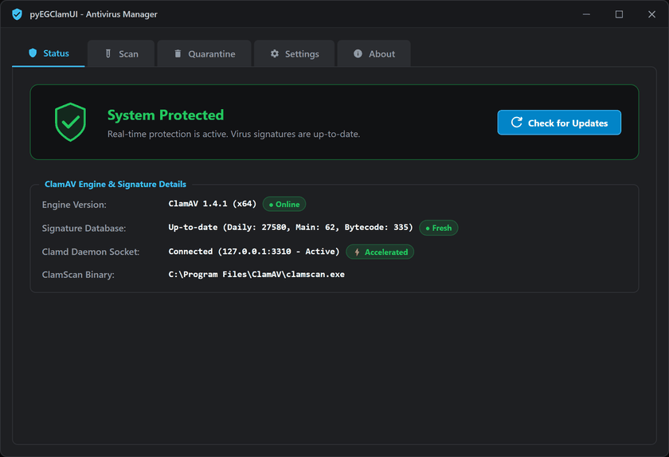

# pyEGClamUI

[](docs/VERSIONING.md)
[](https://www.gnu.org/licenses/gpl-3.0)
[](https://python.org)
[](https://github.com/EG1DOTIN/pyEGClamUI)

**Current Stable Release**: `v3.0.0` — An open-source, cross-platform desktop GUI for ClamAV engine. Built with Python and PySide6 (Qt).

---



*Live walkthrough tour of pyEGClamUI desktop interface.*

---

## Features

* **Cross-Platform**: Runs natively on **Windows 10/11**, **Linux**, and **macOS**.
* **Engine Auto-Discovery**: Automatically discovers `clamscan`, `clamd`, and `freshclam` across system PATH, standard directories, and Homebrew paths via [`ClamEngineDetector`](src/pyegclamui/core/detector.py).
* **ClamAV Daemon Integration**: High-performance Unix domain socket (`/var/run/clamav/clamd.ctl`, `/opt/homebrew/...`) and TCP socket (`127.0.0.1:3310`) communication with `INSTREAM` chunk framing support via [`ClamDaemonClient`](src/pyegclamui/core/daemon.py).
* **Multiple Scan Modes**:
  * **Quick Scan**: Lightweight check focusing on common high-priority directories (Downloads, Desktop, Temp).
  * **Full System Scan**: Thorough scan across all accessible local storage drives and system partitions.
  * **Custom Scan**: Target specific files, folders, or external drives of your choice.
  * **Memory Scan**: Scans active processes and loaded executable modules for resident threats.
* **Live Progress Tracking**: Real-time file counters, active scanning path display, elapsed time, and threat notifications in [`ScanDialog`](src/pyegclamui/gui/scan_dialog.py).
* **Isolated Quarantine Vault**: Quarantined threats are given unique IDs, hashed with SHA-256, isolated safely with non-executable `.quarantine` extensions, and support one-click restoration via [`QuarantineManager`](src/pyegclamui/core/quarantine.py).
* **Debounced Real-Time Guard**: Monitors Downloads and Desktop using `watchdog` with a debounce worker queue to avoid locking files being downloaded or written via [`RealTimeGuard`](src/pyegclamui/core/monitor.py).
* **Desktop & Menu Integration**: XDG desktop entry and hicolor icon integration for Linux application menus via [`LinuxDesktopManager`](src/pyegclamui/core/desktop_integration.py), macOS Menu Bar status item, and Windows System Tray daemon via [`SystemTrayManager`](src/pyegclamui/gui/tray.py).
* **FreshClam Updates**: Check and update ClamAV virus signatures with one click from the UI without requiring elevated permissions via [`ClamUpdater`](src/pyegclamui/core/updater.py).
* **Vector High-DPI UI & Native Dark Frame**: 100% procedural vector icons via [`IconFactory`](src/pyegclamui/gui/icons.py) (crisp on any scale/DPI) and native dark titlebar frame integration via [`PlatformTheme`](src/pyegclamui/gui/platform_theme.py) (Windows DWM immersive dark mode, Linux GTK dark frame, macOS).
* **Dynamic 3-Tier Protection Matrix**: Reactive visual status shield (Protected Emerald, Warning Amber, Unprotected Crimson) dynamically reflecting ClamAV binary detection, Real-Time Guard active state, and signature database freshness in [`MainWindow`](src/pyegclamui/gui/main_window.py).
* **Lightweight & Privacy-Focused**: Zero telemetry, zero tracking, no network beacons, and 100% free and open-source (GPL-3.0).

---

## Comprehensive Documentation

Detailed architectural, technical, and operational documentation is available in the [`docs/`](docs/) directory:

| Guide | Description |
| :--- | :--- |
| **[Documentation Index](docs/README.md)** | Overview map and full repository structure |
| **[System Architecture](docs/ARCHITECTURE.md)** | Decoupled layers, Qt signal/slot concurrency, and threading model |
| **[Core Engines](docs/CORE_ENGINES.md)** | In-depth logic for Scanner, Detector, Daemon client, and Quarantine |
| **[Cross-Platform Matrix](docs/CROSS_PLATFORM.md)** | Directory mapping, socket discovery, and platform specifics (Windows, Linux, macOS) |
| **[Configuration & Schemas](docs/CONFIG_SCHEMA.md)** | `config.json` schema, quarantine manifests, and local diagnostic exports |
| **[CLI Reference](docs/CLI_REFERENCE.md)** | Complete CLI syntax for `pyegclamui`, `egclam`, `pyegclamui-scan`, and `pyegclamui-setup` |
| **[Security & Privacy](docs/SECURITY_MODEL.md)** | Zero-telemetry policy, subprocess argument safety, and FOSS compliance |
| **[Application Versioning](docs/VERSIONING.md)** | SemVer policy, single source of truth (SSOT), and release bumping workflow |
| **[Universal Setup Suite](setup/README.md)** | One-liner installers, global updater (`--update`), and desktop shortcut engine |

---

## Quick Installation & One-Liners

pyEGClamUI includes an automated, cross-platform bootstrap setup suite ([`setup/README.md`](setup/README.md)) that provisions Python, creates an isolated virtual environment (`.venv`), checks ClamAV, and configures desktop shortcuts automatically.

### 🪟 Windows (PowerShell 1-Liner)
Run in PowerShell (Administrative or standard):
```powershell
powershell -ExecutionPolicy Bypass -Command "Invoke-WebRequest -Uri 'https://raw.githubusercontent.com/EG1DOTIN/pyEGClamUI/main/setup/install.ps1' -OutFile setup.ps1; .\setup.ps1"
```

### 🐧 Linux & 🍎 macOS (Bash 1-Liner)
Run in your terminal:
```bash
curl -sSL https://raw.githubusercontent.com/EG1DOTIN/pyEGClamUI/main/setup/install.sh | bash
```

### 💻 From Cloned Repository
```bash
git clone https://github.com/EG1DOTIN/pyEGClamUI.git
cd pyEGClamUI

# Run automated master installer (Python 3.9+)
python setup/setup.py --install --start
```

> [!TIP]
> **One-Command Updates**: To update ClamAV virus signatures, ClamAV binaries, and pyEGClamUI all at once, simply run:
> ```bash
> python setup/setup.py --update
> ```

---

### Manual pip Installation (Optional)

```bash
python -m venv .venv
# Windows:
.venv\Scripts\activate
# Linux/macOS:
source .venv/bin/activate

pip install -e .
```

---

## Usage

### Launch GUI
```bash
pyegclamui
# or use the short alias:
egclam
```

### Run from Command Line
```bash
# Quick scan
pyegclamui-scan --quick

# Full system scan
pyegclamui-scan --full

# Scan specific directory
pyegclamui-scan /path/to/folder
```

---

## Prerequisites (ClamAV Engine)

`pyEGClamUI` interfaces with the open-source ClamAV engine on your system:
* **Windows (10 / 11)**: `winget install Cisco.ClamAV` (or use the built-in setup wizard: `pyegclamui-setup --install`)
* **Linux (Ubuntu / Debian / Mint)**: `sudo apt install clamav clamav-daemon`
* **Linux (Fedora / RHEL)**: `sudo dnf install clamav clamd clamav-update`
* **Linux (Arch Linux)**: `sudo pacman -S clamav`
* **macOS**: `brew install clamav`

---

## Trademark Notice

**ClamAV®** is a registered trademark of Cisco Systems, Inc.  
`pyEGClamUI` is an independent open-source frontend and is not affiliated with, endorsed by, or sponsored by Cisco Systems, Inc.

---

## License & Attribution

* **License**: GNU General Public License v3.0 or later ([GPL-3.0-or-later](LICENSE))
* **Developed by**: [EG1](https://eg1.in)
