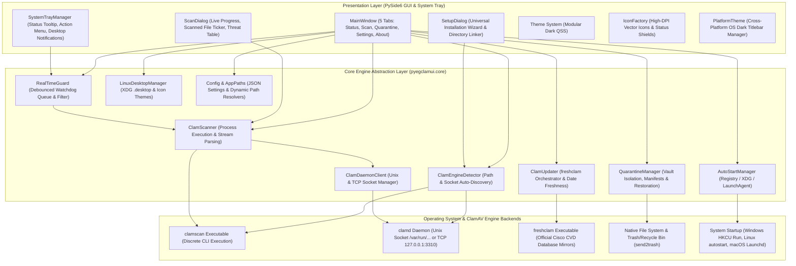
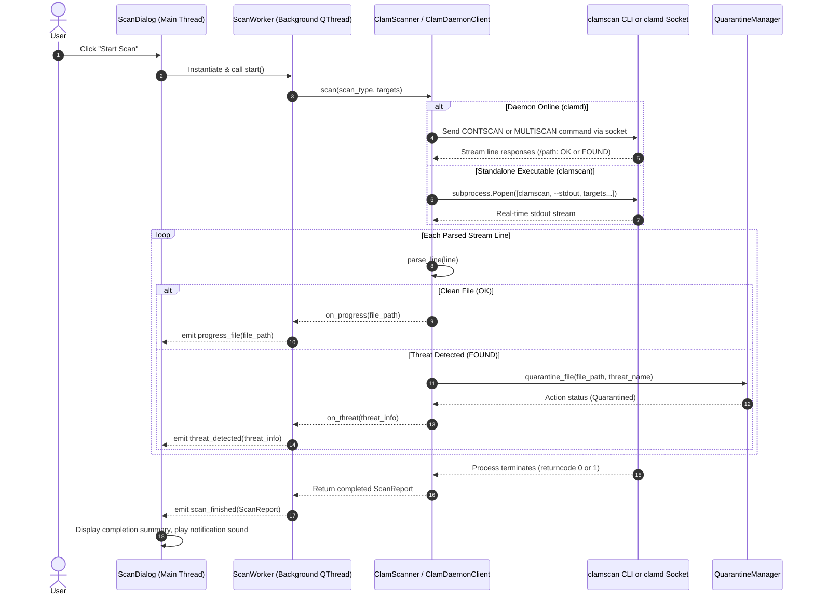
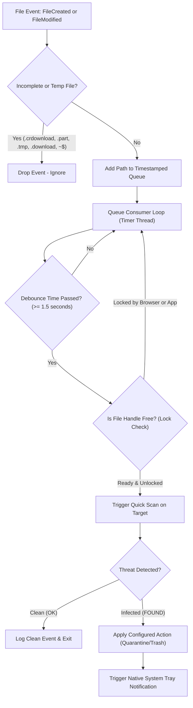

# System Architecture & Concurrency Model

**pyEGClamUI** is architected using a decoupled multi-layer design separating the desktop presentation layer (PySide6 / Qt6) from the core antivirus abstraction and engine execution backends.

---

## 1. Multi-Layer Architectural Overview

---

### Architectural Subsystems & Source Files

| Layer | Subsystem Component | Source Implementation | Key Responsibilities |
| :--- | :--- | :--- | :--- |
| **Presentation** | `MainWindow` | [`../src/pyegclamui/gui/main_window.py`](../src/pyegclamui/gui/main_window.py) | 5-tab dashboard, live status evaluations, action routing |
| **Presentation** | `ScanDialog` | [`../src/pyegclamui/gui/scan_dialog.py`](../src/pyegclamui/gui/scan_dialog.py) | Live telemetry dialog, file ticker, threat table |
| **Presentation** | `SetupDialog` | [`../src/pyegclamui/gui/setup_dialog.py`](../src/pyegclamui/gui/setup_dialog.py) | Universal engine installer wizard & folder linker |
| **Presentation** | `SystemTrayManager` | [`../src/pyegclamui/gui/tray.py`](../src/pyegclamui/gui/tray.py) | Background daemon, menu actions, balloon notifications |
| **Presentation** | `IconFactory` | [`../src/pyegclamui/gui/icons.py`](../src/pyegclamui/gui/icons.py) | High-DPI procedural vector icons & 3-tier status shields |
| **Presentation** | `PlatformTheme` | [`../src/pyegclamui/gui/platform_theme.py`](../src/pyegclamui/gui/platform_theme.py) | Native OS dark window titlebar (Windows DWM, Linux, macOS) |
| **Presentation** | `Theme & Styles` | [`../src/pyegclamui/gui/styles.py`](../src/pyegclamui/gui/styles.py) | Centralized QSS dark theme stylesheets & palette tokens |
| **Core Abstraction** | `ClamEngineDetector` | [`../src/pyegclamui/core/detector.py`](../src/pyegclamui/core/detector.py) | Executable auto-discovery & socket liveness probing |
| **Core Abstraction** | `ClamScanner` | [`../src/pyegclamui/core/scanner.py`](../src/pyegclamui/core/scanner.py) | Subprocess scan execution, line parsing, result reports |
| **Core Abstraction** | `ClamDaemonClient` | [`../src/pyegclamui/core/daemon.py`](../src/pyegclamui/core/daemon.py) | `clamd` Unix domain & TCP socket client with `INSTREAM` |
| **Core Abstraction** | `QuarantineManager` | [`../src/pyegclamui/core/quarantine.py`](../src/pyegclamui/core/quarantine.py) | SHA-256 fingerprinting, vault isolation & restoration |
| **Core Abstraction** | `ClamUpdater` | [`../src/pyegclamui/core/updater.py`](../src/pyegclamui/core/updater.py) | `freshclam` process orchestrator & signature freshness |
| **Core Abstraction** | `RealTimeGuard` | [`../src/pyegclamui/core/monitor.py`](../src/pyegclamui/core/monitor.py) | Watchdog event debounce pipeline & file lock checks |
| **Core Abstraction** | `AutoStartManager` | [`../src/pyegclamui/core/autostart.py`](../src/pyegclamui/core/autostart.py) | Registry / XDG / LaunchAgent autostart management |
| **Core Abstraction** | `LinuxDesktopManager` | [`../src/pyegclamui/core/desktop_integration.py`](../src/pyegclamui/core/desktop_integration.py) | XDG `.desktop` launcher and hicolor icon deployment |
| **Core Abstraction** | `Config & AppPaths` | [`../src/pyegclamui/core/config.py`](../src/pyegclamui/core/config.py) | JSON settings persistence & dynamic platform path resolution |
| **Core Abstraction** | `ClamEngineInstaller` | [`../src/pyegclamui/core/setup_engine.py`](../src/pyegclamui/core/setup_engine.py) | Automated package manager downloads & custom folder linking |
| **Core Abstraction** | `DualTrackLogger` | [`../src/pyegclamui/core/logger.py`](../src/pyegclamui/core/logger.py) | 2MB timestamped rotation for errors and operational audit logs |
| **Core Abstraction** | `TelemetryManager` | [`../src/pyegclamui/core/telemetry.py`](../src/pyegclamui/core/telemetry.py) | 100% opt-in transparent Firestore REST diagnostics dispatch |

## 2. Threading & Concurrency Architecture

A primary requirement of pyEGClamUI is a **strictly non-blocking main GUI thread**. Any long-running task—including recursive disk traversal, process launching, mirror downloading, or socket waits—is executed inside dedicated background worker threads.

### Thread Role Matrix

| Thread | Technology | Managed By | Responsibility | UI Communication Mechanism |
| :--- | :--- | :--- | :--- | :--- |
| **Main GUI Thread** | Qt Event Loop | `QApplication` | Window rendering, widgets, animations, button clicks, dialog modals | Direct UI manipulation |
| **Active Scan Worker** | `QThread` | `ScanDialog` | Spawns `clamscan` or connects to `clamd`, parses stdout line-by-line | Qt Signals (`Signal(int)`, `Signal(str)`, `Signal(dict)`) |
| **Database Update Worker** | `threading.Thread` | `MainWindow` | Spawns `freshclam` and validates return codes & signature dates | Callbacks wrapped with thread-safe UI updates |
| **Watchdog Observer** | `threading.Thread` | `watchdog.Observer` | Monitors kernel filesystem events (inotify on Linux, ReadDirectoryChangesW on Windows, FSEvents on macOS) | Internal event queue buffer |
| **Real-Time Guard Worker** | `threading.Thread` | `RealTimeGuard` | Debounces write bursts, verifies file lock release, invokes fast scan | Qt System Tray balloon notifications |

---

## 3. Core Process Workflows & Event Lifecycles

### 3.1 Active Scan Execution Flow

---

### 3.2 Real-Time Background File Guard Pipeline

The real-time protection engine continuously watches high-risk user directories (such as `Downloads` and `Desktop`). To prevent system freezing and false errors while files are being downloaded or created, it utilizes a debouncing pipeline.

---

### 3.3 Dynamic 3-Tier Protection State Matrix & Vector Icon Architecture

The presentation layer employs a real-time reactive state evaluation matrix on the Status dashboard. Four protection variables are evaluated continuously:

1. **Engine Availability**: ClamAV executable discovered and verified by `ClamEngineDetector`.
2. **Real-Time Guard**: Background watchdog directory monitoring active on `Downloads`/`Desktop`.
3. **Database Freshness**: Signature CVD database updated within the past 7 days.
4. **Auto-Updates**: Scheduled daily database synchronization enabled in user preferences.

| State Tier | Conditions | Visual Styling | Vector Status Shield | Contextual Action Button |
| :--- | :--- | :--- | :--- | :--- |
| 🟢 **System Protected** | Engine Ready + Guard Active + DB Up-to-Date + Auto-Updates ON | Dim green border (`#166534`), Green title (`#22c55e`) | `IconFactory.shield_ok` (Emerald Checkmark) | `[ Check for Updates ]` (`#primaryButton`) |
| 🟡 **System at Risk** | Engine Ready, BUT Guard OFF, DB Outdated, or Auto-Updates OFF | Amber border (`#854d0e`), Amber title (`#eab308`) | `IconFactory.shield_warn` (Amber Exclamation `!`) | `[ Enable Real-Time Guard ]` or `[ Update Signatures Now ]` |
| 🔴 **Engine Not Detected** | ClamAV binary missing or socket unreachable | Crimson border (`#991b1b`), Red title (`#ef4444`) | `IconFactory.shield_error` (Crimson Cross `X`) | `[ Configure Engine... ]` (`#dangerButton`) |

#### High-DPI Vector `IconFactory`
Instead of static raster bitmaps, icons are generated dynamically in-memory via `IconFactory` (`pyegclamui.gui.icons`) using `QPainter` and `QPainterPath`. This provides:
- Mathematical scalability to any DPI scale (100%, 125%, 150%, 200%, 4K/8K) without pixelation or blur.
- Dynamic color adaptation based on UI state (e.g., pure white `#ffffff` on buttons, emerald green on restore, crimson red on delete).
- In-memory caching (`_cache` and `_pix_cache`) for sub-millisecond retrieval with zero disk I/O.

---

## 4. Architectural Boundaries & Data Protection

1. **Subprocess Isolation**: Subprocesses are never invoked via shell interpreters (`shell=False`). Arguments are passed exclusively as strongly typed arrays of strings, completely neutralizing command injection vectors.
2. **Directory Isolation**: Configuration, database, log, and quarantine storage paths are strictly isolated inside standard user-level directories, preventing elevation-of-privilege vulnerabilities.
3. **Graceful Teardown**: Worker threads monitor cancellation flags (`self._cancelled`) and safely terminate child processes via `terminate()` with a fallback to `kill()` after a timeout, ensuring no zombie processes remain.
4. **Native OS Window Integration**: Adheres to cross-platform native window standards via `platform_theme.py`. On Windows 10/11, native DWM immersive dark mode (`DWMWA_USE_IMMERSIVE_DARK_MODE`) is applied to the titlebar without overriding OS window frames, preserving 100% native Aero Snap and Windows 11 Snap Layouts.
