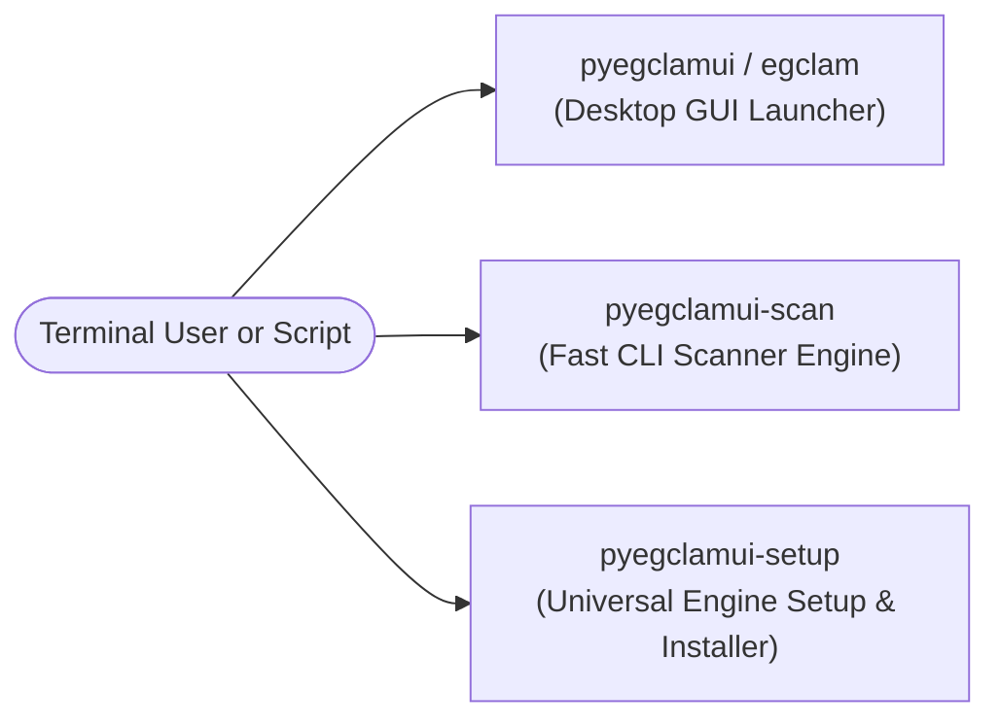

# Command-Line Interface (CLI) Reference

**pyEGClamUI** provides four standardized console entry points configured via `pyproject.toml`.

---

## 1. CLI Commands Overview



| Command | Category | Source Implementation | Description | Primary Target Audience |
| :--- | :--- | :--- | :--- | :--- |
| **`pyegclamui`** | GUI Launcher | [`../src/pyegclamui/gui/app.py`](../src/pyegclamui/gui/app.py) | Opens the full PySide6 desktop antivirus manager window | Desktop end-users |
| **`egclam`** | Alias | [`../src/pyegclamui/gui/app.py`](../src/pyegclamui/gui/app.py) | Quick terminal shorthand for `pyegclamui` | Terminal power-users |
| **`pyegclamui-scan`** | CLI Engine | [`../src/pyegclamui/core/scanner.py`](../src/pyegclamui/core/scanner.py) | Headless scanner for automation, shell scripts, and servers | CI/CD pipelines, sysadmins |
| **`pyegclamui-setup`** | Setup Tool | [`../src/pyegclamui/core/setup_engine.py`](../src/pyegclamui/core/setup_engine.py) | Checks dependencies, installs ClamAV, and configures databases | First-time setup, DevOps |

---

## 2. Desktop Launcher (`pyegclamui` & `egclam`)

* **Source File**: [`../src/pyegclamui/gui/app.py`](../src/pyegclamui/gui/app.py)  
* **Main Window**: [`../src/pyegclamui/gui/main_window.py`](../src/pyegclamui/gui/main_window.py)  


Launches the primary graphical user interface.

### Syntax & Arguments

```bash
pyegclamui [OPTIONS] [TARGET_PATHS...]
egclam [OPTIONS] [TARGET_PATHS...]
```

| Flag | Long Flag | Description | Example |
| :--- | :--- | :--- | :--- |
| `-m` | `--minimized` | Starts pyEGClamUI minimized directly to the system tray | `pyegclamui --minimized` |
| | `--quarantine` | Opens the GUI with the Quarantine Vault tab active | `pyegclamui --quarantine` |
| | `--install-desktop` | *(Linux)* Installs the XDG `.desktop` launcher and system icons | `pyegclamui --install-desktop` |
| | `--uninstall-desktop` | *(Linux)* Uninstalls the `.desktop` launcher and system icons | `pyegclamui --uninstall-desktop` |
| `-h` | `--help` | Displays help message and command syntax | `pyegclamui --help` |

---

## 3. Dedicated CLI Scanner (`pyegclamui-scan`)

* **Source File**: [`../src/pyegclamui/core/scanner.py`](../src/pyegclamui/core/scanner.py) (`ClamScanner.cli_main`)

A fast, scriptable scanner capable of operating on headless servers without requiring Qt or an active X11/Wayland desktop session.

### Syntax & Arguments

```bash
pyegclamui-scan [OPTIONS] [PATHS...]
```

| Argument / Flag | Description | Default |
| :--- | :--- | :--- |
| `PATHS...` | One or more files or directories to inspect | `.` (Current directory) |
| `-q`, `--quick` | Scans standard system high-risk directories (Downloads, Desktop, Temp) | Off |
| `-f`, `--full` | Scans all available mounted disk drives and partitions | Off |
| `-a`, `--action` | Override threat remediation action: `1` = Report, `2` = Trash, `3` = Quarantine | Read from `config.json` |
| `-h`, `--help` | Shows command options and exits | Off |

### Common Usage Examples

```bash
# Scan current directory recursively
pyegclamui-scan

# Perform quick scan on high-risk user paths
pyegclamui-scan --quick

# Scan specific directories and quarantine any detected threats
pyegclamui-scan /var/www/uploads /tmp/downloads -a 3

# Full system partition scan
pyegclamui-scan --full
```

### CLI Exit Codes

| Exit Code | Meaning | Scripting Interpretation |
| :--- | :--- | :--- |
| `0` | **Clean** | Scan completed successfully; no infected files found |
| `1` | **Threat Detected** | One or more viruses or malware threats were identified |
| `2` | **Scan Error** | ClamAV binary missing, path not accessible, or scan cancelled |

---

## 4. Universal Engine Installer (`pyegclamui-setup`)

* **Source File**: [`../src/pyegclamui/core/setup_engine.py`](../src/pyegclamui/core/setup_engine.py) (`ClamEngineInstaller.cli_main`)

Provides automated engine setup, database configuration, and status verification.


### Syntax & Arguments

```bash
pyegclamui-setup [OPTIONS]
```

| Flag | Long Flag | Description |
| :--- | :--- | :--- |
| `-i` | `--install` | Runs automated non-interactive ClamAV installation |
| `-c` | `--check` | Audits system and prints ClamAV binary paths and socket status |
| `-u` | `--update` | Downloads the latest CVD signature database via `freshclam` |
| `-l` | `--link PATH` | Links an existing custom ClamAV directory to user configuration |
| `-h` | `--help` | Shows setup command help and exits |

### Sample Output (`pyegclamui-setup --check`)

```
============================================================
           pyEGClamUI - Engine Audit & Diagnostics
============================================================
 Operating System:       Windows 11 (AMD64)
 Clamscan Binary:        C:\Program Files\ClamAV\clamscan.exe
 Clamd Binary:           C:\Program Files\ClamAV\clamd.exe
 Freshclam Binary:       C:\Program Files\ClamAV\freshclam.exe
 Clamd Daemon Socket:    Offline (TCP 127.0.0.1:3310)
 ClamAV Engine Version:  ClamAV 1.5.4
 Signature DB Version:   28130
 Signature DB Date:      Mon Sep 21 04:30:00 2026
 Engine Status:          READY (Fully Configured)
============================================================
```

---

## 5. Universal Setup & Maintenance Suite (`setup/setup.py`)

* **Documentation**: [`../setup/README.md`](../setup/README.md)
* **Master Script**: [`../setup/setup.py`](../setup/setup.py)
* **Bootstrap Launchers**: [`../setup/install.ps1`](../setup/install.ps1) (Windows) and [`../setup/install.sh`](../setup/install.sh) (Linux/macOS)

A zero-dependency Python standard library installer managing the entire lifecycle: Python checks, `.venv` isolation, ClamAV engine provisioning, desktop shortcut generation, and global updates.

### Syntax & Arguments

```bash
python setup/setup.py [OPTIONS]
```

| Flag | Long Flag | Description | Default |
| :--- | :--- | :--- | :--- |
| | `--install` | Complete end-to-end setup (checks, `.venv`, packages, ClamAV, shortcuts) | **Default** |
| | `--update` | Synchronously updates ClamAV signatures, engine, and pyEGClamUI | Off |
| | `--check` | Non-destructive system compatibility and readiness audit | Off |
| | `--shortcuts-only`| Generates or repairs desktop and application menu shortcuts | Off |
| | `--uninstall` | Cleanly removes desktop shortcuts, application entries, and `.venv` | Off |
| | `--with-clamav` | Enforces automated ClamAV engine download and setup | Auto |
| | `--no-clamav` | Bypasses ClamAV engine provisioning | Off |
| `-v` | `--verbose` | Emits live subprocess stdout/stderr and diagnostic breadcrumbs | Off |
| | `--start` | Launches pyEGClamUI immediately following installation or update | Off |

### Bootstrap One-Liners

```powershell
# Windows (PowerShell)
powershell -ExecutionPolicy Bypass -Command "Invoke-WebRequest -Uri 'https://raw.githubusercontent.com/EG1DOTIN/pyEGClamUI/main/setup/install.ps1' -OutFile setup.ps1; .\setup.ps1"
```

```bash
# Linux / macOS (Bash)
curl -sSL https://raw.githubusercontent.com/EG1DOTIN/pyEGClamUI/main/setup/install.sh | bash
```
