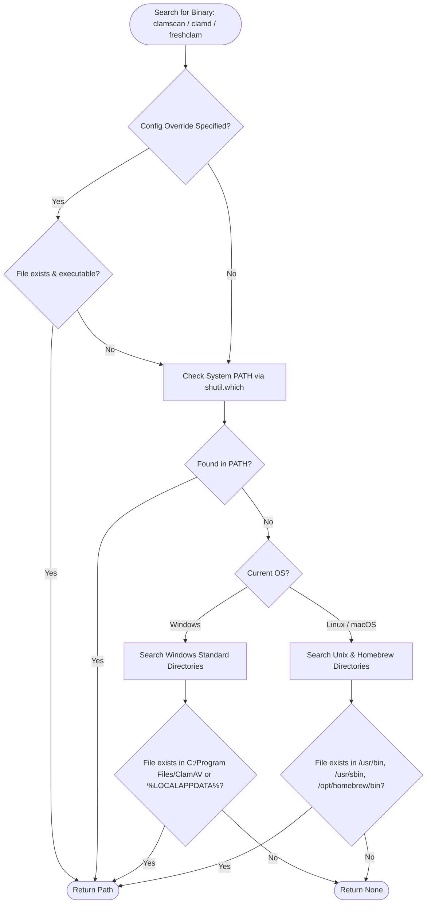
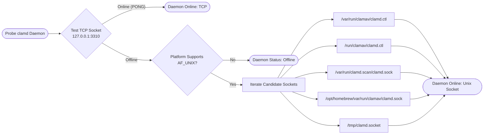
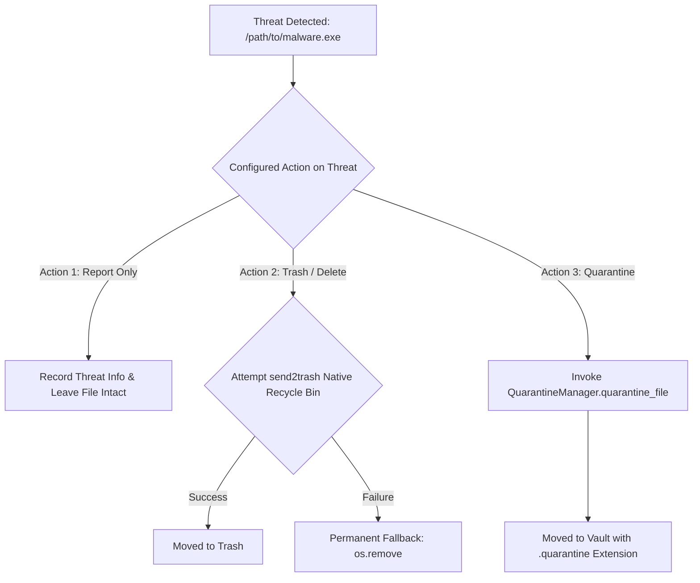

# Core Engine Subsystems & Logic

This document specifies the technical logic, decision trees, and data structures implemented across **pyEGClamUI**'s core engine subsystem (`src/pyegclamui/core/`).

---

## 1. ClamEngineDetector (`detector.py`)

* **Source File**: [`../src/pyegclamui/core/detector.py`](../src/pyegclamui/core/detector.py) (`ClamEngineDetector`)

The detector module discovers ClamAV binaries and checks socket responsiveness across all supported operating systems.

### 1.1 Discovery Priority Algorithm



### 1.2 Daemon Socket Discovery Hierarchy



---

## 2. ClamScanner Engine (`scanner.py`)

* **Source File**: [`../src/pyegclamui/core/scanner.py`](../src/pyegclamui/core/scanner.py) (`ClamScanner`)

The scanner engine converts high-level scan requests into discrete subprocess arguments or socket commands, parses real-time output streams, and applies remediation actions.

### 2.1 Scan Modes Comparison

| Mode | Target Scope | Implementation Detail | Best Used For |
| :--- | :--- | :--- | :--- |
| **Quick Scan** | Downloads, Desktop, Temp, Startup | Inspects standard entry points for incoming malware | Daily routine check (10–30s) |
| **Full System Scan** | All mounted local drives | Traverses all mount points enumerated via `psutil.disk_partitions()` | Comprehensive system audit |
| **Custom Scan** | User-selected file(s) or folder(s) | Discrete paths passed via file picker or drag-and-drop | Individual downloads, external drives |
| **Memory Scan** | Windows active system memory | Targets active process executables and working directories | Verifying running memory state |
| **Daemon Scan** | Single files or entire trees | Routed via `ClamDaemonClient` Unix or TCP socket | High-performance batch scanning |

### 2.2 Output Parsing Rules

The engine parses stdout lines using robust regular expressions to handle Windows drive letters with colons, space-separated filenames, and threat names:

| Stream Type | Pattern | Extracted Fields | Action Taken |
| :--- | :--- | :--- | :--- |
| **Clean File** | `^(.*):\s+OK$` | `path` | Increments clean file counter; updates UI progress ticker |
| **Threat Found** | `^(.*):\s+(.+?)\s+FOUND$` | `path`, `threat` | Increments infected counter; invokes remediation handler |
| **File Error** | `^(.*):\s+(.+?)\s+ERROR$` | `path`, `error` | Increments error counter; logs permission/access failure |
| **Warning** | `^(.*):\s+(.+?)\s+WARNING$` | `path`, `warning` | Logs non-fatal warning (e.g., oversized archive) |
| **Summary Files** | `Scanned files:\s+(\d+)` | `count` | Sets verified total scanned files |
| **Summary Threats** | `Infected files:\s+(\d+)` | `count` | Sets verified total infected files |

### 2.3 Threat Remediation Options



---

## 3. ClamAV Daemon Client (`daemon.py`)

* **Source File**: [`../src/pyegclamui/core/daemon.py`](../src/pyegclamui/core/daemon.py) (`ClamDaemonClient`)

`ClamDaemonClient` manages native socket communication with `clamd`, supporting Unix Domain Sockets (`AF_UNIX`) and TCP Sockets (`AF_INET`).

### 3.1 Protocol Command Specification

| Command | Request Format | Expected Response | Description |
| :--- | :--- | :--- | :--- |
| `PING` | `PING\n` | `PONG\n` | Liveness check |
| `VERSION` | `VERSION\n` | `ClamAV <version>/<db_ver>/<date>` | Queries engine version and signature database date |
| `STATS` | `STATS\n` | Multiline text (POOLS, THREADS, QUEUE) | Returns daemon operational metrics |
| `RELOAD` | `RELOAD\n` | `RELOADING\n` | Commands daemon to reload CVD signature database |
| `SCAN <path>` | `SCAN /absolute/path\n` | `/path: <result>` | Scans path; stops on first threat |
| `CONTSCAN <path>` | `CONTSCAN /absolute/path\n` | `/path: <result>` | Scans entire directory without stopping on threats |
| `MULTISCAN <path>` | `MULTISCAN /absolute/path\n` | `/path: <result>` | Scans path concurrently utilizing all daemon threads |
| `INSTREAM` | `zINSTREAM\0` + Chunks | `stream: OK` or `stream: <threat> FOUND` | Streams binary data in-memory directly to clamd |
| `SHUTDOWN` | `SHUTDOWN\n` | Connection closed | Gracefully shuts down clamd daemon |

### 3.2 INSTREAM Chunk Framing Protocol

The `INSTREAM` protocol allows pyEGClamUI to scan user files without requiring the `clamav` daemon system account to have read permissions on user home directories:

```
+-------------------+--------------------+-------------------+--------------------+-------------------+
|  zINSTREAM\0      | Chunk 1 Length     | Chunk 1 Payload   | Chunk 2 Length     | End-of-Stream     |
|  (Command Header) | (4 bytes, Big-End) | (N bytes)         | (4 bytes, Big-End) | (4 bytes: 0x0000) |
+-------------------+--------------------+-------------------+--------------------+-------------------+
```

---

## 4. Quarantine Vault Manager (`quarantine.py`)

* **Source File**: [`../src/pyegclamui/core/quarantine.py`](../src/pyegclamui/core/quarantine.py) (`QuarantineManager`)

The quarantine subsystem isolates malicious files safely without the possibility of accidental user execution.

### 4.1 Vault File Layout

```
%LOCALAPPDATA%/pyEGClamUI/quarantine/       (Windows)
~/.local/share/pyegclamui/quarantine/        (Linux)
~/Library/Application Support/pyEGClamUI/quarantine/ (macOS)
├── metadata.json                            # Master catalog manifest of all items
├── 1a2b3c4d-5e6f-7a8b-9c0d-1e2f3a4b5c6d.quarantine
└── 9f8e7d6c-5b4a-3a2b-1c0d-e9f8a7b6c5d4.quarantine
```

### 4.2 Security Protections

1. **Non-Executable Extension**: Quarantined files are stripped of their original extension and saved strictly with a `.quarantine` extension.
2. **Directory Permission Lockdown**: The quarantine folder is created with user-restricted permissions (`0o700`), denying other local accounts access.
3. **SHA-256 Checksumming**: Every quarantined file is fingerprinted before isolation and re-verified on restoration.
4. **Safe Restoration**: Restoration requires explicit user confirmation. If the destination path already has a file, the user is prompted before overwriting.

---

## 5. Signature Updater (`updater.py`)

* **Source File**: [`../src/pyegclamui/core/updater.py`](../src/pyegclamui/core/updater.py) (`ClamUpdater`)

The updater orchestrates the official ClamAV `freshclam` utility.

### 5.1 Freshclam Return Code Matrix

| Exit Code | Classification | Action Taken | UI Notification |
| :--- | :--- | :--- | :--- |
| 🟢 `0` | **Success** | Database updated with new signatures | "Signatures updated successfully" |
| 🟢 `1` | **Success** | Database already at the latest version | "Signatures are already up to date" |
| 🟡 `40` | **Network Error** | Cannot connect to database.clamav.net mirrors | "Mirror connection failed; check network" |
| 🔴 `Other` | **Engine Failure** | Configuration syntax error or lock collision | Error message with return code logged |

### 5.2 User-Level Database Isolation

To prevent Windows Admin UAC permission errors, pyEGClamUI automatically generates a customized `freshclam.conf` storing databases inside the user's local application data directory (`%LOCALAPPDATA%\pyEGClamUI\database`), eliminating the need for elevated Administrator privileges during daily signature updates.

---

## 6. Real-Time File Guard (`monitor.py`)

* **Source File**: [`../src/pyegclamui/core/monitor.py`](../src/pyegclamui/core/monitor.py) (`RealTimeGuard`)
* **Dedicated Deep-Dive**: [`REALTIME_GUARD.md`](REALTIME_GUARD.md)

The real-time protection subsystem utilizes `watchdog` to monitor filesystem events on **strictly two high-exposure directories** (Desktop and Downloads by default) with a **1.5-second debounce window** and file lock probing (`open(..., "rb")`).

### Temporary & In-Flight Exclusion Table

The following file patterns are automatically ignored during real-time monitoring to prevent scanning incomplete downloads or lock collisions:

| Pattern | Source Application | Reason for Exclusion | Action Taken |
| :--- | :--- | :--- | :--- |
| `*.crdownload` | Google Chrome, Chromium, Brave | In-flight active download | ⚪ Ignored until finalized |
| `*.part` | Mozilla Firefox, wget | In-flight partial download | ⚪ Ignored until finalized |
| `*.tmp`, `*.temp` | Windows OS, generic installers | Transient temporary scratch file | ❌ Ignored permanently |
| `*.download` | Apple Safari | In-flight active download | ⚪ Ignored until finalized |
| `~$*` | Microsoft Office Word / Excel | In-flight lock file | ❌ Ignored permanently |

---

## 7. Dual-Track 2MB Timestamped Logger (`logger.py`)

* **Source File**: [`../src/pyegclamui/core/logger.py`](../src/pyegclamui/core/logger.py) (`TimestampedFileHandler`)
* **Dedicated Deep-Dive**: [`LOGGING.md`](LOGGING.md)

Provides separated logging streams for errors (`pyegclamui`) and operational reports (`pyegclamui.reports`), each strictly capped at 2 MB with automatic timestamped rotation (`YYYY-MM-DD-HH-MM-[type].log`) and uncaught crash interception via `sys.excepthook`.

---

## 8. Transparent Opt-In Telemetry (`telemetry.py`)

* **Source File**: [`../src/pyegclamui/core/telemetry.py`](../src/pyegclamui/core/telemetry.py) (`TelemetryManager`)
* **Dedicated Deep-Dive**: [`TELEMETRY_LOGIC.md`](TELEMETRY_LOGIC.md)

Implements 100% opt-in diagnostic reporting to Firebase Firestore REST v1 via standard `urllib.request`, granular consent checkboxes, anonymous `GuestXXXXXXXX` profile generation, and live payload preview modal dialogs.

