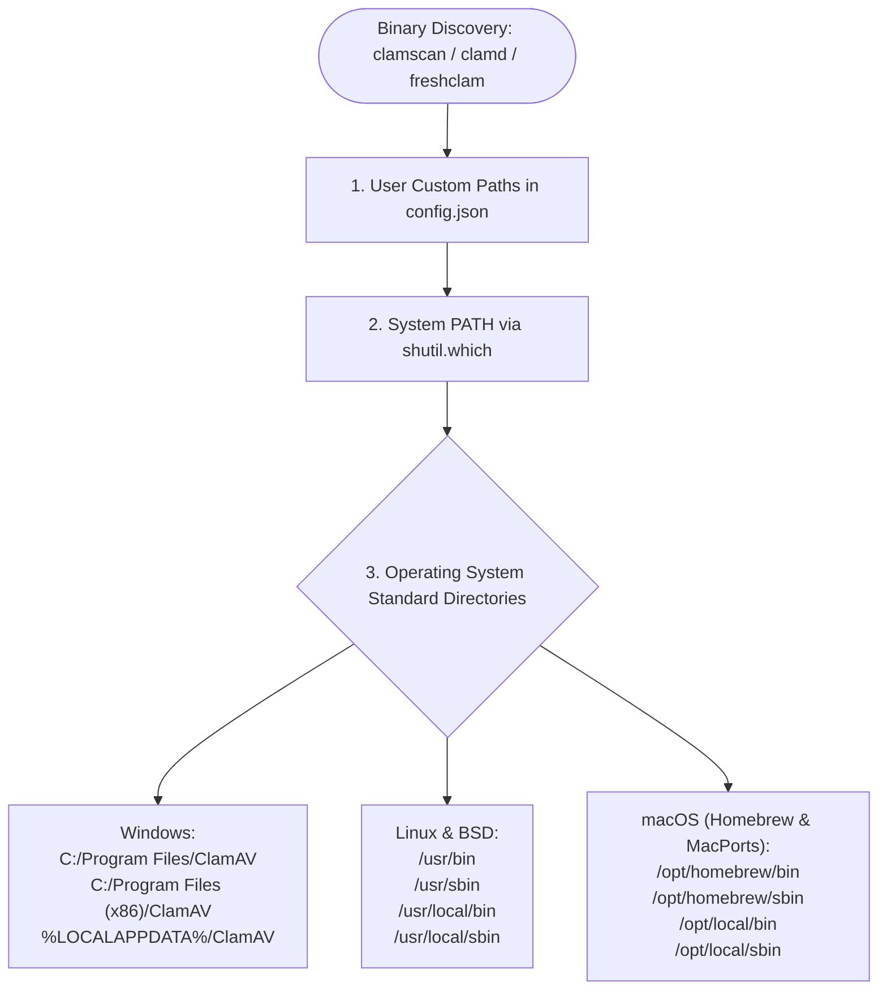
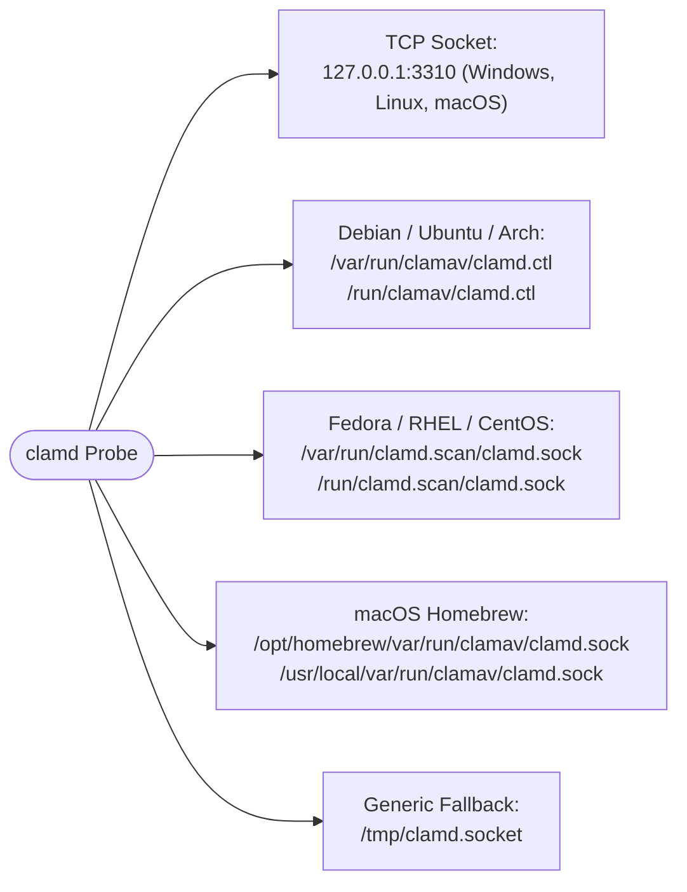

# Cross-Platform Hardening & Operating System Matrix

**pyEGClamUI** is designed from the ground up to operate natively and reliably across **Windows**, **Linux**, and **macOS**.

---

## 1. Operating System Capabilities Matrix

| Feature | Windows (10 / 11) | Linux (Ubuntu, Fedora, Arch) | macOS (12+ Monterey to Sonoma) |
| :--- | :--- | :--- | :--- |
| **Primary Execution Backend** | `clamscan.exe` CLI process | `clamd` Unix socket or `clamscan` | `clamd` Unix socket or `clamscan` |
| **Daemon Socket Communication** | TCP (`127.0.0.1:3310`) | Unix socket (`/var/run/clamav/clamd.ctl`) | Unix socket (`/opt/homebrew/var/run/...`) |
| **Native System Startup** | Registry (`HKCU\...\Run`) | XDG Autostart (`~/.config/autostart`) | Launchd Agent (`~/Library/LaunchAgents`) |
| **System Tray / Menu Bar** | Windows Taskbar Notification Area | FreeDesktop System Tray / AppIndicator | macOS Top Menu Bar Status Item |
| **Desktop Application Menu** | Start Menu Shortcuts | XDG Desktop Entry (`/usr/share/applications`) | macOS Dock & Application Bundle |
| **Automated Engine Installer** | Winget + Cisco MSI silent installer | Tailored package manager instructions (`apt`/`dnf`) | Homebrew (`brew install clamav`) |
| **Safe Threat Trash / Recycling** | Windows Recycle Bin (`send2trash`) | FreeDesktop Trash (`~/.local/share/Trash`) | macOS Trash (`~/.Trash`) |
| **Window Frame Behavior** | Native Windows Aero Snap | Native Wayland / X11 Tiling & Floating | macOS Native Split View & Cocoa Frames |

---

## 2. Cross-Platform Directory & Path Mapping

* **Source File**: [`../src/pyegclamui/core/config.py`](../src/pyegclamui/core/config.py) (`AppPaths`)

| Directory Purpose | Windows Location | Linux Location | macOS Location |
| :--- | :--- | :--- | :--- |
| **User Configuration** | `%APPDATA%\pyEGClamUI` | `~/.config/pyegclamui` | `~/Library/Application Support/pyEGClamUI` |
| **Application Data** | `%LOCALAPPDATA%\pyEGClamUI` | `~/.local/share/pyegclamui` | `~/Library/Application Support/pyEGClamUI` |
| **Quarantine Vault** | `%LOCALAPPDATA%\pyEGClamUI\quarantine` | `~/.local/share/pyegclamui/quarantine` | `~/Library/Application Support/pyEGClamUI/quarantine` |
| **Application Logs** | `%LOCALAPPDATA%\pyEGClamUI\logs` | `~/.local/state/pyegclamui/logs` | `~/Library/Logs/pyEGClamUI` |
| **User CVD Database** | `%LOCALAPPDATA%\pyEGClamUI\database` | `/var/lib/clamav` or user data dir | `/opt/homebrew/var/lib/clamav` |
| **Startup Launcher** | `HKCU\Software\Microsoft\Windows\CurrentVersion\Run` | `~/.config/autostart/pyegclamui.desktop` | `~/Library/LaunchAgents/in.eg1.pyegclamui.plist` |

---

## 3. ClamAV Engine Discovery Paths

* **Source File**: [`../src/pyegclamui/core/detector.py`](../src/pyegclamui/core/detector.py) (`ClamEngineDetector`)

### 3.1 Executable Search Locations

When auto-discovering `clamscan`, `clamd`, and `freshclam`, pyEGClamUI searches the following locations in order:



### 3.2 Daemon Socket Locations

When querying the ClamAV daemon (`clamd`), the following socket locations are probed:



---

## 4. Package Manager & Engine Installation Matrix

| Operating System | Package Manager | Recommended Installation Command | Service Daemon Command |
| :--- | :--- | :--- | :--- |
| **Windows 10/11** | Windows Package Manager | `winget install Cisco.ClamAV` | Installed as optional Windows Service |
| **Ubuntu / Debian / Mint** | APT | `sudo apt update && sudo apt install -y clamav clamav-daemon` | `sudo systemctl start clamav-daemon` |
| **Fedora / RHEL / Alma** | DNF / YUM | `sudo dnf install -y clamav clamd clamav-update` | `sudo systemctl start clamd@scan` |
| **Arch Linux / Manjaro** | Pacman | `sudo pacman -S clamav` | `sudo systemctl start clamav-daemon` |
| **openSUSE** | Zypper | `sudo zypper install -y clamav clamav-daemon` | `sudo systemctl start clamav-daemon` |
| **macOS (Apple Silicon)** | Homebrew | `brew install clamav` | `brew services start clamav` |
| **macOS (Intel x86_64)** | Homebrew | `brew install clamav` | `brew services start clamav` |
| **macOS (MacPorts)** | MacPorts | `sudo port install clamav` | Managed via `daemondo` |

---

## 5. Linux Desktop Integration Specifics

* **Source File**: [`../src/pyegclamui/core/desktop_integration.py`](../src/pyegclamui/core/desktop_integration.py) (`LinuxDesktopManager`)

### 5.1 XDG Desktop File Installation

`LinuxDesktopManager` handles installing the official desktop launcher according to the Freedesktop XDG Desktop Entry Specification:

* **User Installation Path**: `~/.local/share/applications/pyegclamui.desktop`
* **System Installation Path**: `/usr/share/applications/pyegclamui.desktop`
* **Actions Included**: Quick Scan (`pyegclamui-scan --quick`), Quarantine Vault (`pyegclamui --quarantine`).

### 5.2 Hicolor Icon Theme Deployment

Application icons are deployed across standard hicolor resolutions to ensure crisp rendering in all desktop environments (GNOME, KDE Plasma, XFCE, Cinnamon, MATE):

```
~/.local/share/icons/hicolor/
├── scalable/apps/pyegclamui.png
├── 256x256/apps/pyegclamui.png
├── 128x128/apps/pyegclamui.png
├── 64x64/apps/pyegclamui.png
└── 48x48/apps/pyegclamui.png
```

After deployment, `LinuxDesktopManager` automatically invokes `update-desktop-database` and `gtk-update-icon-cache` to immediately register the new entries without requiring a system reboot or session logout.

---

## 6. macOS Menu Bar & System Tray Specifics

* **Source Files**: [`../src/pyegclamui/gui/tray.py`](../src/pyegclamui/gui/tray.py) (`SystemTrayManager`), [`../src/pyegclamui/gui/platform_theme.py`](../src/pyegclamui/gui/platform_theme.py) (`apply_dark_titlebar`)

1. **Menu Bar Status Item**: On macOS, `QSystemTrayIcon` manifests as a native item in the top macOS Menu Bar.
2. **Icon Optimization**: While Windows uses `.ico` files, macOS requires high-DPI `.png` assets. pyEGClamUI's `AppPaths.get_app_icon_path()` automatically detects macOS and selects the crisp 256x256 PNG asset.
3. **Application Lifecycle**: In accordance with macOS human interface guidelines, closing the main window hides the window rather than terminating the process (`setQuitOnLastWindowClosed(False)`). The application continues running in the background and can be re-opened from the Menu Bar or Dock.
