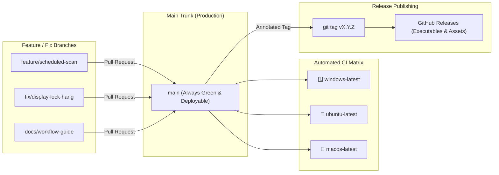
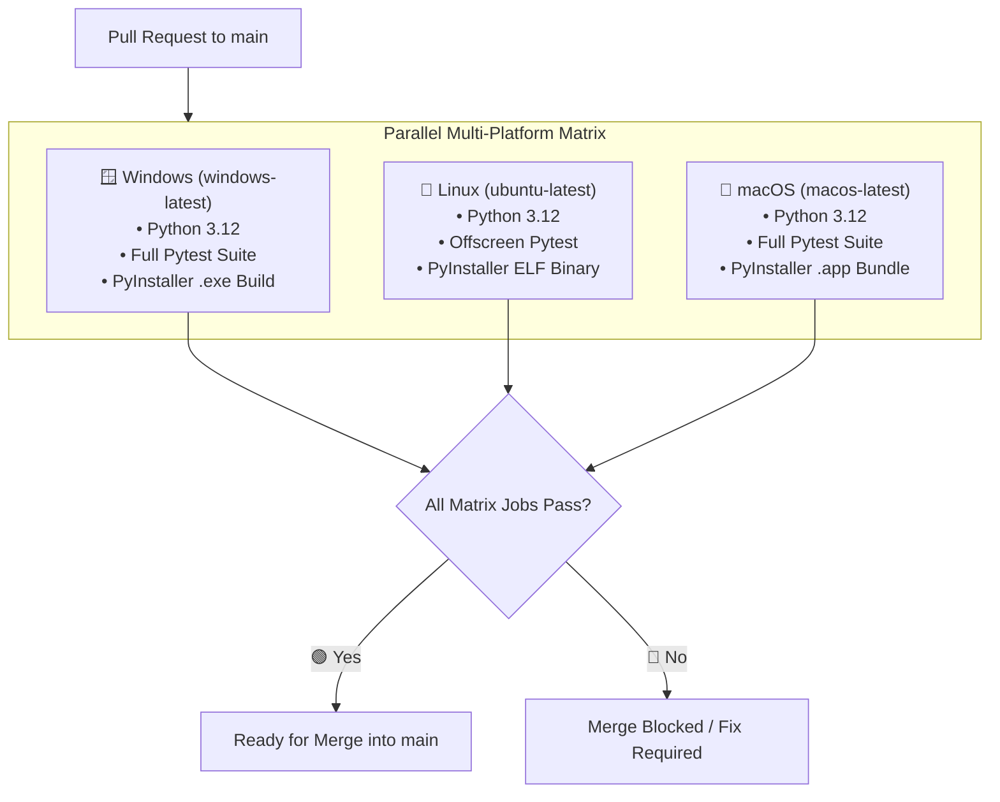
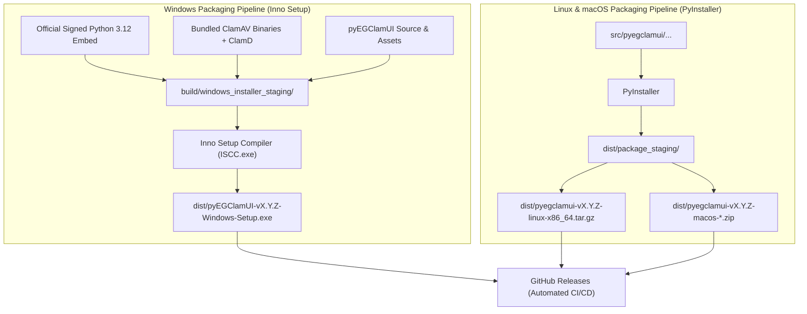

# Development Workflow & Release Engineering Guide

This document defines the official engineering workflow, branching strategy, quality gates, automated deployment pipelines, and release management rules for **pyEGClamUI**.

---

## 1. Branching Strategy & Conventions

pyEGClamUI follows a **Trunk-Based Development** model with short-lived feature and fix branches. The `main` branch serves as the single source of truth for stable, release-ready code.



### Branch Naming Conventions

All branches created off `main` must adhere to standard lowercase descriptive prefixes:

| Branch Prefix | Purpose | Example |
| :--- | :--- | :--- |
| 🟢 `feature/<name>` | New application capability, GUI dialog, or scanning mode | `feature/scheduled-scans` |
| 🟡 `fix/<name>` | Bug fix, regression resolution, or race condition patch | `fix/quarantine-path-resolver` |
| ⚪ `docs/<name>` | Documentation updates, architecture guides, or API specs | `docs/workflow-guide` |
| 🛡️ `chore/<name>` | Dependency updates, tooling enhancements, or CI tweaks | `chore/upgrade-pytest` |

### Working on a Feature Branch

1. **Pull Latest Main**:
   ```bash
   git checkout main
   git pull origin main
   ```
2. **Create Feature Branch**:
   ```bash
   git checkout -b feature/your-feature-name
   ```
3. **Develop & Test Inside `.venv`**:
   Execute all changes within the virtual environment and ensure 100% test passage:
   ```bash
   .venv\Scripts\pytest tests/
   ```
4. **Commit with Conventional Messages**:
   Use standard prefixes (`feat:`, `fix:`, `docs:`, `chore:`, `refactor:`):
   ```bash
   git commit -m "feat(scanner): add custom file size limit filter"
   ```

---

## 2. Quality Gates & Local Validation

Before pushing any branch or requesting review, developers must pass all local quality checks:

| Gate | Tool / Command | Success Criteria |
| :--- | :--- | :--- |
| 🧪 **Unit Tests** | `pytest tests/` | 100% passing across all test suites (115+ tests) |
| ⚡ **Speed Requirement** | `pytest -v tests/` | Total execution completes in under 20 seconds |
| 🛡️ **Headless Isolation** | `QT_QPA_PLATFORM=offscreen` | Zero modal popups (`QMessageBox`) blocking execution |
| 📦 **Packaging Validation** | `python scripts/build.py --no-archive` | Standalone executable compiles without missing imports |

> [!IMPORTANT]
> **Zero-Deletion Policy**: Never permanently delete deprecated code, scripts, or assets. Instead, move obsolete files to `.unused-old-files/<category>/` in compliance with repository governance standards.

---

## 3. Pull Requests & Automated CI Pipeline

When a branch is pushed and a Pull Request is opened against `main`, GitHub Actions automatically triggers the multi-platform matrix:



### Headless Display Architecture

To guarantee identical behavior across developer workstations and cloud CI environments:
* PySide6 tests run with `QT_QPA_PLATFORM=offscreen`.
* Qt dialogs use mock fixtures or guard checks (`if os.getenv("QT_QPA_PLATFORM") != "offscreen":`) to prevent modal blocking.
* No Xvfb server locks or display daemons are required on Linux.

---

## 4. Release Rules & Centric Version Management

pyEGClamUI follows **Semantic Versioning 2.0.0** (`MAJOR.MINOR.PATCH`).

### Centric Single Source of Truth (SSOT)

Version numbers are declared in **one single location**:
* **Centric SSOT**: [`src/pyegclamui/__init__.py`](../src/pyegclamui/__init__.py) (`__version__ = "X.Y.Z"`)

All other components dynamically derive their version:
* [`pyproject.toml`](../pyproject.toml): Configured with PEP 621 `dynamic = ["version"]` and `[tool.setuptools.dynamic]`.
* [`scripts/package_windows_installer.py`](../scripts/package_windows_installer.py): Dynamically passes version to Inno Setup (`/DAppVersion=X.Y.Z`).
* [`scripts/build.py`](../scripts/build.py): Dynamically formats `.tar.gz` and `.zip` distribution filenames.
* GUI, CLI, and Telemetry: Dynamically read `pyegclamui.__version__`.

The automated test [`tests/test_version.py`](../tests/test_version.py) validates SemVer compliance and dynamic resolution.

---

## 5. Deployment & Installer Packaging Architecture

pyEGClamUI maintains distinct, tailored packaging pipelines for desktop operating systems while preserving a clean directory organization under `setup/`:
* `setup/windows/`: Inno Setup compiler script (`pyegclamui_installer.iss`), PowerShell service configuration (`setup_clamd_service.ps1`), and installation script (`install.ps1`).
* `setup/linux/`: Shell installation script (`install.sh`) and desktop entry.
* `setup/macos/`: Shell installation script (`install.sh`).



### Windows Embedded Runtime Advantage
The Windows installer embeds the official Python Software Foundation signed `pythonw.exe` runtime:
* 🟢 **Zero Defender False Positives**: No unsigned unpacker bootloader heuristics (`Trojan:Win32/Wacatac.B!ml`).
* 🟢 **Instant Startup**: Zero `%TEMP%` extraction decompression latency.
* 🟢 **Self-Contained ClamAV & ClamD**: Optionally provisions and activates ClamD daemon service automatically during installation.

---

## 6. Step-by-Step Release Checklist

Follow this checklist sequentially whenever releasing a new public version:

| Step | Action | Command / Location | Expected Runtime |
| :---: | :--- | :--- | :--- |
| **1** | Update Centric SSOT version | [`src/pyegclamui/__init__.py`](../src/pyegclamui/__init__.py) | Instant (1 line edit) |
| **2** | Run entire test suite locally | `.venv\Scripts\python.exe -m pytest tests/` | < 15 seconds (119 passing) |
| **3** | Commit version bump to `main` | `git commit -am "chore(release): bump version to X.Y.Z"` | Instant |
| **4** | Push commit to GitHub | `git push origin main` | Instant |
| **5** | Create & push annotated release tag | `git tag -a vX.Y.Z -m "Release vX.Y.Z"` && `git push origin vX.Y.Z` | Instant |
| **6** | Monitor automated CI/CD pipeline | [GitHub Actions Workflow](https://github.com/EG1DOTIN/pyEGClamUI/actions) | < 15 minutes total |
| **7** | Verify release attachments | [GitHub Releases](https://github.com/EG1DOTIN/pyEGClamUI/releases) | Setup.exe, tar.gz, zip attached |

---

## 7. Related Documentation

* [`VERSIONING.md`](VERSIONING.md) — Single Source of Truth architecture and SemVer specifications.
* [`ARCHITECTURE.md`](ARCHITECTURE.md) — System architecture, thread boundaries, and engine layers.
* [`SECURITY_MODEL.md`](SECURITY_MODEL.md) — Subprocess execution safety and permission policies.
* [`README.md`](README.md) — Complete documentation suite map and subsystem index.
