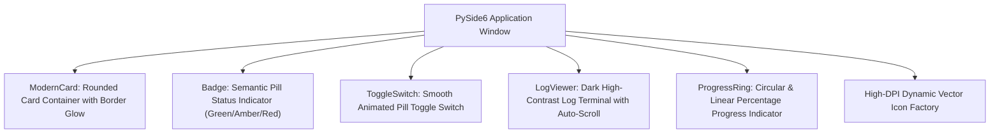
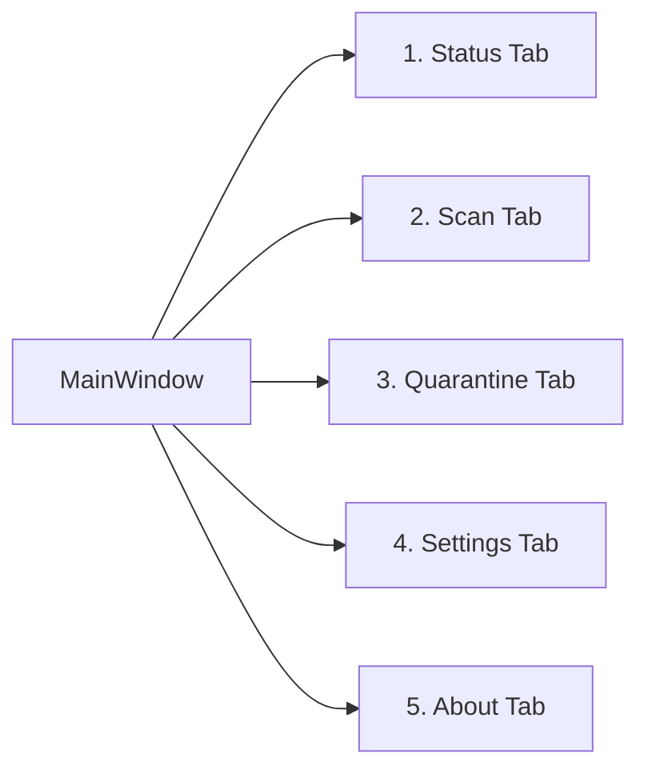
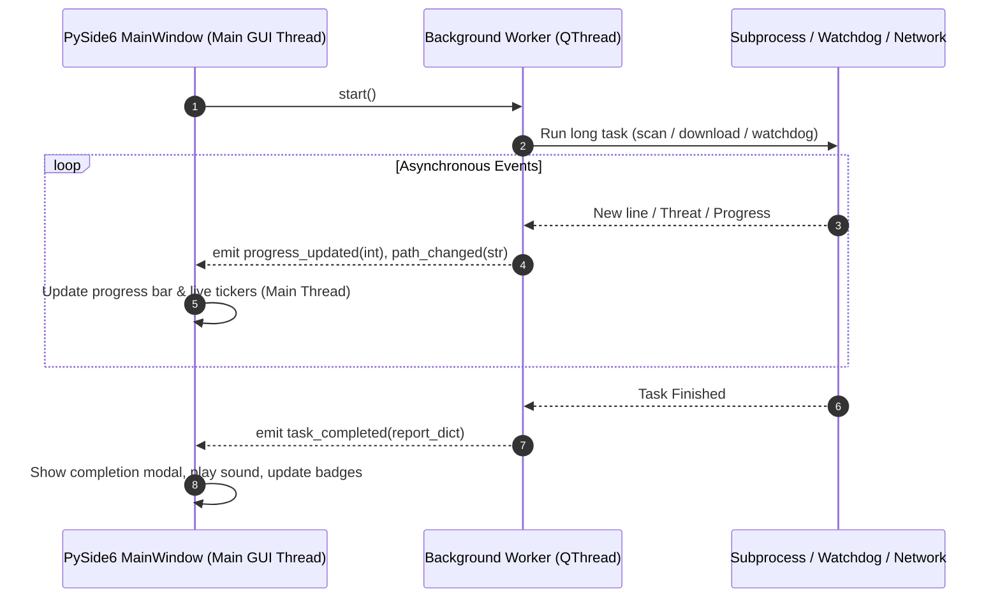

# GUI Architecture & Design System Reference

This document provides a comprehensive, code-independent architectural reference for the PySide6 Graphical User Interface and Design System in **pyEGClamUI**. It details the modern dark theme palette, reusable widget components, high-DPI scaling, native window titlebar hardening, multi-threaded signal/slot concurrency, and tab-by-tab operational layouts.

---

## 1. Design Philosophy & Visual Excellence

Security applications are frequently burdened with outdated, uninspired user interfaces. pyEGClamUI adheres to modern, premium desktop design standards:

* **Rich Aesthetics**: A cohesive, professional dark theme built upon tailored Zinc/Slate color scales with luminous Emerald (`#00DC82`), Amber (`#F59E0B`), and Crimson (`#EF4444`) semantic accents.
* **Fluid Micro-Interactions**: Hover transitions, dynamic badge animations, smooth progress indicators, and custom toggle switches provide immediate tactile feedback.
* **Responsive Fluid Layouts**: All tabs and dialogs resize fluidly across varying display geometries without clipped labels or awkward horizontal scrollbars.
* **Platform Titlebar Integration**: Interacts directly with Windows Desktop Window Manager (`dwmapi.dll`) to enforce dark titlebars and rounded window corners on Windows 10/11.
* **Thread-Safe Architecture**: The main GUI event loop is never blocked by disk I/O, subprocesses, or network operations. All background events communicate strictly via **Qt Signals & Slots**.

---

## 2. Color Palette & Design Tokens

Visual styles are centralized in [`styles.py`](../src/pyegclamui/gui/styles.py) and applied uniformly via Qt Style Sheets (QSS):

```
+-------------------------------------------------------------+
| Background: #121214 (Zinc Dark)                             |
| Card Surface: #1A1A1E | Border: #2A2A32                     |
|                                                             |
| Accent Brand: #00DC82 (Emerald Green)                       |
| Text Primary: #F4F4F5 | Secondary: #A1A1AA | Muted: #71717A |
| Danger: #EF4444       | Warning: #F59E0B   | Info: #3B82F6  |
+-------------------------------------------------------------+
```

### Design Token Matrix

| Token Name | Hex Code | Visual Swatch | Purpose & Usage |
| :--- | :--- | :--- | :--- |
| `BG_DARK` | `#121214` | ⬛ Dark Zinc | Main window canvas, dialog background |
| `BG_SURFACE` | `#1A1A1E` | ⬛ Elevated Slate | Card containers, tab panels, group boxes |
| `BG_INPUT` | `#24242B` | ⬛ Input Slate | Text input fields, dropdown menus, table headers |
| `BORDER_MUTED` | `#2A2A32` | ⚪ Subtle Border | Container borders, dividing rules |
| `BORDER_FOCUS` | `#00DC82` | 🟢 Focus Ring | Active input outline, primary button border |
| `TEXT_PRIMARY` | `#F4F4F5` | ⚪ Bright White | Primary titles, active labels, body text |
| `TEXT_SECONDARY`| `#A1A1AA` | ⚪ Soft Gray | Subtitles, helper descriptions, table cells |
| `TEXT_MUTED` | `#71717A` | ⚪ Muted Gray | Placeholder text, inactive options, timestamps |
| `ACCENT_GREEN` | `#00DC82` | 🟢 Emerald | System protected status, primary scan button, clean badges |
| `ACCENT_AMBER` | `#F59E0B` | 🟡 Amber | Warning status, stale database badge, pause button |
| `ACCENT_RED` | `#EF4444` | 🔴 Crimson | Threat detected, critical engine offline, delete buttons |
| `ACCENT_BLUE` | `#3B82F6` | 🔵 Sky Blue | Informational badges, link buttons, update tickers |

---

## 3. High-DPI Scaling & Platform Titlebar Hardening

### High-DPI Support

To ensure razor-sharp typography and crisp vector iconography on 4K and Retina displays, the application configures Qt DPI attributes prior to creating `QApplication`:

```python
QApplication.setHighDpiScaleFactorRoundingPolicy(
    Qt.HighDpiScaleFactorRoundingPolicy.PassThrough
)
```

### Windows Native Dark Titlebar (`DWMWA_USE_IMMERSIVE_DARK_MODE`)

Standard Qt applications on Windows 10/11 frequently display jarring white titlebars even when their application canvas is dark. pyEGClamUI hardens window chrome via the Windows Desktop Window Manager API in [`platform_theme.py`](../src/pyegclamui/gui/platform_theme.py):

```python
import ctypes

def set_windows_dark_titlebar(window_handle: int):
    # DWMWA_USE_IMMERSIVE_DARK_MODE = 20 (Windows 10 20H1+ / Windows 11)
    # DWMWA_USE_IMMERSIVE_DARK_MODE_BEFORE_20H1 = 19
    for attr in (20, 19):
        val = ctypes.c_int(1)
        res = ctypes.windll.dwmapi.DwmSetWindowAttribute(
            window_handle, attr, ctypes.byref(val), ctypes.sizeof(val)
        )
        if res == 0:
            break
```

---

## 4. Reusable Custom Component Library



### Component Details

1. **`ModernCard`**:
   - Elevated container with rounded corners (`border-radius: 10px`), subtle border line, and dark background (`#1A1A1E`).
   - Used for the hero status banner, metrics cards, and settings categories.
2. **`Badge`**:
   - Compact pill-shaped label (`border-radius: 12px`) displaying status states (e.g. `Active`, `Protected`, `28130 Defs`, `0 Threats`).
   - Automatically adapts background and text color based on semantic level (`success`, `warning`, `danger`, `info`).
3. **`ToggleSwitch`**:
   - Replaces standard clumsy checkboxes with an animated pill switch (like iOS/macOS).
   - Features a smooth sliding white thumb handle with emerald glow when toggled on.
4. **`LogViewer`**:
   - Monospaced console widget with dark background, line wrap, and automatic scroll-to-bottom behavior.
   - Used for active scan progress and update logs.

---

## 5. Reactive 3-Tier Status Matrix

The **Status Tab** displays three primary health cards driven by a reactive status matrix:

```
+-----------------------------------------------------------------------+
|                             HERO BANNER                               |
|        [ SHIELD ICON ]   YOUR SYSTEM IS PROTECTED                     |
|        Real-time protection is active and threat definitions current   |
+-----------------------------------------------------------------------+
|  ENGINE STATUS        |  DATABASE DEFINITIONS |  REAL-TIME GUARD      |
|  [ ClamAV 1.5.4 ]     |  [ 28,130 Signatures] |  [ Desktop, Downloads]|
|  Status: ACTIVE       |  Status: UP TO DATE   |  Status: GUARDING     |
+-----------------------------------------------------------------------+
```

### Status Matrix Evaluation Logic

```mermaid
flowchart TD
    Init["Status Refresh Check"] --> CheckEngine{"Is ClamAV Installed & Path Valid?"}
    
    CheckEngine -- "No" --> EngOffline["Engine: OFFLINE (Red)"]
    CheckEngine -- "Yes" --> EngOnline["Engine: ACTIVE (Green)"]
    
    EngOnline --> CheckDB{"Is Signature Database Fresh?"}
    CheckDB -- "<= 3 Days" --> DBFresh["Database: UP TO DATE (Green)"]
    CheckDB -- "4-7 Days" --> DBWarn["Database: NEEDS UPDATE (Amber)"]
    CheckDB -- "> 7 Days" --> DBCrit["Database: OUTDATED (Red)"]
    
    DBFresh & DBWarn & DBCrit --> CheckGuard{"Is RealTimeGuard Active?"}
    CheckGuard -- "Active" --> GuardOn["Guard: GUARDING (Green)"]
    CheckGuard -- "Inactive" --> GuardOff["Guard: DISABLED (Amber)"]
    
    EngOffline --> HeroRed["Hero: SYSTEM AT RISK (Red)"]
    EngOnline & DBFresh & GuardOn --> HeroGreen["Hero: SYSTEM IS PROTECTED (Green)"]
    EngOnline & (DBWarn | DBCrit | GuardOff) --> HeroAmber["Hero: ACTION RECOMMENDED (Amber)"]
```

---

## 6. Comprehensive 5-Tab Dashboard Structure



### Tab Breakdown & Features

#### 1. Status Tab
* **Hero Banner**: High-impact status shield displaying system security posture.
* **3-Tier Cards**: Real-time Engine, Database, and Real-Time Guard statuses.
* **Quick Action Buttons**: "Quick Scan Now", "Check for Updates", "Open Quarantine".
* **Recent Activity Log**: Shows recent scan reports and threat isolations.

#### 2. Scan Tab
* **4 Dedicated Scan Modes**:
  * **Quick Scan**: Lightweight check focusing on common high-priority directories (Downloads, Desktop, Temp).
  * **Full System Scan**: Thorough scan across all accessible local storage drives and system partitions.
  * **Custom Scan**: Target specific files, folders, or external drives of your choice.
  * **Memory Scan**: Scans active processes and loaded executable modules for resident threats.
* **Direct Execution Buttons**: Distinct action triggers ("Run Quick Scan", "Run Full Scan", "Select & Scan", "Scan Memory") opening the responsive non-blocking **ScanDialog**.

#### 3. Quarantine Tab
* **Threat Table**: Lists Quarantined File Name, Threat Name, Quarantine Date, File Size, SHA-256 Hash.
* **Action Toolbar**: "Restore Selected", "Delete to Trash", "Purge Permanently", "Empty Quarantine".
* **Badge Counter**: Reflects total items currently isolated in the vault.

#### 4. Settings Tab
* **Real-Time Protection**: Master toggle switch, slot 1 folder selector, slot 2 folder selector (strict 2-folder cap).
* **Scan & Threat Settings**: Action on threat (`Quarantine`, `Trash`, `Report`), max file size limit.
* **General Preferences**: Launch minimized, Close to tray, Confirm exit from tray.
* **Transparent Telemetry**: Master toggle, user profile ID generator, granular consent checkboxes, "Preview Data" modal, "Send Test Telemetry" button.
* **Logs & Diagnostics**: Direct paths to log folder with "Open Log Folder" trigger.

#### 5. About Tab
* **Application Identity**: Version string, developer credits, open-source GPL-3.0 license.
* **Diagnostics & Support**: "Open Log Folder" button for quick troubleshooting.
* **Issue Reporter**: Built-in bug report dialog with optional automatic screenshot capture.
* **Official Repository Links**: Direct link to GitHub project and release pages.

---

## 7. Multi-Threaded Signal & Slot Architecture

All background execution threads communicate with the user interface via strictly decoupled Qt Signals:



---

## 8. Related Source Modules & Unit Tests

* **Implementation**:
  - [`src/pyegclamui/gui/app.py`](../src/pyegclamui/gui/app.py) — Application entry point, crash handler, high-DPI initialization.
  - [`src/pyegclamui/gui/icons.py`](../src/pyegclamui/gui/icons.py) — Programmatic High-DPI anti-aliased vector icon factory.
  - [`src/pyegclamui/gui/main_window.py`](../src/pyegclamui/gui/main_window.py) — 5-tab main dashboard window and reactive status matrix.
  - [`src/pyegclamui/gui/styles.py`](../src/pyegclamui/gui/styles.py) — Centralized QSS dark theme stylesheet and color constants.
  - [`src/pyegclamui/gui/platform_theme.py`](../src/pyegclamui/gui/platform_theme.py) — Windows DWM dark titlebar hardening.
  - [`src/pyegclamui/gui/scan_dialog.py`](../src/pyegclamui/gui/scan_dialog.py) — Active scan dialog with live tickers and progress ring.
  - [`src/pyegclamui/gui/setup_dialog.py`](../src/pyegclamui/gui/setup_dialog.py) — Universal ClamAV setup and installer wizard.
* **Automated Tests**:
  - [`tests/test_main_window.py`](../tests/test_main_window.py) — Validates window initialization, tab switching, and reactive badge updates.
