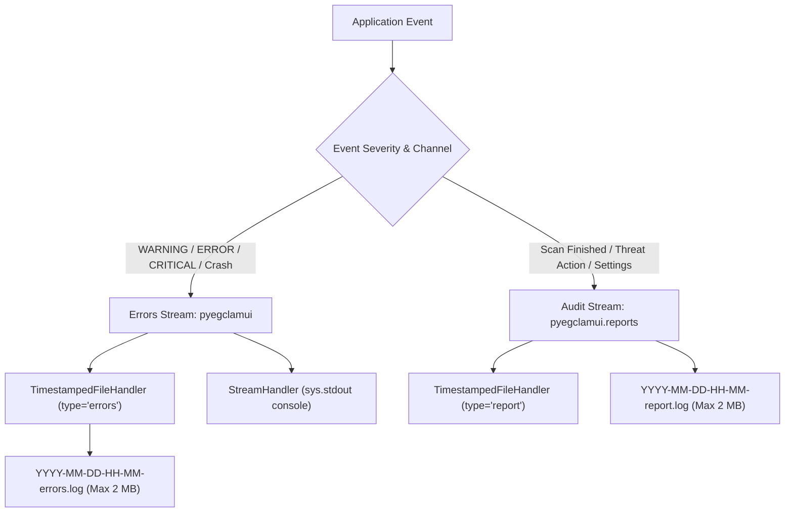
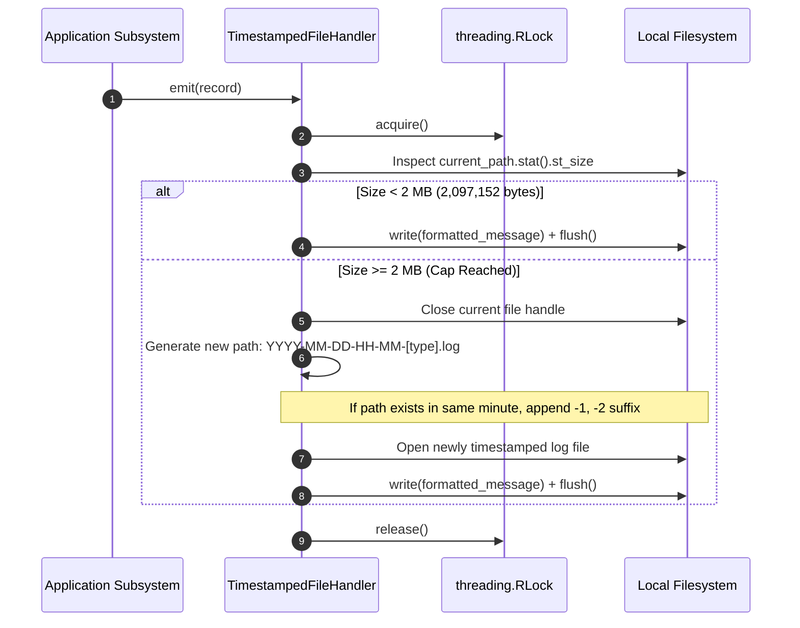
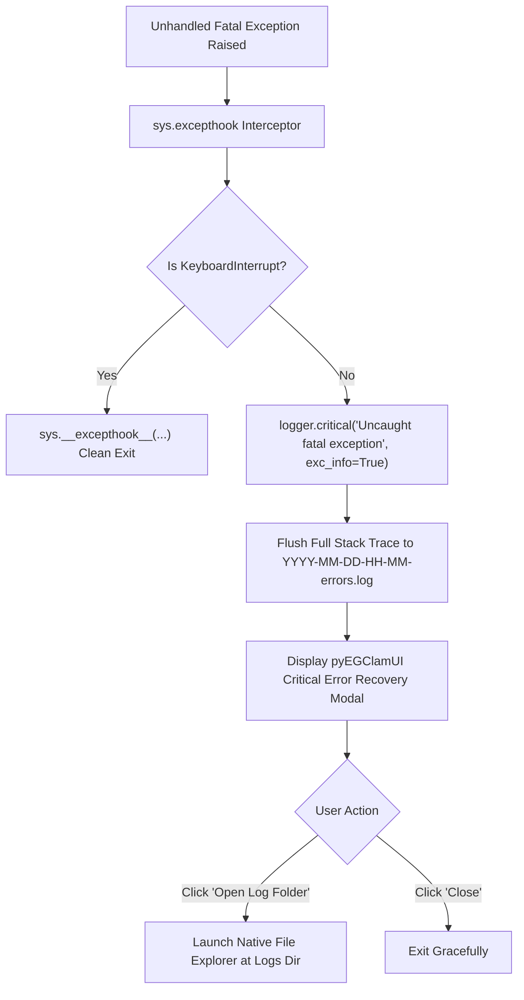

# Dual-Track Timestamped Logging Architecture

This document provides a comprehensive, code-independent guide to the dual-track logging subsystem in **pyEGClamUI**. It details the architectural separation between error diagnostics and operational audit trails, the 2 MB timestamped rollover policy, runtime crash trapping, and cross-platform log management.

---

## 1. Architectural Overview & Philosophy

Logging in pyEGClamUI is engineered to be **thread-safe**, **isolated**, **performant**, and **human-readable**:

* **Dual-Track Separation**: Error diagnostics (exceptions, warnings, crash traces) are strictly segregated from operational audit logs (scans executed, threats quarantined, settings updated).
* **2 MB Size-Capped Rotation**: No log file is ever permitted to grow unbounded. When any active log reaches **2 Megabytes (2,097,152 bytes)**, it rotates automatically to a fresh timestamped file.
* **Timestamped Naming**: Every log file name encodes its creation minute (`YYYY-MM-DD-HH-MM-<type>.log`), enabling instant chronological identification.
* **Crash Trapping & GUI Recovery**: Global unhandled exceptions are captured via `sys.excepthook`, recorded in full stack trace detail, and presented via a friendly user recovery dialog.
* **Standard Library Powered**: Built entirely with Python's native `logging` and `threading` modules with zero third-party dependencies.

---

## 2. Log Stream Classification

The application routes system events into two dedicated, non-overlapping streams:



### Stream Comparison Matrix

| Stream Attribute | Errors Stream (`*-errors.log`) | Audit Report Stream (`*-report.log`) |
| :--- | :--- | :--- |
| **Logger Name** | `pyegclamui` | `pyegclamui.reports` |
| **Target Audience** | Developers, technical support, debugging | End users, security auditors, compliance review |
| **Minimum Level** | 🟡 `logging.WARNING` (Level 30) | 🟢 `logging.INFO` (Level 20) |
| **Console Output** | 🟢 Yes (mirrored to `sys.stdout` for CLI dev) | ⚪ No (isolated strictly to audit report files) |
| **Monitored Events** | 🔴 Uncaught crashes, engine detection failures, socket timeouts | 🛡️ Scan completion summaries, threat quarantines, settings updates |
| **Rotation Trigger** | ⚡ File size reaches $\ge$ 2 MB | ⚡ File size reaches $\ge$ 2 MB |
| **Module Source** | [`TimestampedFileHandler`](../src/pyegclamui/core/logger.py) | [`TimestampedFileHandler`](../src/pyegclamui/core/logger.py) |

---

## 3. Timestamped File Rotation Lifecycle

File rotation in pyEGClamUI follows a thread-safe, size-capped progression:



### Rotation Algorithm Details

1. **Initial Startup**:
   - The handler scans the log folder for existing files matching `*-<log_type>*.log`.
   - If the most recent matching file is smaller than 2 MB, the application appends to it.
   - If the most recent file is $\ge$ 2 MB or none exists, a fresh timestamped file is generated.
2. **Same-Minute Collision Protection**:
   - If high write volume triggers rotation within the exact same minute as an existing 2 MB file, a counter is appended:
     - Primary: `2026-09-22-18-30-report.log`
     - Second file: `2026-09-22-18-30-report-1.log`
     - Third file: `2026-09-22-18-30-report-2.log`
3. **Reentrant Thread Safety**:
   - All size inspections, file pointer closures, and write flushes are synchronized using `threading.RLock()`, preventing deadlocks and race conditions when background workers write concurrently.

---

## 4. Structured Audit Log Formats

All operational entries written to `*-report.log` use structured, parseable key-value tokens:

### 4.1 Scan Completion Audit Record

Logged automatically by [`log_scan_report()`](../src/pyegclamui/core/logger.py):

```text
2026-09-22 18:25:30 [REPORT] Scan Completed | Type: 'Quick Scan' | Scanned: 420 | Threats: 0 | Duration: 1.84s | Target(s): [C:\Users\User\Downloads, C:\Users\User\Desktop]
```

When threats are identified during a scan:
```text
2026-09-22 18:26:12 [REPORT] Scan Completed | Type: 'Real-Time Guard' | Scanned: 1 | Threats: 1 | Duration: 0.02s | Target(s): [C:\Users\User\Downloads\eicar.com] | Details: Remediation: QUARANTINE
```

### 4.2 Threat Quarantine & Vault Action Record

Logged automatically by [`log_quarantine_action()`](../src/pyegclamui/core/logger.py):

```text
2026-09-22 18:26:12 [REPORT] Quarantine Action: QUARANTINED | File: 'C:\Users\User\Downloads\eicar.com' | Threat: 'Win.Test.EICAR_HDB-1'
2026-09-22 18:27:05 [REPORT] Quarantine Action: RESTORED | File: 'C:\Users\User\Downloads\eicar.com' | Threat: 'Win.Test.EICAR_HDB-1'
2026-09-22 18:28:10 [REPORT] Quarantine Action: DELETED | File: 'C:\Users\User\Downloads\eicar.com' | Threat: 'Win.Test.EICAR_HDB-1'
```

### 4.3 Settings Modification Audit Record

Logged automatically by [`log_settings_change()`](../src/pyegclamui/core/logger.py):

```text
2026-09-22 18:29:40 [REPORT] Settings Updated | User updated settings via Settings tab
```

---

## 5. Uncaught Crash Interception & Recovery Dialog

Unhandled runtime exceptions can cause abrupt window termination. pyEGClamUI intercepts all uncaught exceptions at the Python runtime level via [`install_crash_handler()`](../src/pyegclamui/gui/app.py):



### Crash Recovery Modal Features
* Displays the exact exception class name and message (e.g. `PermissionError: [WinError 5] Access is denied`).
* Reassures the user that full debugging context has been saved safely to disk.
* Provides an **"Open Log Folder"** button so users can easily attach logs to issue tickets.

---

## 6. Cross-Platform Directory Resolution

Log files are stored in standard user application data paths resolved dynamically at runtime:

| Operating System | Default Log Storage Directory | Path Resolution Helper |
| :--- | :--- | :--- |
| **Windows 10 / 11** | `%LOCALAPPDATA%\pyEGClamUI\logs\` | [`AppPaths.get_logs_dir()`](../src/pyegclamui/core/config.py) |
| **Linux (XDG)** | `~/.local/state/pyegclamui/logs/` (or `$XDG_STATE_HOME`) | [`AppPaths.get_logs_dir()`](../src/pyegclamui/core/config.py) |
| **macOS** | `~/Library/Logs/pyEGClamUI/` | [`AppPaths.get_logs_dir()`](../src/pyegclamui/core/config.py) |

### Native OS Explorer Integration

Users can reveal the log directory directly from the desktop interface by clicking:
1. **About Tab** $\rightarrow$ `[ Open Log Folder ]`
2. **Crash Recovery Dialog** $\rightarrow$ `[ Open Log Folder ]`
3. Programmatic launch via [`open_log_folder()`](../src/pyegclamui/core/logger.py):
   * **Windows**: `os.startfile(logs_dir)`
   * **macOS**: `subprocess.run(["open", logs_dir])`
   * **Linux**: `subprocess.run(["xdg-open", logs_dir])`

---

## 7. Related Source Modules & Unit Tests

* **Implementation**:
  * [`src/pyegclamui/core/logger.py`](../src/pyegclamui/core/logger.py) — Core logging engine, file handler, rotation mechanics.
  * [`src/pyegclamui/gui/app.py`](../src/pyegclamui/gui/app.py) — Crash hook installation and Qt startup.
  * [`src/pyegclamui/gui/main_window.py`](../src/pyegclamui/gui/main_window.py) — GUI event linkage and About tab controls.
* **Automated Tests**:
  * [`tests/test_dual_logging.py`](../tests/test_dual_logging.py) — Validates handler creation, 2 MB rollover, stream segregation, and helper functions.
