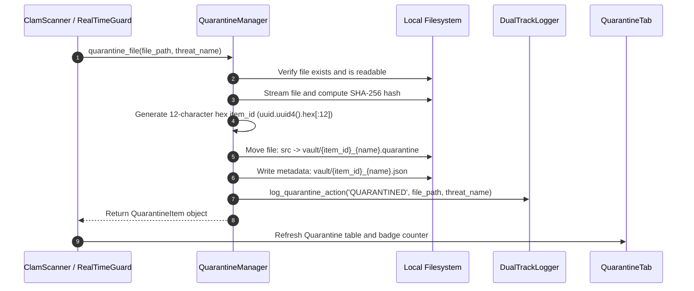
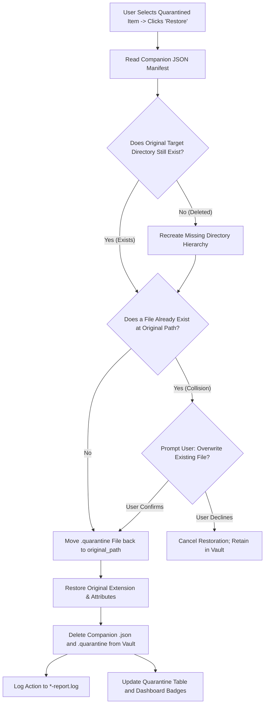
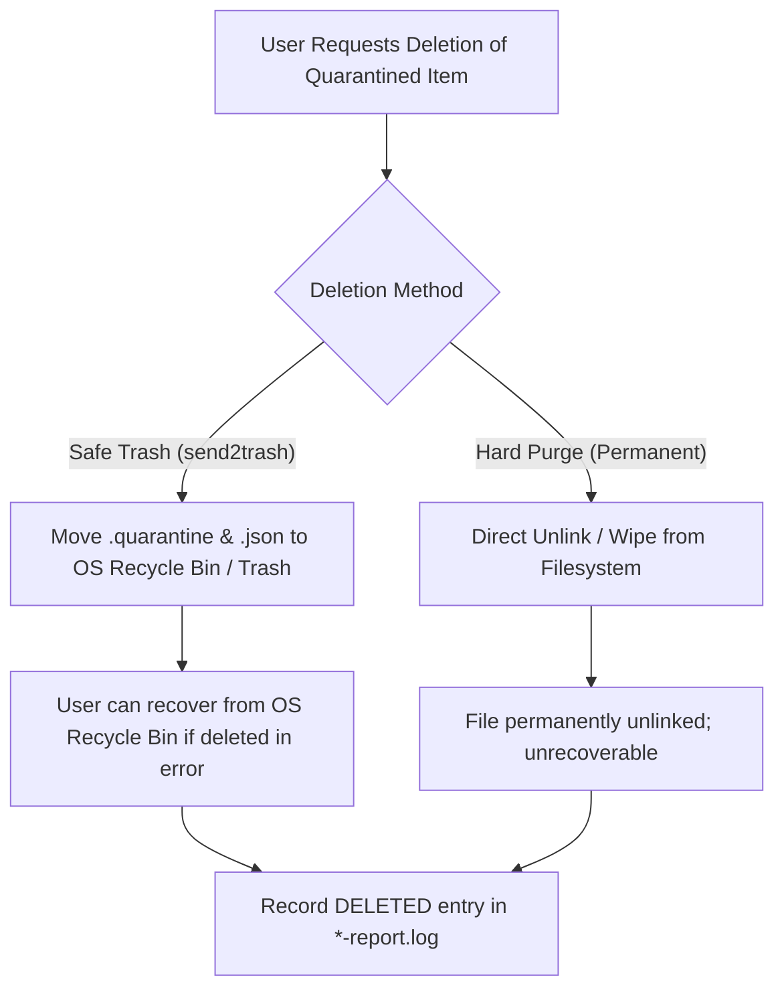

# Quarantine Vault & Threat Isolation Architecture

This document provides a comprehensive, code-independent architectural reference for the Quarantine Vault and Threat Remediation subsystem in **pyEGClamUI**. It explains the isolation file structure, non-executable neutralization, SHA-256 integrity verification, hardened access permissions, safe restoration, and unrecoverable shredding vs. Recycle Bin disposal.

---

## 1. Architectural Overview & Philosophy

When an antivirus detects malicious code, executing immediate hard file deletion risks unrecoverable data loss due to potential false positives. Conversely, leaving infected files active on the filesystem risks lateral malware execution.

The Quarantine Vault solves this dilemma through **safe, isolated containment**:

* **Non-Executable Neutralization**: Quarantined files are renamed with a non-executable `.quarantine` extension, completely neutralizing them from accidental execution by the OS or the user.
* **Atomic Ingestion**: Files are moved atomically from their host location into an isolated vault directory, instantly terminating any file system access.
* **Cryptographic SHA-256 Hashing**: A full SHA-256 checksum is calculated before isolation and stored in a metadata manifest, enabling integrity verification upon restoration.
* **Hardened File Permissions**: The vault directory and contained files are locked down with strict user-only permissions (`0o700`), preventing access from other non-privileged user accounts.
* **Reversible Restoration**: Every item retains its full original absolute path, directory structure, and timestamp, allowing clean, one-click restoration if a detection is confirmed benign.
* **Dual Deletion Pathways**: Supports both permanent deletion and moving to the native OS Recycle Bin / Trash (`send2trash`).

---

## 2. Vault Storage Directory Structure

Quarantine data resides in a dedicated application storage folder resolved dynamically per platform:

```
quarantine/
├── a1b2c3d4e5f6_trojan.exe.quarantine   # Neutralized payload (binary content)
├── a1b2c3d4e5f6_trojan.exe.json         # Companion metadata manifest
├── f7e8d9c0b1a2_eicar.com.quarantine    # Neutralized payload
├── f7e8d9c0b1a2_eicar.com.json          # Companion metadata manifest
└── ...
```

### Storage Locations by Operating System

| Operating System | Default Quarantine Vault Location | Access Restriction |
| :--- | :--- | :--- |
| **Windows 10 / 11** | `%LOCALAPPDATA%\pyEGClamUI\quarantine\` | Current user account ACL |
| **Linux (XDG)** | `~/.local/share/pyegclamui/quarantine/` (or `$XDG_DATA_HOME`) | Mode `0o700` (`rwx------`) |
| **macOS** | `~/Library/Application Support/pyEGClamUI/quarantine/` | Mode `0o700` (`rwx------`) |

---

## 3. Threat Isolation Lifecycle

When ClamAV identifies a threat and the remediation policy is set to **Quarantine**, the file undergoes an atomic 6-stage isolation procedure:



### Metadata Companion Schema (`.json`)

Each quarantined item has a companion JSON manifest describing its provenance:

```json
{
  "id": "e4a82f1b0c9d",
  "original_path": "C:\\Users\\User\\Downloads\\suspicious_installer.exe",
  "filename": "suspicious_installer.exe",
  "threat_name": "Win.Trojan.Agent-12345",
  "quarantine_date": "2026-09-22 18:35:10",
  "file_size_bytes": 1048576,
  "sha256": "8f434346648f6b96df89dda901c5176b10a6d83961dd3c1ac88b59b2dc327aa4",
  "quarantined_filename": "e4a82f1b0c9d_suspicious_installer.exe.quarantine",
  "status": "quarantined"
}
```

### Metadata Field Specifications

| Field | Type | Description |
| :--- | :--- | :--- |
| `id` | `string` | Unique 12-character hexadecimal identifier generated from UUID4. |
| `original_path` | `string` | Absolute path on host filesystem where the file was originally located. |
| `filename` | `string` | Basename of the file (e.g. `suspicious_installer.exe`). |
| `threat_name` | `string` | ClamAV signature name triggering the detection (e.g. `Win.Test.EICAR_HDB-1`). |
| `quarantine_date`| `string` | Human-readable timestamp format `YYYY-MM-DD HH:MM:SS`. |
| `file_size_bytes`| `integer`| Exact file size in bytes at the time of quarantine. |
| `sha256` | `string` | 64-character lowercase hexadecimal SHA-256 cryptographic digest. |
| `quarantined_filename`| `string`| Name of the neutralized payload file stored within the vault. |
| `status` | `string` | Operational state: `quarantined`, `restored`, or `deleted`. |

---

## 4. File Restoration Workflow

If a detection is verified as a benign false positive, the user can restore it cleanly from the **Quarantine Tab**:



---

## 5. Deletion Pathways: Safe Trash vs. Hard Purge

pyEGClamUI offers two distinct threat deletion strategies to balance security needs with accident prevention:



### Deletion Comparison

| Feature | Safe Trash (`send2trash`) | Permanent Hard Purge |
| :--- | :--- | :--- |
| **Destruction Level** | 🟡 Moves to OS Trash / Recycle Bin | 🔴 Atomic filesystem `unlink()` |
| **Recovery Possibility** | 🟢 Recoverable via OS Recycle Bin | ❌ Irrevocably destroyed |
| **Audit Logging** | 🟢 Logged as `DELETED` in `*-report.log` | 🟢 Logged as `DELETED` in `*-report.log` |
| **Security Use Case** | 🛡️ Accidental click protection for general users | 🛡️ Compliance purging of confirmed malware payloads |

---

## 6. Security Threat Model & Protections

| Potential Threat / Attack Vector | Mitigation in pyEGClamUI Quarantine Vault |
| :--- | :--- |
| **Accidental Execution** | 🛡️ Payload renamed to `.quarantine`; executable header bits stripped or disabled on systems respecting extensions. |
| **File Tampering / Corruption** | 🛡️ SHA-256 hash computed before quarantine and verified before restore. |
| **Unauthorized Multi-User Access** | 🛡️ Vault folder created with `0o700` user-only permissions. |
| **Name Collision in Vault** | 🛡️ Every item receives a unique random 12-char hex UUID prefix (`{id}_{name}.quarantine`). |
| **Directory Traversal Attack** | 🛡️ Original paths resolved via `Path.resolve()` and validated against root drives. |

---

## 7. Related Source Modules & Unit Tests

* **Implementation**:
  - [`src/pyegclamui/core/quarantine.py`](../src/pyegclamui/core/quarantine.py) — `QuarantineManager`, `QuarantineItem`, SHA-256 hashing, move, restore, delete logic.
  - [`src/pyegclamui/gui/main_window.py`](../src/pyegclamui/gui/main_window.py) — Quarantine UI tab, table view, restore/delete actions, badge updates.
* **Automated Tests**:
  - [`tests/test_quarantine.py`](../tests/test_quarantine.py) — Validates quarantine ingestion, JSON metadata persistence, SHA-256 verification, restoration, and deletion.
