# pyEGClamUI Documentation Index

Welcome to the definitive technical and architectural documentation for **pyEGClamUI** (`pyegclamui`). This documentation suite provides an exhaustive reference for users, developers, system administrators, and security auditors, explaining every subsystem in depth without requiring source code inspection.

---

## Documentation Map

```mermaid
graph TD
    Index["Documentation Index (docs/README.md)"]
    
    subgraph Core Architecture
        Arch["System Architecture (docs/ARCHITECTURE.md)"]
        Engines["Core Engine Subsystems (docs/CORE_ENGINES.md)"]
        Config["Configuration & Schemas (docs/CONFIG_SCHEMA.md)"]
    end
    
    subgraph Individual Subsystem Deep Dives
        RT["Real-Time Guard & 2-Folder Watch (docs/REALTIME_GUARD.md)"]
        Tray["System Tray & Lifecycle (docs/TRAY_AND_LIFECYCLE.md)"]
        Vault["Quarantine Vault & Remediation (docs/QUARANTINE_VAULT.md)"]
        Scan["Scanner Engine & Streaming (docs/SCANNER_ENGINE.md)"]
        Update["Signature Database Updater (docs/SIGNATURE_UPDATER.md)"]
        Log["Dual-Track 2MB Logging (docs/LOGGING.md)"]
        Telem["Transparent Opt-In Telemetry (docs/TELEMETRY_LOGIC.md)"]
        GUI["GUI Architecture & Design System (docs/GUI_DESIGN_SYSTEM.md)"]
    end

    subgraph Security & Operations
        Cross["Cross-Platform Hardening (docs/CROSS_PLATFORM.md)"]
        CLI["CLI Command Reference (docs/CLI_REFERENCE.md)"]
        Sec["Security & Privacy Model (docs/SECURITY_MODEL.md)"]
        Ver["Versioning & Release Management (docs/VERSIONING.md)"]
        Workflow["Development & Release Workflow (docs/DEVELOPMENT_WORKFLOW.md)"]
    end

    Index --> Arch
    Index --> Engines
    Index --> Config
    
    Index --> RT
    Index --> Tray
    Index --> Vault
    Index --> Scan
    Index --> Update
    Index --> Log
    Index --> Telem
    Index --> GUI
    
    Index --> Cross
    Index --> CLI
    Index --> Sec
    Index --> Ver
    Index --> Workflow

    Arch --> RT
    Arch --> Tray
    Arch --> Vault
    Arch --> Scan
    Arch --> Update
    Arch --> Log
    Arch --> Telem
    Arch --> GUI
```



---

## Standalone Subsystem Deep-Dive Guides

| Document | Purpose | Key Topics Covered |
| :--- | :--- | :--- |
| **[Real-Time Filesystem Guard](REALTIME_GUARD.md)** | Background threat interception | Strict 2-directory cap (Desktop & Downloads), watchdog kernel events, 1.5s debouncing, temporary file filters (`.crdownload`, `.tmp`), file lock probing, resident daemon (`clamd`) socket acceleration (~20ms), threat actions |
| **[System Tray & Lifecycle](TRAY_AND_LIFECYCLE.md)** | Continuous background execution | Close-to-tray window interception, two-step exit confirmation dialog, cross-platform autostart persistence (Windows Registry, Linux XDG, macOS LaunchAgents), dynamic health tooltips, desktop notification balloons |
| **[Quarantine Vault](QUARANTINE_VAULT.md)** | Safe threat isolation and recovery | Non-executable `.quarantine` neutralization, SHA-256 pre/post hashing, JSON companion metadata manifest, `0o700` permission lockdown, safe restoration workflow, unrecoverable shredding vs native OS Trash (`send2trash`) |
| **[Scanner Subsystem](SCANNER_ENGINE.md)** | Detection engine and stream parsing | Quick, Full, and Custom scan profiles, safe CLI argument isolation (no `shell=True`), real-time stdout regex stream parsing (`FOUND`, `OK`, `ERROR`), `clamd` socket streaming (`INSTREAM`), scan state machine (Pause/Resume/Cancel) |
| **[Signature Updater](SIGNATURE_UPDATER.md)** | Definition freshness and updating | `freshclam` invocation, CVD database files (`daily`, `main`, `bytecode`), header age calculation (<3d, 4-7d, >7d), auto-generated `freshclam.conf`, mirror failover (`database.clamav.net`), exit code translation |
| **[Dual-Track Logging](LOGGING.md)** | Segregated diagnostics and audit trails | 2 MB size-capped timestamped rotation (`YYYY-MM-DD-HH-MM-[type].log`), `pyegclamui` error stream vs `pyegclamui.reports` audit stream, global `sys.excepthook` crash recovery modal, native explorer integration |
| **[Telemetry Logic & Privacy](TELEMETRY_LOGIC.md)** | Transparent opt-in diagnostics | 100% opt-in policy (off by default), zero hidden trackers, random Guest ID generator, granular consent checkboxes (OS, Engine, Stats), zero hostname/IP collection, Firestore REST JSON mapping, live data preview modal, bug reporter with screenshots |
| **[GUI Design System](GUI_DESIGN_SYSTEM.md)** | PySide6 interface and aesthetics | Modern dark palette (Zinc/Slate/Emerald), reusable widgets (`ModernCard`, `Badge`, `ToggleSwitch`, `LogViewer`), high-DPI scaling, Windows DWM dark titlebar, 3-tier reactive status matrix, 5-tab dashboard breakdown |

---

## Core System Architecture & Operational Guides

| Document | Purpose | Key Topics Covered |
| :--- | :--- | :--- |
| **[Architecture & Design](ARCHITECTURE.md)** | High-level system structure and threading model | PySide6 GUI layer, Qt signal/slot concurrency, engine abstraction, real-time event pipeline, background worker segregation |
| **[Core Engines](CORE_ENGINES.md)** | Subsystem classes and responsibilities | `ClamEngineDetector`, `ClamScanner`, `ClamDaemonClient`, `QuarantineManager`, `ClamUpdater`, `RealTimeGuard`, `DualTrackLogger`, `TelemetryManager` |
| **[Cross-Platform Hardening](CROSS_PLATFORM.md)** | Operating system interoperability | Windows 10/11, Linux (Debian/Fedora/Arch), macOS (Homebrew/Apple Silicon), path mapping, socket discovery, native platform adaptations |
| **[Configuration & Schemas](CONFIG_SCHEMA.md)** | Data structures and persistent storage | `config.json` schema, quarantine metadata manifest, Firestore REST document schema, defaults, and OS storage locations |
| **[CLI Reference](CLI_REFERENCE.md)** | Command-line utilities guide | `pyegclamui`, `egclam`, `pyegclamui-scan`, `pyegclamui-setup`, argument reference, exit codes |
| **[Security & Privacy](SECURITY_MODEL.md)** | Safety, integrity, and privacy standards | Zero-telemetry policy, subprocess parameter isolation (no `shell=True`), SHA-256 verification, FOSS compliance |
| **[Application Versioning](VERSIONING.md)** | Single source of truth (SSOT) and release management | SemVer 2.0.0 criteria, __version__ sync, pyproject.toml alignment, release tagging workflow, automated tests |
| **[Development & Release Workflow](DEVELOPMENT_WORKFLOW.md)** | Branching strategy, CI/CD and staging architecture | Trunk-based feature branching, PR gates, scratch staging isolation, release publishing runbook |
| **[Universal Setup Suite](../setup/README.md)** | Bootstrap installer, updater & shortcuts | Cross-platform setup (`setup.py`), 1-liner PowerShell (`install.ps1`), 1-liner Bash (`install.sh`), `--update`, `.venv` isolation |
| **[Administrator TODO Checklist](../TODO.md)** | External setup action items | Cloud Firestore project setup, production security rules, local `clamd` service, PyInstaller packaging |

---

## Project Directory Structure


```
pyEGClamUI/
├── docs/                              # Comprehensive architectural & user documentation
│   ├── README.md                      # Documentation index (this file)
│   ├── ARCHITECTURE.md                # System architecture & threading model
│   ├── CORE_ENGINES.md                # In-depth subsystem specifications
│   ├── CROSS_PLATFORM.md              # OS-specific integration & hardening
│   ├── CONFIG_SCHEMA.md               # JSON configuration & data schemas
│   ├── CLI_REFERENCE.md               # Command-line tools & syntax reference
│   ├── DEVELOPMENT_WORKFLOW.md        # Branching model, PR gates & scratch staging
│   ├── SECURITY_MODEL.md              # Security, isolation & privacy standards
│   ├── REALTIME_GUARD.md              # Filesystem surveillance & 2-folder cap
│   ├── TRAY_AND_LIFECYCLE.md          # System tray daemon & exit confirmation
│   ├── QUARANTINE_VAULT.md            # Threat isolation vault & SHA-256 hashing
│   ├── SCANNER_ENGINE.md              # Scanner engine, clamd stream & regex parser
│   ├── SIGNATURE_UPDATER.md           # freshclam updater & CVD freshness heuristics
│   ├── LOGGING.md                     # Dual-track 2MB timestamped logging & crash modal
│   ├── TELEMETRY_LOGIC.md             # Opt-in Firestore telemetry & user profile
│   ├── GUI_DESIGN_SYSTEM.md           # PySide6 UI design tokens & custom widgets
│   └── VERSIONING.md                  # Application versioning, SSOT & release tagging
├── setup/                             # Universal setup, update & deployment suite
│   ├── README.md                      # Setup suite architecture & CLI reference
│   ├── setup.py                       # Master cross-platform installer & updater
│   ├── install.ps1                    # Windows PowerShell 1-liner bootstrap launcher
│   └── install.sh                     # Linux & macOS Bash 1-liner bootstrap launcher
├── src/
│   └── pyegclamui/                    # Core Python package
│       ├── __init__.py                # Package version definition
│       ├── __main__.py                # Package execution entry point
│       ├── assets/                    # Application icons, themes & .desktop templates
│       ├── core/                      # Engine abstraction & backend subsystems
│       │   ├── autostart.py           # Cross-platform startup launcher
│       │   ├── config.py              # Configuration manager & AppPaths
│       │   ├── daemon.py              # clamd Unix/TCP socket client & protocols
│       │   ├── desktop_integration.py # Linux XDG desktop menu integration
│       │   ├── detector.py            # Multi-path ClamAV auto-discovery
│       │   ├── logger.py              # Dual-track timestamped 2MB logging & crash handler
│       │   ├── monitor.py             # Watchdog real-time file monitor (Max 2 folders)
│       │   ├── quarantine.py          # Secure threat isolation vault
│       │   ├── scanner.py             # Subprocess scanner & stream parser (clamd priority)
│       │   ├── setup_engine.py        # Automated engine setup & installer
│       │   ├── telemetry.py           # Opt-in Firestore REST diagnostics & user profile
│       │   └── updater.py             # freshclam signature updater
│       └── gui/                       # PySide6 desktop user interface
│           ├── app.py                 # Application lifecycle & main()
│           ├── icons.py               # Programmatic High-DPI Vector Icon Factory
│           ├── main_window.py         # 5-tab dashboard window
│           ├── platform_theme.py      # Cross-platform native dark titlebar manager
│           ├── scan_dialog.py         # Active scan progress dialog
│           ├── setup_dialog.py        # Universal setup wizard dialog
│           ├── styles.py              # Modular dark theme QSS styling
│           └── tray.py                # System tray daemon & desktop notifications
├── tests/                             # Automated pytest test suite (79 tests)
├── pyproject.toml                     # PEP 517/621 build configuration
├── requirements.txt                   # Backwards compatibility dependencies
├── LICENSE                            # GNU GPL-3.0 License
├── README.md                          # Root project README
└── TODO.md                            # External setup & administration checklist
```


### Key Source Module Directory

| Subsystem | Source File | Description |
| :--- | :--- | :--- |
| **GUI Dashboard** | [`../src/pyegclamui/gui/main_window.py`](../src/pyegclamui/gui/main_window.py) | Main window with 5 tabs, reactive 3-tier status matrix, action handlers |
| **Active Scan Telemetry** | [`../src/pyegclamui/gui/scan_dialog.py`](../src/pyegclamui/gui/scan_dialog.py) | Active scan modal, progress bar, live path ticker, threat table |
| **Engine Setup Wizard** | [`../src/pyegclamui/gui/setup_dialog.py`](../src/pyegclamui/gui/setup_dialog.py) | Guided engine discovery, installation wizard, custom path linker |
| **System Tray Daemon** | [`../src/pyegclamui/gui/tray.py`](../src/pyegclamui/gui/tray.py) | Background tray icon, quick actions, native desktop notifications |
| **Vector Icon Engine** | [`../src/pyegclamui/gui/icons.py`](../src/pyegclamui/gui/icons.py) | Procedural QPainter vector icons and status shields |
| **Native Titlebar Manager** | [`../src/pyegclamui/gui/platform_theme.py`](../src/pyegclamui/gui/platform_theme.py) | Windows DWM immersive dark mode and cross-platform window theme |
| **QSS Dark Theme** | [`../src/pyegclamui/gui/styles.py`](../src/pyegclamui/gui/styles.py) | Unified dark palette tokens and widget style definitions |
| **Dual-Track Logger** | [`../src/pyegclamui/core/logger.py`](../src/pyegclamui/core/logger.py) | 2MB timestamped log rollover, audit tokens, sys.excepthook crash handler |
| **Telemetry Manager** | [`../src/pyegclamui/core/telemetry.py`](../src/pyegclamui/core/telemetry.py) | Opt-in Firestore REST reporter, user profile ID, issue reporter |
| **Engine Detector** | [`../src/pyegclamui/core/detector.py`](../src/pyegclamui/core/detector.py) | PATH and directory auto-discovery for clamscan, clamd, freshclam |
| **Scanner Engine** | [`../src/pyegclamui/core/scanner.py`](../src/pyegclamui/core/scanner.py) | Subprocess execution, real-time output parsing, threat remediation |
| **Daemon Socket Client** | [`../src/pyegclamui/core/daemon.py`](../src/pyegclamui/core/daemon.py) | clamd Unix domain and TCP socket client with INSTREAM chunk protocol |
| **Quarantine Vault** | [`../src/pyegclamui/core/quarantine.py`](../src/pyegclamui/core/quarantine.py) | SHA-256 fingerprinting, vault isolation, metadata manifest, file restore |
| **Signature Updater** | [`../src/pyegclamui/core/updater.py`](../src/pyegclamui/core/updater.py) | freshclam updater executor and database date freshness validator |
| **Real-Time Guard** | [`../src/pyegclamui/core/monitor.py`](../src/pyegclamui/core/monitor.py) | Watchdog file observer with debouncing queue and lock verification |
| **System Autostart** | [`../src/pyegclamui/core/autostart.py`](../src/pyegclamui/core/autostart.py) | Windows Registry, Linux XDG autostart, and macOS LaunchAgent manager |
| **Desktop Integration** | [`../src/pyegclamui/core/desktop_integration.py`](../src/pyegclamui/core/desktop_integration.py) | Linux XDG .desktop launcher generator and hicolor icon installer |
| **Settings & AppPaths** | [`../src/pyegclamui/core/config.py`](../src/pyegclamui/core/config.py) | Dynamic OS path resolution, JSON configuration storage |
| **Engine Setup Backend** | [`../src/pyegclamui/core/setup_engine.py`](../src/pyegclamui/core/setup_engine.py) | Automated non-interactive winget/package manager installer backend |

---

## System Requirements & Technology Stack

| Component | Minimum Requirement | Recommended |
| :--- | :--- | :--- |
| **Python** | Python 3.9+ | Python 3.11 or 3.12 |
| **GUI Framework** | PySide6 >= 6.5.0 (Qt 6.5+) | PySide6 6.7+ |
| **Operating System** | Windows 10/11, Linux (kernel 4.15+), macOS 12+ | Windows 11, Ubuntu 24.04, macOS 14+ |
| **Antivirus Backend** | Cisco ClamAV® 0.103+ | Cisco ClamAV® 1.4+ / 1.5+ |
| **Process Monitoring** | psutil >= 5.9.0 | psutil latest |
| **File Monitoring** | watchdog >= 3.0.0 | watchdog latest |
| **Safe Deletion** | send2trash >= 1.8.0 | send2trash latest |
| **License** | GPL-3.0-or-later | 100% Free & Open-Source (FOSS) |
