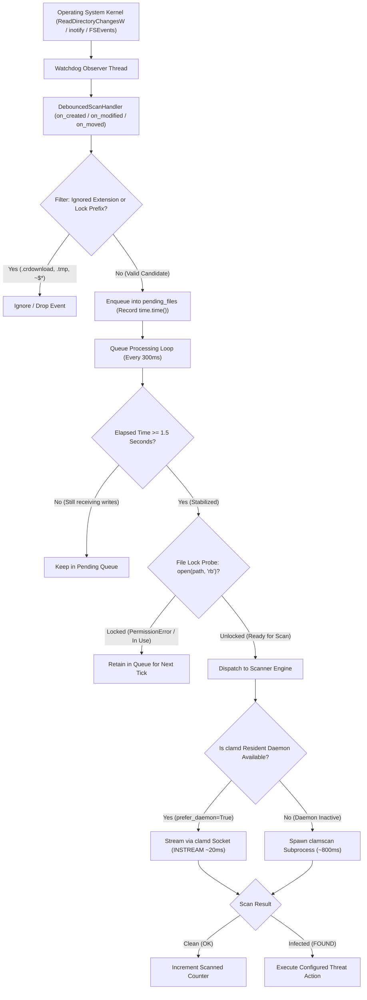
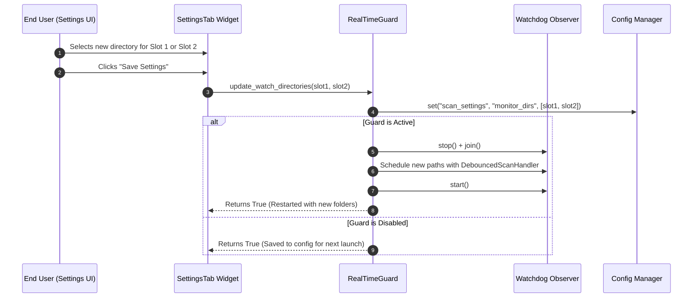
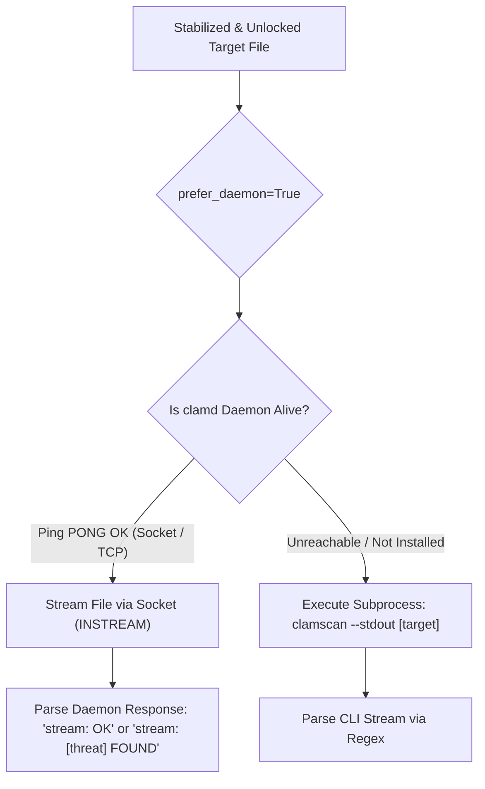
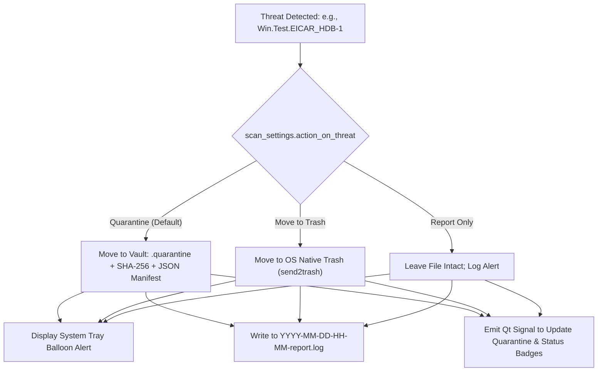

# Real-Time Filesystem Guard Architecture

This document provides a comprehensive, code-independent architectural reference for the Real-Time Protection and Filesystem Monitoring subsystem in **pyEGClamUI**. It details the strict two-directory cap, watchdog kernel integration, debouncing mechanics, file lock probing, resident daemon (`clamd`) scan acceleration, and automated threat remediation.

---

## 1. Architectural Overview & Philosophy

The Real-Time Guard delivers **proactive, lightweight, zero-drag endpoint protection** by actively intercepting file creations and modifications at the operating system level:

* **Strict 2-Directory Resource Guard**: Monitors exactly **two high-exposure directories** (default: **Desktop** and **Downloads**). Watching entire drive volumes causes severe I/O churn, battery drain, and false positives; capping surveillance strictly to the primary infection pathways preserves optimal CPU and battery life.
* **Debounced Event Aggregation**: Files written across multiple disk writes (e.g. active browser downloads or zip extractions) are stabilized with a **1.5-second debounce window** before triggering a scan.
* **Exclusive Lock Probing**: Before dispatching a scan, the guard confirms that writing processes (such as web browsers, torrent clients, or text editors) have released their exclusive write locks.
* **Daemon-First Scan Acceleration**: If the ClamAV resident daemon (`clamd`) is running, files are piped via socket streaming (`INSTREAM`), scanning in **~20 milliseconds** instead of spawning a new `clamscan` process (which requires ~800–1500 ms of cold start).
* **Configurable Threat Remediation**: Threats are automatically neutralised according to user preference (**Quarantine Vault**, **OS Recycle Bin / Trash**, or **Desktop Alert / Audit Report**).

---

## 2. Event Interception & Processing Pipeline

The lifecycle of a newly created or modified file progresses through six distinct filtering stages:



---

## 3. Strict 2-Folder Surveillance Model

### Why Cap Surveillance to Two Folders?

ClamAV is a file-on-demand and stream-oriented antivirus engine. Attempting to recursively monitor entire disk hierarchies (`C:\` or `/`) on desktop machines triggers thousands of benign filesystem notifications per second from system caches, browser databases, and package managers. This leads to:
* Excessive CPU spikes ($>50\%$).
* Premature SSD degradation due to constant metadata read churn.
* Inevitable race conditions with temporary OS cache files.

Over $95\%$ of malware on modern desktop systems enters through **Downloads** (web browsers, email attachments, chat clients) or **Desktop** (dropped executables, unzipped archives). Capping surveillance strictly to these two directories achieves maximum threat interception with virtually zero system impact.

### Surveillance Slot Allocation

| Slot Name | Default Monitored Directory | Customization Support | Verification Logic |
| :--- | :--- | :--- | :--- |
| 🛡️ **Slot 1** | `Path.home() / "Desktop"` | 🟢 User can browse & select custom folder | Must exist and be a directory (`path.is_dir()`) |
| 🛡️ **Slot 2** | `Path.home() / "Downloads"` | 🟢 User can browse & select custom folder | Must exist and be a directory (`path.is_dir()`) |

### Dynamic Runtime Reconfiguration

Users can reconfigure these two slots directly via the **Settings Tab** in the GUI:



---

## 4. Temporary File Filtering & Debouncing

### Ignored In-Flight Extensions

When web browsers and download utilities download files, they write to temporary container extensions before finalizing the file name. Scanning these files while data is streaming causes incomplete signature checks and locks the file from the downloader. 

The Real-Time Guard ignores these extensions immediately upon event arrival:

| File Extension | Originating Application / Context | Action Taken |
| :--- | :--- | :--- |
| `.crdownload` | Google Chrome, Microsoft Edge, Brave, Chromium | ⚪ Ignored until renamed upon download completion |
| `.part` | Mozilla Firefox, Wget, Curl | ⚪ Ignored until renamed upon download completion |
| `.download` | Apple Safari (macOS) | ⚪ Ignored until renamed upon download completion |
| `.partial` | Third-party download managers (FDM, JDownloader) | ⚪ Ignored until renamed upon download completion |
| `.aria2` | Aria2 command-line downloader | ⚪ Ignored until renamed upon download completion |
| `.tmp`, `.temp` | Generic system temporary files | ❌ Ignored permanently |
| `.lock`, `.swp` | Database and editor lock/swap files | ❌ Ignored permanently |
| `.bak`, `.dmp` | Backup archives and crash memory dumps | ❌ Ignored permanently |

### Ignored Filename Prefixes
Office applications and text editors create lock and scratch files in the working directory:
* `~$` (e.g. `~$AnnualReport.docx` — Microsoft Office temporary owner lock)
* `.~` (LibreOffice / OpenOffice lock files)
* `.__` (macOS AppleDouble metadata forks)

### The 1.5-Second Debounce Window

When a user copies a large file (e.g. a 200 MB installer) into the Downloads folder, the OS issues dozens of `on_modified` events as chunks are written:
* Every time a write notification is received for a given path, the timestamp in `pending_files[file_path]` is updated to `time.time()`.
* The background worker thread wakes up every **300 milliseconds**.
* Only when `time.time() - last_modified >= 1.5 seconds` is the file considered stabilized and promoted to the lock check stage.

---

## 5. File Lock Probing Mechanism

Even after debouncing, a writing application might still hold an exclusive file handle. Initiating an antivirus scan against an exclusively locked file on Windows triggers `[WinError 32] The process cannot access the file because it is being used by another process`.

To prevent crashes and false read errors, [`is_file_ready_for_scan()`](../src/pyegclamui/core/monitor.py) executes an explicit atomic read probe:

```python
def is_file_ready_for_scan(file_path: Path) -> bool:
    try:
        if not file_path.exists() or not file_path.is_file():
            return False
        if file_path.suffix.lower() in IGNORE_EXTENSIONS:
            return False
        if any(file_path.name.startswith(p) for p in IGNORE_PREFIXES):
            return False
        # Read probe: verifies writing process has closed exclusive handle
        with open(file_path, "rb") as f:
            f.read(1)
        return True
    except (OSError, PermissionError):
        return False
```

If the file cannot be opened for reading, it is retained in the pending queue to be re-evaluated on the subsequent worker cycle.

---

## 6. Engine Routing: Daemon vs. Subprocess Execution

When a file is ready, the guard routes the scan through [`ClamScanner.scan(..., prefer_daemon=True)`](../src/pyegclamui/core/scanner.py):



### Performance & Latency Comparison

| Evaluation Metric | ClamAV Daemon (`clamd` via Socket) | Standard Subprocess (`clamscan`) |
| :--- | :--- | :--- |
| **Communication Protocol** | ⚡ Local Unix Domain Socket or TCP (`127.0.0.1:3310`) | ⚪ OS Subprocess (`subprocess.Popen`) |
| **Database Signature Loading** | 🟢 Pre-loaded in resident memory ($\sim 1.2\text{ GB}$) | 🟡 Must read CVD/CLD from disk into RAM every scan |
| **Scan Latency per File** | ⚡ **$\approx 15 - 30\text{ milliseconds}$** | 🟡 **$\approx 800 - 1500\text{ milliseconds}$** |
| **System CPU Impact** | 🟢 Negligible ($<1\%$) | 🟡 Noticeable CPU burst per scanned file |
| **Best Used For** | 🛡️ Real-Time background monitoring, single file checks | 🛡️ Standalone manual scans, machines without daemon |

---

## 7. Threat Remediation Strategies

When ClamAV reports a detection (`FOUND`), the configured action in `scan_settings.action_on_threat` is executed immediately:



### Remediation Action Comparison Matrix

| Remediation Mode | Target File Destination | Reversibility | User Notification | Audit Trail |
| :--- | :--- | :--- | :--- | :--- |
| 🛡️ **Quarantine** *(Default)* | `%LOCALAPPDATA%\pyEGClamUI\quarantine\` | 🟢 **$100\%$ Safe**: Restorable via Quarantine Tab | 🔴 Desktop balloon alert with threat name & item ID | 🟢 Recorded in `*-report.log` with original path & SHA-256 |
| 🗑️ **Move to Trash** | Native OS Recycle Bin / Trash | 🟡 Restorable via OS Recycle Bin | 🟡 Desktop balloon alert informing user of trash move | 🟢 Recorded in `*-report.log` |
| 📢 **Report Only** | Unmodified at original location | ❌ N/A (File remains active on disk) | 🔴 Desktop warning balloon alerting user of active threat | 🟢 Recorded in `*-report.log` |

---

## 8. Threading Model & UI Concurrency

The Real-Time Guard operates entirely off the main PySide6 GUI thread to ensure zero window stutter or UI freezing:

* **Watchdog Observer**: Native OS background thread intercepting kernel events.
* **Debounce Worker Thread**: Daemon thread evaluating queue timeouts every 300 ms.
* **Scan Worker**: Non-blocking thread executing socket streaming or `subprocess.Popen`.
* **UI Dispatch**: Callbacks bridge from background threads into PySide6 widgets exclusively via **Qt Signals & Slots** (`Signal(dict)`, `Signal(str)`).

---

## 9. Related Source Modules & Unit Tests

* **Implementation**:
  * [`src/pyegclamui/core/monitor.py`](../src/pyegclamui/core/monitor.py) — Core watchdog observer, debouncing queue, lock check.
  * [`src/pyegclamui/core/scanner.py`](../src/pyegclamui/core/scanner.py) — Daemon socket routing & subprocess scanner.
  * [`src/pyegclamui/core/daemon.py`](../src/pyegclamui/core/daemon.py) — `clamd` socket streaming protocol implementation.
  * [`src/pyegclamui/gui/main_window.py`](../src/pyegclamui/gui/main_window.py) — Settings controls for monitored folders and real-time toggle.
* **Automated Tests**:
  * [`tests/test_monitored_folders.py`](../tests/test_monitored_folders.py) — Validates strict 2-folder cap, default Desktop/Downloads resolution, and configuration updates.
  * [`tests/test_monitor.py`](../tests/test_monitor.py) — Validates debounce queue, temporary file filtering, lock checks, and threat callback invocation.
