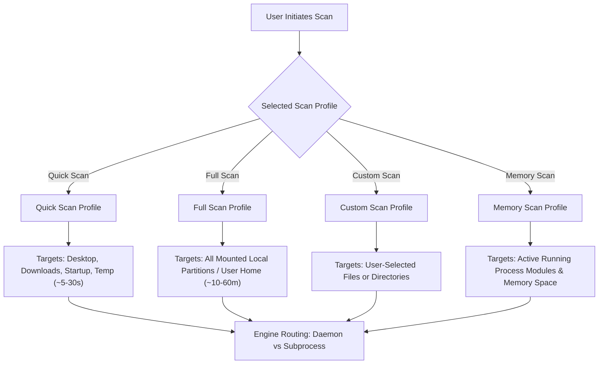
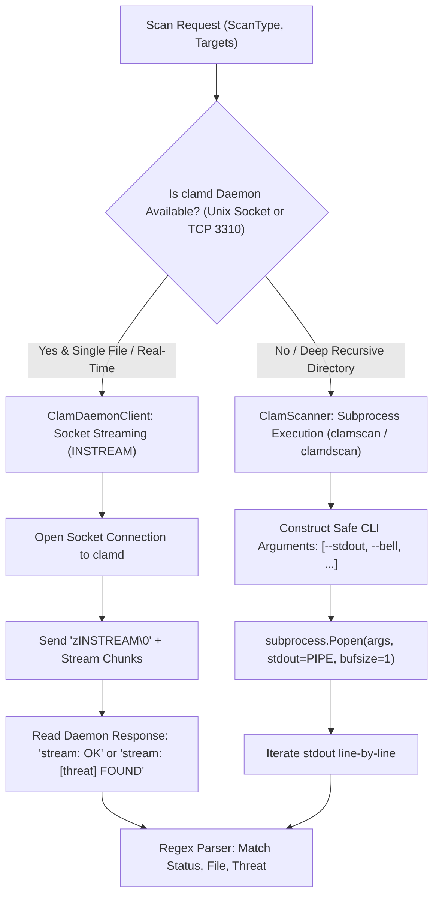
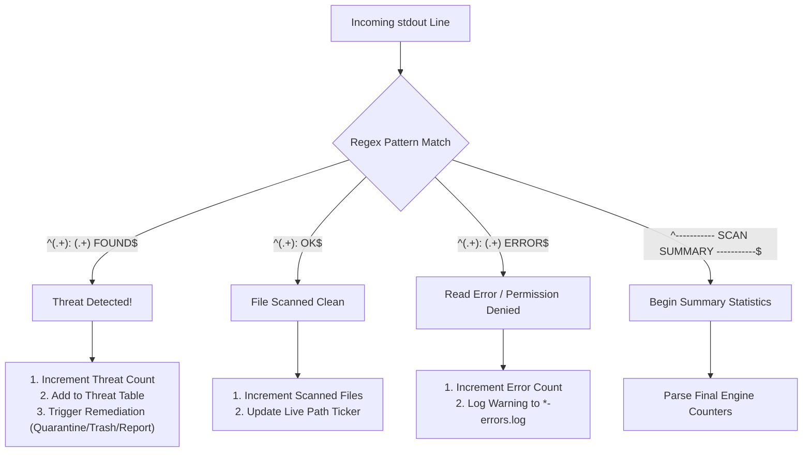
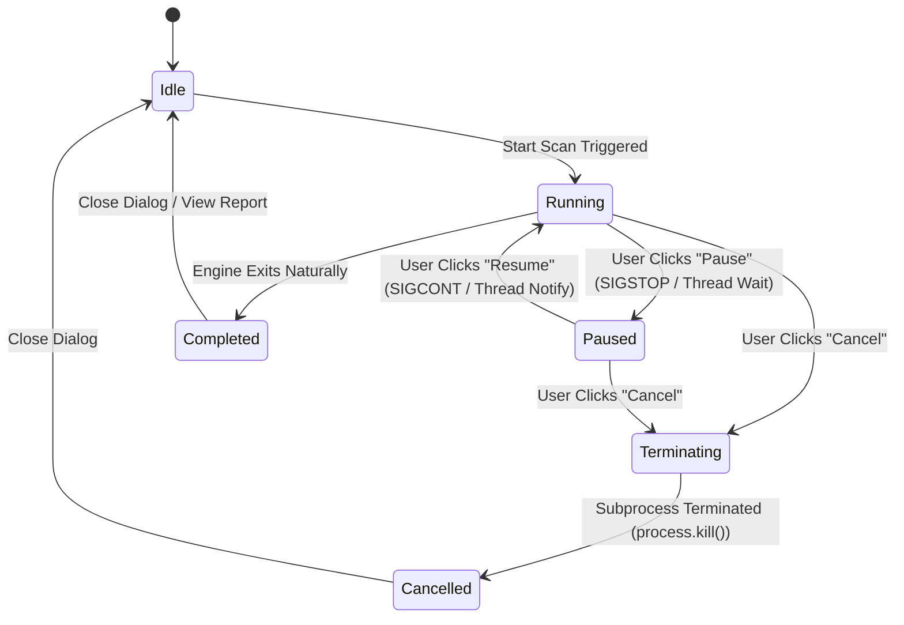

# Scanner Subsystem & Engine Routing Architecture

This document provides a comprehensive, code-independent architectural reference for the Scanner Engine and Subprocess Execution pipeline in **pyEGClamUI**. It details the scan profiles, resident daemon (`clamd`) socket streaming vs. `clamscan` CLI execution, real-time stdout stream parsing, progress metrics, and state management.

---

## 1. Architectural Overview & Philosophy

The scanning engine is the core detection pipeline of pyEGClamUI, designed with four fundamental principles:

* **Non-Blocking UI Concurrency**: All scanning operations execute inside dedicated background worker threads (`QThread`), communicating strictly via Qt Signals & Slots. The user interface remains fluid, responsive, and interactive throughout large scans.
* **Dual-Engine Routing**: Automatically detects and leverages the resident ClamAV daemon (`clamd`) via socket streaming (`INSTREAM`) when available, achieving instantaneous sub-20ms file scans. When the daemon is absent, it seamlessly falls back to isolated `clamscan` subprocess execution.
* **Strict Subprocess Isolation**: Subprocess execution **never utilizes `shell=True`**. Parameters and target paths are passed as discrete tokenized arrays, rendering shell injection and path-whitespace corruption impossible.
* **Real-Time Stream Parsing**: Stdout output from ClamAV is parsed line-by-line using regular expressions as it occurs, updating file counters, threat alerts, and current paths with zero delay.

---

## 2. Scan Execution Profiles

pyEGClamUI offers four distinct scanning profiles tailored for different security requirements:



### Scan Profile Comparison Matrix

| Scan Profile | Target Filesystem Paths | Scope / Depth | Average Duration | Ideal Use Case |
| :--- | :--- | :--- | :--- | :--- |
| ⚡ **Quick Scan** | Desktop, Downloads, Documents, `%TEMP%`, Startup folder | 🟢 Check of high-priority system and user directories | Varies with directory size and file count | Daily security health check, post-download scan |
| 🛡️ **Full System Scan** | All local drive partitions (`C:\`, `D:\` on Windows; `/home`, `/` on Linux) | 🟡 Deep scan across all accessible storage partitions | Varies with drive capacity, file volume, and disk speed | Comprehensive system audit, initial setup |
| 🎯 **Custom Scan** | User-selected file(s) or folder tree | 🟢 Target specific files, folders, or external drives | Varies with selected target size | Verifying USB drives, extracted archives, suspicious files |
| 🧠 **Memory Scan** | Active running processes, loaded binaries & modules | 🔴 Scans active processes and loaded executable modules | Varies with running process count | Suspected memory-resident infections, rootkit verification |

---

## 3. Dual-Engine Routing Pipeline: Daemon vs. Subprocess

When a scan is dispatched, pyEGClamUI determines the optimal execution pathway based on daemon availability and scan type:



### Performance & Overhead Comparison

| Characteristic | Resident Daemon (`clamd`) | Subprocess (`clamscan`) |
| :--- | :--- | :--- |
| **Execution Method** | ⚡ Unix Domain Socket or TCP `127.0.0.1:3310` | ⚪ Direct process spawning (`subprocess.Popen`) |
| **Signature Loading** | 🟢 Loaded once into resident memory ($\sim 1.2\text{ GB}$) | 🟡 Re-read and decompressed from disk on every invocation |
| **Single-File Latency** | ⚡ **$15 - 30\text{ ms}$** | 🟡 **$800 - 1500\text{ ms}$** |
| **Multi-Gigabyte Folder** | ⚡ Chunk-streamed over socket | 🟢 Scans natively via recursive filesystem traversal |
| **Best Suited For** | 🛡️ Real-Time Protection, single-file checks | 🛡️ Batch recursive scans, environments without daemon |

---

## 4. Subprocess Execution & CLI Parameter Hardening

When executing `clamscan`, parameters are strictly isolated in a discrete list:

```python
cmd = [
    clamscan_binary_path,
    "--stdout",                # Force all output to stdout for unified line parsing
    "--bell",                  # Trigger audible bell on threat (optional)
    "--max-filesize=100M",     # Prevent archive zip-bomb extraction traps
    "--max-scansize=500M",     # Cap cumulative data per archive
    "--recursive",             # Traverse directory trees
    target_path,               # Discrete target path (handles spaces safely)
]
```

### Protection Against Shell Injection & Path Spaces
* **`shell=False`**: The process is spawned directly by the OS kernel without an intermediate command shell (`cmd.exe` or `/bin/sh`).
* **Spaces in Paths**: Paths such as `C:\Users\John Doe\Downloads\My File.exe` do not require awkward quote escaping because each argument is passed as an isolated string element.

---

## 5. Real-Time Stdout Stream Parsing

As `clamscan` runs, its stdout buffer is read line-by-line with `bufsize=1` (line-buffered). Output lines are matched against compiled regular expressions:



### Output Line Examples & Regular Expression Matches

| Engine Output Line | Matched State | Captured Groups |
| :--- | :--- | :--- |
| `C:\Users\User\Downloads\eicar.com: Win.Test.EICAR_HDB-1 FOUND` | 🔴 **Infected** | Group 1: `C:\...\eicar.com`<br>Group 2: `Win.Test.EICAR_HDB-1` |
| `C:\Users\User\Documents\report.pdf: OK` | 🟢 **Clean** | Group 1: `C:\...\report.pdf` |
| `C:\Windows\System32\config\SAM: Can't open file ERROR` | 🟡 **Error** | Group 1: `C:\...\SAM`<br>Group 2: `Can't open file` |
| `Infected files: 1` | 🛡️ **Summary** | Metric: `threats_found = 1` |

---

## 6. Scan State Machine & User Controls

During an active scan, the user can control the scan state through the **Scan Progress Dialog**:



### Active Scan Metrics Displayed

* **Current File Ticker**: Truncated live path of the file currently undergoing signature evaluation.
* **Scanned Count**: Total number of files evaluated.
* **Threat Counter**: Real-time counter of malicious items detected.
* **Elapsed Time & Speed**: Elapsed duration in seconds and real-time processing throughput (e.g. `24.5 files/sec`).
* **Live Threat Table**: Dynamic table detailing File Name, Detected Threat Name, and Status.

---

## 7. Related Source Modules & Unit Tests

* **Implementation**:
  - [`src/pyegclamui/core/scanner.py`](../src/pyegclamui/core/scanner.py) — `ClamScanner`, `ScanReport`, `ScanType`, subprocess launcher, regex stream parser.
  - [`src/pyegclamui/core/daemon.py`](../src/pyegclamui/core/daemon.py) — `ClamDaemonClient` socket streaming implementation.
  - [`src/pyegclamui/gui/scan_dialog.py`](../src/pyegclamui/gui/scan_dialog.py) — Active scan modal dialog, live tickers, progress ring, threat table.
* **Automated Tests**:
  - [`tests/test_scanner.py`](../tests/test_scanner.py) — Validates scan types, regex stream parsing, cancel workflows, and threat detection callbacks.
