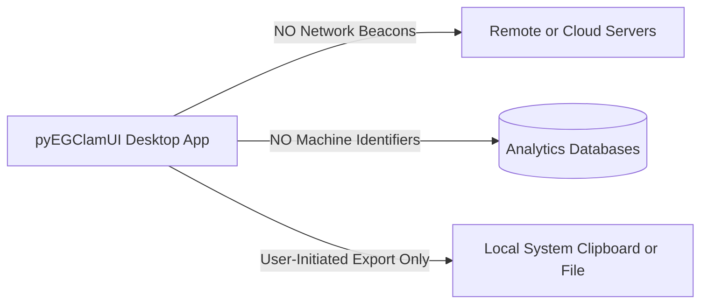
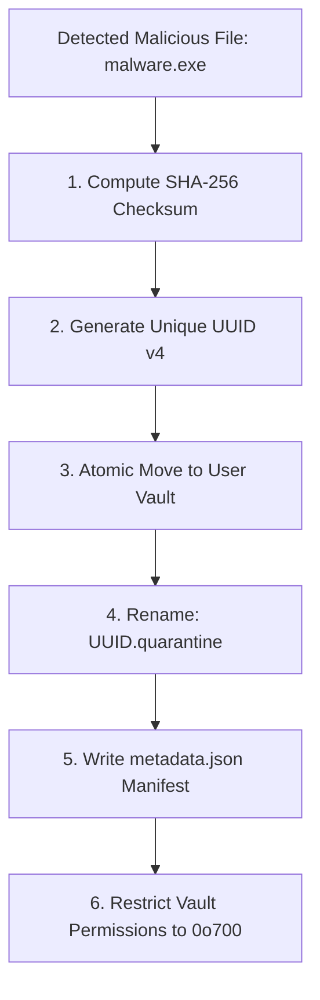

# Security, Privacy & Safety Architecture

**pyEGClamUI** is engineered with an uncompromising focus on user privacy, subprocess execution safety, permission lockdown, and open-source integrity.

---

## 1. Zero Silent Telemetry Policy

* **Source Implementation**: [`../src/pyegclamui/gui/main_window.py`](../src/pyegclamui/gui/main_window.py) (`copy_diagnostics_to_clipboard`)

### Explicit Privacy Guarantees

1. **No Background Telemetry**: pyEGClamUI never collects, aggregates, or transmits user identifiers, MAC addresses, public IP addresses, hostnames, usernames, or hardware profiles.
2. **Transparent Diagnostics**: Diagnostic information is exclusively generated when explicitly triggered by the user via the "Copy Diagnostics" button and remains strictly on the user's local machine.
3. **Offline Operation**: pyEGClamUI operates completely offline without internet access, with the sole exception of the user-initiated `freshclam` signature database update connecting directly to official Cisco ClamAV mirrors (`database.clamav.net`).

---

## 2. Secure Subprocess Execution Protocols

* **Source Implementation**: [`../src/pyegclamui/core/scanner.py`](../src/pyegclamui/core/scanner.py) (`ClamScanner`), [`../src/pyegclamui/core/updater.py`](../src/pyegclamui/core/updater.py) (`ClamUpdater`)

External process execution is a frequent vector for command injection vulnerabilities in desktop antivirus frontends. pyEGClamUI enforces strict security controls:

### Execution Security Principles

| Risk Vector | Vulnerable Approach | pyEGClamUI Hardened Approach |
| :--- | :--- | :--- |
| **Shell Injection** | `shell=True` with formatted string | `shell=False` strictly enforced; arguments passed as discrete lists |
| **Path Traversal** | Raw string concatenation (`path + "/file"`) | Modern `pathlib.Path` resolution and validation |
| **Whitespace in Paths** | Unquoted string execution (`C:\Program Files\...`) | Discrete argument array items; OS handles argument spacing natively |
| **Process Hangs** | Unbounded blocking calls (`proc.wait()`) | Managed worker threads with timeouts and cancellation tokens |

---

## 3. Filesystem Isolation & Quarantine Vault Safety

* **Source Implementation**: [`../src/pyegclamui/core/quarantine.py`](../src/pyegclamui/core/quarantine.py) (`QuarantineManager`)

### Safety Controls Implemented

1. **Non-Executable Extension Renaming**: Malicious files are stripped of their executable extensions (`.exe`, `.dll`, `.sh`, `.elf`, `.bat`, `.cmd`) and renamed to `{uuid}.quarantine`, completely preventing accidental double-click execution by the user or OS.
2. **Cryptographic Fingerprinting**: Files are hashed with SHA-256 prior to isolation. Before any file restoration is executed, the checksum is verified against the manifest to guarantee that the file has not been altered or tampered with.
3. **Safe Deletion Priority**: When configured to delete threats, pyEGClamUI prioritizes the native OS Trash / Recycle Bin (`send2trash`), giving users a safe window to recover accidental deletions before irreversible permanent disk removal.

---

## 4. 100% Free & Open-Source (FOSS) Compliance

pyEGClamUI adheres to an absolute **100% FOSS policy**. No commercial, proprietary, closed-source, or telemetry-bundled libraries are permitted.

### Dependency License Audit Matrix

| Dependency | Version Scope | License | Type | Verified Purpose |
| :--- | :--- | :--- | :--- | :--- |
| **Python** | `>= 3.9` | PSF License | FOSS Core | Python Runtime |
| **PySide6** | `>= 6.5.0` | LGPL-3.0 | FOSS GUI | Official Qt for Python UI framework |
| **clamd** | `>= 1.0.2` | LGPL-3.0 | FOSS Client | ClamAV daemon socket connector |
| **psutil** | `>= 5.9.0` | BSD-3-Clause | FOSS System | Cross-platform drive & process enumeration |
| **watchdog** | `>= 3.0.0` | Apache-2.0 | FOSS Monitor | Native OS filesystem event observation |
| **send2trash** | `>= 1.8.0` | BSD-3-Clause | FOSS Utility | Native OS Recycle Bin / Trash integration |
| **pytest** | `>= 7.0.0` | MIT | FOSS Test | Automated unit and regression testing |
