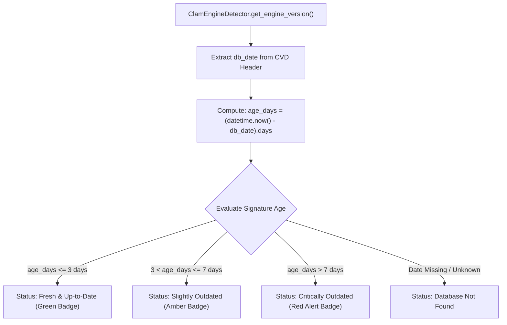
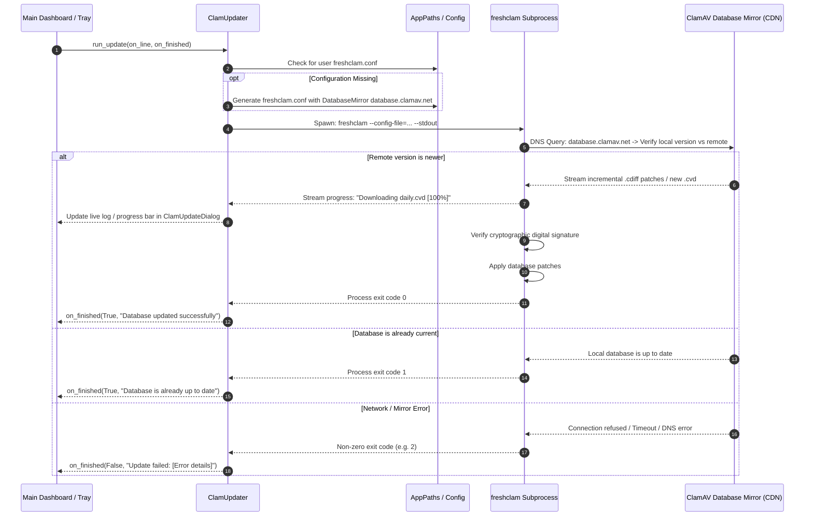
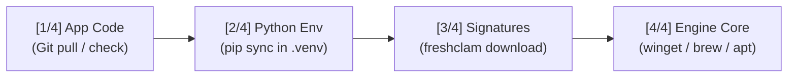

# Signature Database Updater Architecture

This document provides a comprehensive, code-independent architectural reference for the Virus Signature Database Updater subsystem in **pyEGClamUI**. It details the `freshclam` update pipeline, CVD database files, freshness calculation heuristics, configuration generation, and update state machines.

---

## 1. Architectural Overview & Philosophy

Antivirus engines depend directly on up-to-date threat definitions. An outdated signature database leaves endpoints vulnerable to newly emerged malware strains.

The Update Subsystem in pyEGClamUI ensures threat definitions remain current through:

* **Native `freshclam` Integration**: Wraps ClamAV's official, cryptographically verified database updater (`freshclam`).
* **Automated User Configuration Generation**: Automatically generates a local, non-root `freshclam.conf` pointing to official CDN mirrors (`database.clamav.net`) and local user directories.
* **Database Age Heuristics**: Inspects the CVD signature header to compute exact database age in days, categorizing freshness into a 3-tier status hierarchy.
* **Non-Blocking Execution**: Database downloads execute inside background worker threads (`QThread`), streaming live download percentages and mirror connections directly to the UI.
* **Standardized Exit Code Mapping**: Distinguishes between successful downloads, already-up-to-date notices, and network/mirror errors.

---

## 2. ClamAV Database File Structure

ClamAV definitions consist of three core database files stored in the application or system database folder:

```
database/
├── daily.cld (or daily.cvd)      # Daily incremental threat definitions (~60 MB)
├── main.cvd                      # Foundation signature database (~170 MB)
└── bytecode.cvd                  # Executable bytecode heuristics (~250 KB)
```

### Database Types & Storage Formats

| File Name | Format | Update Frequency | Contents |
| :--- | :--- | :--- | :--- |
| `daily.cvd` / `daily.cld` | ClamAV Virus Database (CVD) or Local Directory (CLD) | ⚡ Multiple times per day | Incremental signatures, new malware variants, hashes, heuristics. |
| `main.cvd` | ClamAV Virus Database | 🟢 Periodically (Major releases) | Core database baseline containing historical virus definitions. |
| `bytecode.cvd` | Compiled ClamAV Bytecode | 🟡 As needed | Sandboxed bytecode programs for unpackers and advanced heuristics. |

> [!NOTE]
> `.cvd` files are compressed, digitally signed tar archives containing an authoritative 512-byte header. When `freshclam` applies incremental patches (`.cdiff`), the file is rewritten locally as a `.cld` (ClamAV Local Database) file.

---

## 3. Database Freshness Classification Matrix

pyEGClamUI computes signature freshness by parsing the database compilation timestamp and comparing it against the local system clock:



### 3-Tier Freshness Status Tiers

| Status Tier | Age Threshold | UI Badge Representation | Recommended Action |
| :--- | :--- | :--- | :--- |
| 🟢 **Fresh** | $\le 3\text{ days}$ | 🟢 **Up to Date** | No action required; optimal protection. |
| 🟡 **Warning** | $4 - 7\text{ days}$ | 🟡 **Needs Update** | Notification banner advises user to update definitions. |
| 🔴 **Critical** | $> 7\text{ days}$ | 🔴 **Critically Outdated** | Prominent warning banner; automated background update scheduled. |
| ⚪ **Missing** | File absent | ⚪ **Database Missing** | Setup wizard prompts initial download. |

---

## 4. The `freshclam` Execution Pipeline

When an update is initiated (either manually by the user or automatically by a background schedule), the updater executes the following pipeline:



### 4.1 Live Telemetry & `ClamUpdateDialog`
To ensure complete transparency during signature downloads (which involve 85MB–200MB payloads), pyEGClamUI routes manual update triggers through [`ClamUpdateDialog`](../src/pyegclamui/gui/update_dialog.py):
* **Dynamic Stream Parsing**: `UpdateWorker` evaluates stdout in real-time using regular expressions, calculating download percentages from mirror byte counters (e.g. `23.00MiB / 84.95MiB`).
* **Visual Stage Indicators**: Translates cryptographic checks, mirror handshakes, and verification routines into human-readable stage descriptions with timestamps.
* **Expandable Monospace Terminal Drawer**: Offers a collapsible, read-only terminal viewer with a one-click **"Copy Output"** button for audit and diagnostic review.
* **Process Cancellation**: A **"Cancel"** action invokes `ClamUpdater.cancel()`, cleanly terminating active subprocesses without file corruption.

---

## 5. Automated `freshclam.conf` Generation

To allow pyEGClamUI to update signatures without requiring root or administrator write access to `/etc/clamav/` or system Program Files, the application automatically constructs a dedicated user-level configuration file:

```ini
# pyEGClamUI User freshclam.conf
DatabaseMirror database.clamav.net
DatabaseDirectory /path/to/user/appdata/database
# NotifyClamd <dynamically-resolved-clamd.conf>
ConnectTimeout 30
ReceiveTimeout 60
```

### Configuration Directives Explained

| Directive | Configured Value | Purpose |
| :--- | :--- | :--- |
| `DatabaseMirror` | `database.clamav.net` | 🛡️ Official globally distributed Anycast CDN mirror network maintained by Cisco Talos. |
| `DatabaseDirectory` | Dynamic user data path | 🛡️ Stores CVD files in a user-writeable directory requiring zero elevation. |
| `NotifyClamd` | `no` (handled programmatically) | 🛡️ Prevents freshclam from attempting to signal system services directly. |
| `ConnectTimeout` | `30` | ⚡ Prevents indefinite socket hangs during mirror connection attempts. |

---

## 6. Exit Code Translation Matrix

`freshclam` uses distinct exit codes to convey operational outcomes:

| Exit Code | Official Meaning | pyEGClamUI Handling | User-Facing Message |
| :--- | :--- | :--- | :--- |
| `0` | Database successfully updated | 🟢 **Success** | `"Database updated successfully to latest version."` |
| `1` | Database is already up-to-date | 🟢 **Success** | `"Database is already up to date. No new updates available."` |
| `2` | Network error / Mirror unreachable | 🟡 **Warning / Error** | `"Could not reach ClamAV update mirrors. Please check your internet connection."` |
| `40` | Configuration error in freshclam.conf | 🔴 **Error** | `"Invalid update configuration. Resetting freshclam.conf."` |
| `*` | Unknown subprocess failure | 🔴 **Error** | `"Update failed with code {exit_code}. See error log for details."` |

---

## 7. Global Full-Stack Update Pipeline

In addition to standalone database synchronization, pyEGClamUI incorporates a 4-stage **Global Full-Stack Maintenance Pipeline** accessible directly via the Status tab or CLI (`setup/setup.py --update`):



### Pipeline Stages Summary

| Stage | Target Component | Mechanism | Elevation Required |
| :--- | :--- | :--- | :--- |
| **Stage 1** | pyEGClamUI Source | `git pull --ff-only` | ⚪ No (User Session) |
| **Stage 2** | Virtual Environment | `.venv\Scripts\python -m pip install -e .` | ⚪ No (User Session) |
| **Stage 3** | Virus Definitions | `freshclam --config-file=...` | ⚪ No (User Directory) |
| **Stage 4** | ClamAV Engine Binary | OS package manager (`winget` / `brew` / `apt`) | 🟡 Only if package manager requires |

---

## 8. Related Source Modules & Unit Tests

* **Implementation**:
  - [`src/pyegclamui/core/updater.py`](../src/pyegclamui/core/updater.py) — `ClamUpdater`, `GlobalUpdatePipeline`, `is_database_recent()`, `run_update()`.
  - [`src/pyegclamui/core/service_manager.py`](../src/pyegclamui/core/service_manager.py) — `ClamDaemonServiceManager`, 1-click elevated activation, ping latency measurement.
  - [`src/pyegclamui/gui/update_dialog.py`](../src/pyegclamui/gui/update_dialog.py) — `ClamGlobalUpdateDialog`, `GlobalUpdateWorker`, 4-stage stepper, live monospace log drawer, restart action.
  - [`src/pyegclamui/core/detector.py`](../src/pyegclamui/core/detector.py) — CVD header parser, version string extractor, database date resolution.
  - [`src/pyegclamui/gui/main_window.py`](../src/pyegclamui/gui/main_window.py) — Status hero banner, Daemon Performance Card (`[ ⚡ Enable ClamD Daemon ]`), Global update button.
* **Automated Tests**:
  - [`tests/test_updater_edge_cases.py`](../tests/test_updater_edge_cases.py) — Validates database freshness evaluation, exit code handling (0 vs 1 vs error).
  - [`tests/test_global_updater.py`](../tests/test_global_updater.py) — Validates 4-stage pipeline execution, log callbacks, and cancellation.
  - [`tests/test_service_manager.py`](../tests/test_service_manager.py) — Validates daemon status detection, latency measurement, and graceful UAC handling.
  - [`tests/test_gui_lifecycle.py`](../tests/test_gui_lifecycle.py) — Validates `ClamGlobalUpdateDialog` UI states, progress parsing, and console drawer toggles.

