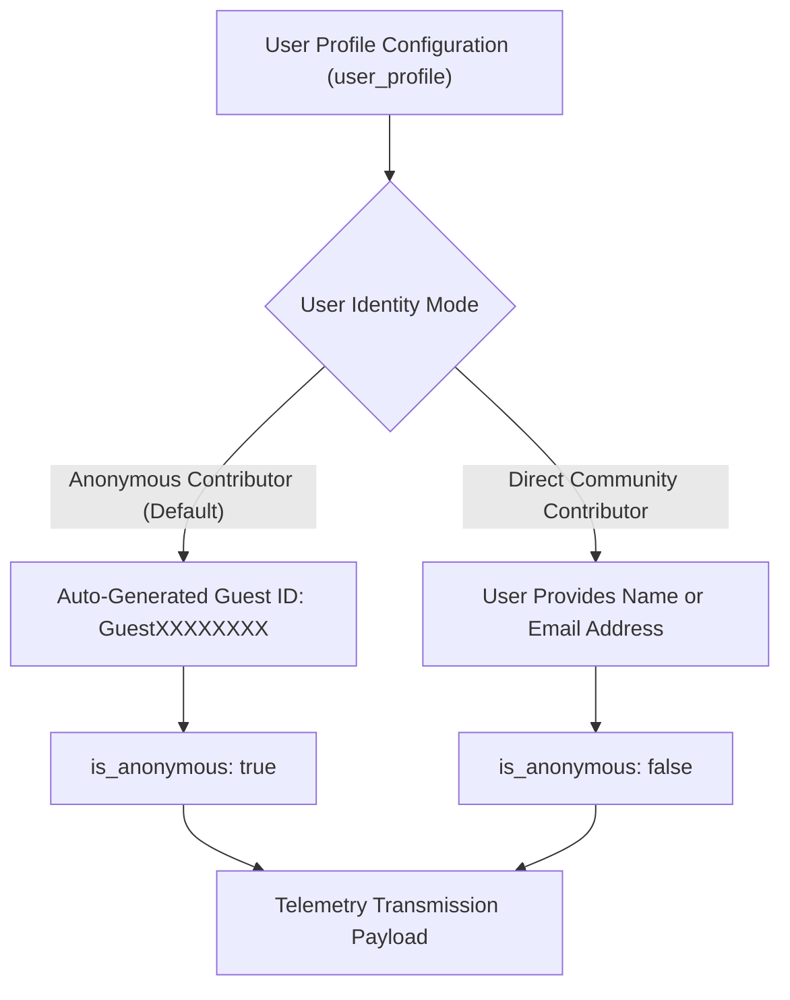
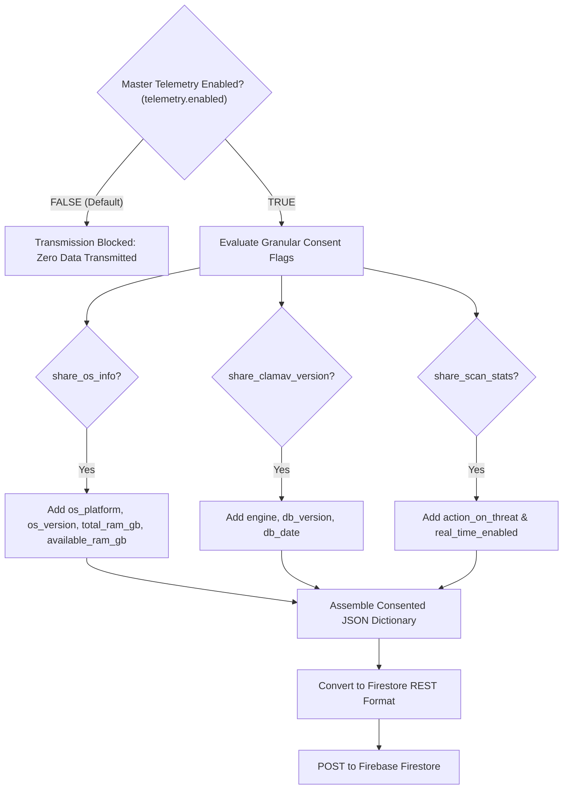

# Transparent Opt-In Telemetry & User Profile Logic

This document details the complete design, privacy principles, consent model, and REST implementation of the opt-in telemetry and user profiling subsystem in **pyEGClamUI**.

---

## 1. Core Privacy Manifesto & Zero-Silent-Tracking Guarantee

pyEGClamUI enforces an uncompromising privacy standard:

* **Strictly 100% Opt-In**: Telemetry is **completely disabled by default** (`"enabled": false`). Not a single byte of diagnostic data is transmitted unless the user explicitly consents.
* **Zero Silent Tracking**: There are no hidden background trackers, analytics pixels, commercial third-party SDKs, or covert ping routines anywhere in the application.
* **Transparent Data Preview**: Users can inspect the **exact JSON payload** that would be transmitted at any time using the built-in **"Preview Data"** dialog before choosing to share.
* **Granular Consent Controls**: Users retain complete control over individual metrics. Any consented category (such as hardware specs or scan metrics) can be toggled off at will.
* **Zero Hostname or IP Tracking**: Device hostnames, local/public IP addresses, and MAC addresses are strictly excluded from telemetry and never collected.
* **No Commercial Libraries**: Built entirely with Python standard library modules (`urllib.request`, `json`, `socket`, `threading`, `psutil`). Zero Firebase SDK or Google Cloud SDK pip dependencies.

---

## 2. User Profile & Identity Architecture

Each installation features a user identity model designed to support both anonymous diagnostic sharing and community contributor identification:



### Profile Fields Matrix

| Setting Field | Configuration Key | Default Value | Description |
| :--- | :--- | :--- | :--- |
| `user_id` | `user_profile.user_id` | `GuestXXXXXXXX` | Unique client identifier. 8-digit random integer formatted as `GuestXXXXXXXX` (e.g. `Guest48291042`). Can be customized. |
| `display_name` | `user_profile.display_name` | `""` (empty) | Optional display name for community contributors. |
| `email` | `user_profile.email` | `""` (empty) | Optional contact email for diagnostics or support feedback. |
| `is_anonymous` | `user_profile.is_anonymous` | 🟢 `true` | Evaluates to `true` if `user_id` starts with `Guest`, `false` otherwise. |

Users can regenerate a brand-new random Guest ID at any time with a single click on **"New Guest ID"** in the Settings tab.

---

## 3. Granular Consent Checkboxes & Sensitivity Matrix

When the master telemetry toggle is enabled, individual permissions govern exactly what attributes are assembled into the transmission payload:



### Granular Consent Matrix

| GUI Checkbox | Config Key | Default State | Privacy Sensitivity | Data Points Transmitted When Enabled |
| :--- | :--- | :--- | :--- | :--- |
| **Master Toggle** | `telemetry.enabled` | ❌ **Disabled (Off)** | 🔴 **High** | Gatekeeper for the entire telemetry engine. When `false`, all dispatch attempts immediately abort. |
| **Share OS platform & architecture** | `telemetry.share_os_info` | 🟢 Enabled (if master on) | 🟢 **Low** | `os_platform` (`win32`, `linux`, `darwin`), `total_ram_gb`, `available_ram_gb`, Python version |
| **Share ClamAV engine & signature version** | `telemetry.share_clamav_version` | 🟢 Enabled (if master on) | 🟢 **Low** | ClamAV engine release string (`ClamAV 1.5.4`), CVD signature count (`28130`), database release date |
| **Share protection metrics** | `telemetry.share_scan_stats` | 🟢 Enabled (if master on) | 🟢 **Low** | Configured remediation mode (`Quarantine`, `Trash`, `Report`), Real-Time Guard toggle state |

---

## 4. Direct Firebase Firestore REST API Dispatch

To preserve the **100% Free & Open-Source (FOSS)** standard and avoid binary bloat, pyEGClamUI communicates directly with Google Cloud Firestore's public REST v1 API using standard Python `urllib.request`:

### Target Firestore Collections

1. **`/telemetry`**: General diagnostic metrics, system performance, and engine version telemetry.
2. **`/issue_reports`**: Private user-submitted crash and bug reports, complete with sanitized error logs and system specs.
3. **`/active_installations`**: Monthly active heartbeats to solve desktop uninstallation tracking.

### REST Endpoint Specification

* **Protocol**: HTTPS POST
* **Target Base URL**:
  ```text
  https://firestore.googleapis.com/v1/projects/{project_id}/databases/(default)/documents/{collection}
  ```
* **Default Project ID**: `eg1-pyegclamui` (configured in `config.py` and `config.json`)
* **Headers**: `Content-Type: application/json`
* **Network Timeout**: 3.0 to 5.0 seconds (prevents slow network calls from lingering)
* **Execution Threading**: All dispatch operations execute inside non-blocking daemon threads ([`send_telemetry_async()`](../src/pyegclamui/core/telemetry.py)).

### Firestore Document Structure Converter

Firestore REST requires typed field envelopes (`stringValue`, `booleanValue`, `integerValue`, `doubleValue`). The internal engine translates standard Python data structures automatically:

| Python Data Type | Firestore REST Type | Example Translation |
| :--- | :--- | :--- |
| `str` | `{"stringValue": ...}` | `"win32"` $\rightarrow$ `{"stringValue": "win32"}` |
| `bool` | `{"booleanValue": ...}` | `True` $\rightarrow$ `{"booleanValue": true}` |
| `int` | `{"integerValue": str(...)}` | `42` $\rightarrow$ `{"integerValue": "42"}` |
| `float` | `{"doubleValue": ...}` | `16.0` $\rightarrow$ `{"doubleValue": 16.0}` |
| `dict` | `{"stringValue": json.dumps(...)}` | `{"a": 1}` $\rightarrow$ `{"stringValue": "{\"a\": 1}"}` |

---

## 5. User Interface Controls & Workflows

### 5.1 First-Run Welcome Onboarding Dialog

On the very first launch, pyEGClamUI presents [`WelcomeDialog`](../src/pyegclamui/gui/welcome_dialog.py), offering 3 transparent choices:

1. 🟢 **[ Enable Full Anonymous Diagnostics ]** (Recommended):
   - Contributes anonymous OS, ClamAV version, and 30-day active heartbeats to help improve stability.
2. ⚪ **[ 1-Time Anonymous Install Count Only ]**:
   - Sends a single anonymous ping confirming installation count, with zero subsequent heartbeats or diagnostics.
3. 🔒 **[ Keep 100% Offline (Air-Gapped) ]**:
   - Disables all telemetry. Absolutely zero network calls will ever be made for metrics.

### 5.2 Monthly Active Heartbeats (Solving Desktop Uninstalls)

Desktop applications cannot reliably catch uninstalls via uninstall hooks (users delete folders or are offline). To measure authentic active usage:

* An opted-in client checks whether 30 days have elapsed since `last_active_heartbeat`.
* If due, it sends a lightweight ping to `/active_installations`.
* **In Firestore Console**:
  * Total Installs = `Count(event == 'install')`
  * Monthly Active Users (MAU) = `Count(last_seen within 30 days)`
  * Churned / Uninstalled Users = Total Installs minus MAU

### 5.3 Hybrid In-App Issue Reporter

The About Tab features [`IssueDialog`](../src/pyegclamui/gui/issue_dialog.py) to streamline bug reporting while strictly preserving user privacy:

1. 🚀 **Submit Privately via Firebase**:
   - Posts directly to Firestore `/issue_reports` without requiring a GitHub account or exposing personal paths publicly.
2. 📋 **Copy Redacted Report for GitHub**:
   - Masks personal paths using [`sanitize_log_text()`](../src/pyegclamui/core/telemetry.py) (e.g. `C:\Users\JohnDoe` becomes `~`) and formats a clean Markdown issue template ready for GitHub Issues.
3. 📸 **Snip Screen**:
   - Launches the operating system native screen clipper (`Win + Shift + S` on Windows, `screencapture` on macOS, `gnome-screenshot` on Linux) so users can crop the bug and blur sensitive files before attaching.

### 5.4 Preview Data & Test Reports

From the Settings Tab, users can:
* Click **[ Preview Data ]** to inspect the live JSON payload.
* Click **[ Send Test Report ]** to verify connectivity with immediate visual feedback.

---

## 6. Related Source Modules & Testing

* **Implementation**:
  * [`src/pyegclamui/core/telemetry.py`](../src/pyegclamui/core/telemetry.py) — `TelemetryManager`, RAM gathering, path sanitization, issue reporting, heartbeats.
  * [`src/pyegclamui/core/config.py`](../src/pyegclamui/core/config.py) — Configuration defaults, user profile management.
  * [`src/pyegclamui/gui/welcome_dialog.py`](../src/pyegclamui/gui/welcome_dialog.py) — 1-time onboarding dialog.
  * [`src/pyegclamui/gui/issue_dialog.py`](../src/pyegclamui/gui/issue_dialog.py) — Hybrid private issue reporter & sanitized clipboard export.
  * [`src/pyegclamui/gui/main_window.py`](../src/pyegclamui/gui/main_window.py) — Window event linkage and About tab controls.
* **Automated Tests**:
  * [`tests/test_telemetry.py`](../tests/test_telemetry.py) — 9 comprehensive unit tests validating guest ID, RAM metrics, consent adherence, path sanitization, offline mode, and field conversion.
