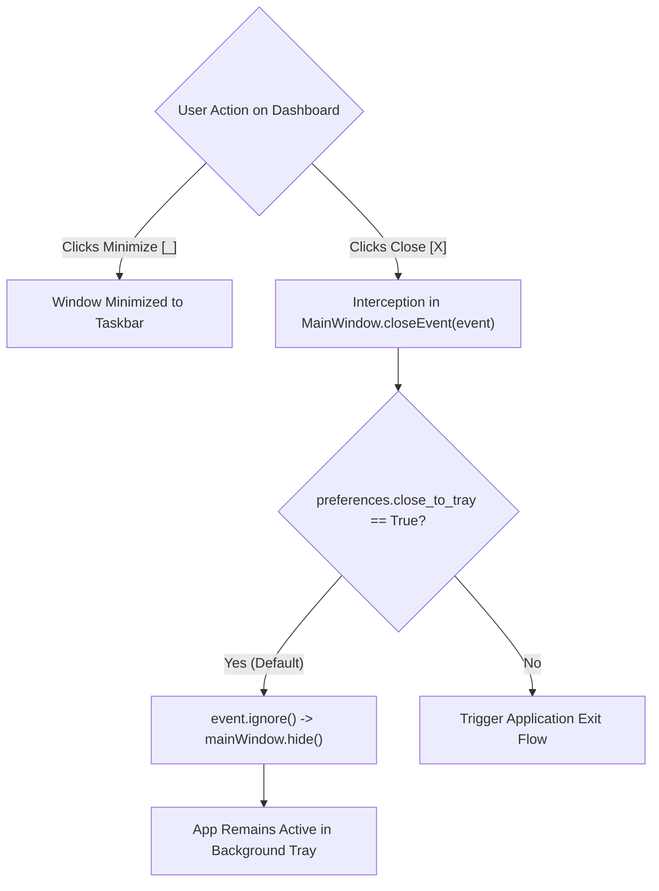
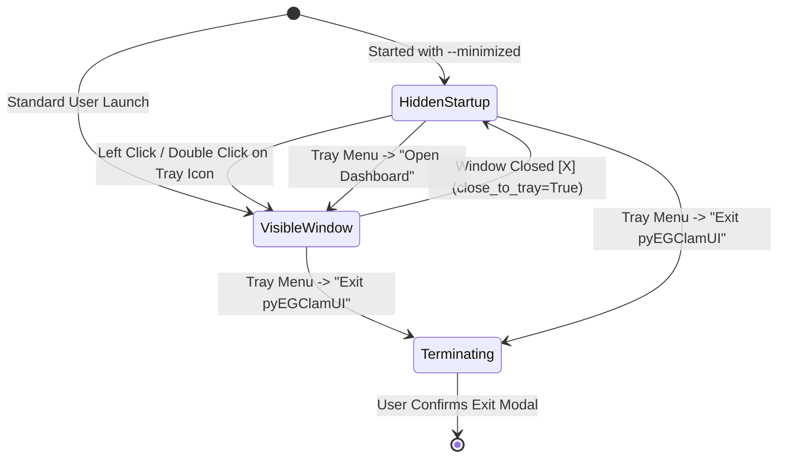
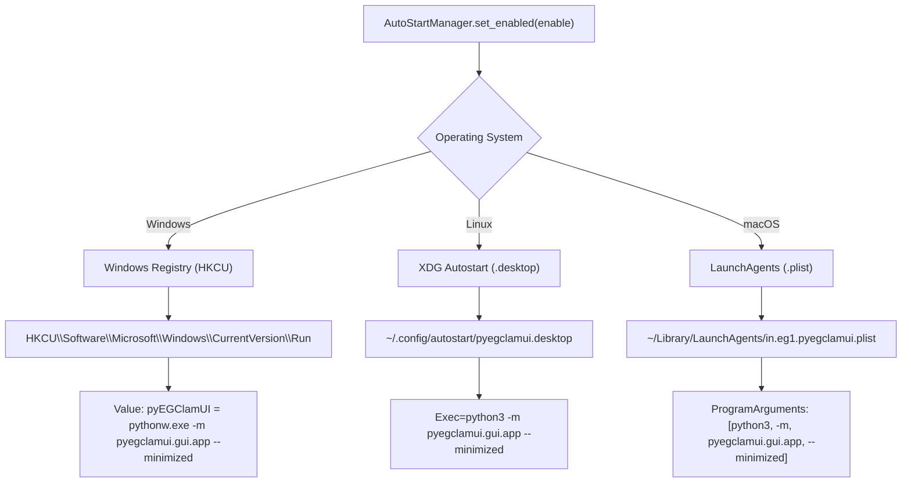
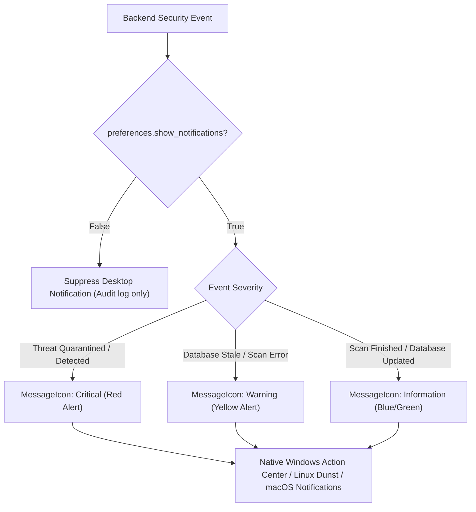

# System Tray & Application Lifecycle Architecture

This document provides a comprehensive, code-independent guide to the background system tray daemon, window lifecycle, exit confirmation workflows, cross-platform autostart persistence, and desktop notification mechanics in **pyEGClamUI**.

---

## 1. Architectural Overview & Philosophy

Antivirus software operates as continuous sentinel software. Unlike typical desktop utility tools that terminate when their main window is closed, pyEGClamUI separates the **Graphical Dashboard** from the **Background Sentinel**:

* **Persistent System Tray Presence**: The application resides in the operating system taskbar / notification area, maintaining continuous background vigilance even when the dashboard window is closed.
* **Close-to-Tray Window Interception**: Clicking the window close button (`[X]`) hides the interface rather than terminating the process, preventing accidental cessation of real-time protection.
* **Intentional Exit Confirmation**: Terminating the application stops real-time protection. To prevent accidental termination, exiting via the tray context menu prompts the user with an explicit confirmation dialog explaining the security implications.
* **Native Autostart Persistence**: Supports seamless launching on user login across Windows, Linux, and macOS without requiring elevated root or administrator permissions.
* **Dynamic Health Tooltips**: Hovering over the system tray icon presents an immediate, real-time summary of protection and engine health.

---

## 2. Window Lifecycle & Event Interception

The interaction between the user, the dashboard window, and the background process follows a clear interception workflow:



### Window State Transitions



---

## 3. Tray Exit Confirmation Workflow

When an end user clicks **"Exit pyEGClamUI"** from the system tray context menu, real-time protection, scheduled tasks, and watchdog filesystem monitors will cease operating. 

To prevent accidental security gaps, pyEGClamUI executes an intentional exit confirmation flow governed by [`confirm_exit_from_tray`](../src/pyegclamui/gui/main_window.py):

```mermaid
sequenceDiagram
    autonumber
    participant User as End User
    participant Tray as SystemTrayManager
    participant App as MainWindow
    participant Modal as Confirmation Modal Dialog
    participant Core as RealTimeGuard & Background Threads

    User->>Tray: Right-clicks tray icon -> "Exit pyEGClamUI"
    Tray->>App: Invokes on_exit callback
    App->>App: Check config: preferences.confirm_exit_from_tray
    alt confirm_exit_from_tray == True (Default)
        App->>Modal: Display "Confirm Exit" Dialog with "Do not ask again" checkbox
        User->>Modal: Decision
        alt User Clicks "Cancel"
            Modal-->>App: Rejected
            App-->>User: Abort exit; protection stays active
        else User Clicks "Exit"
            opt User checked "Do not ask again"
                Modal->>App: Set preferences.confirm_exit_from_tray = False
            end
            Modal-->>App: Confirmed
            App->>Core: Stop RealTimeGuard, flush pending logs
            App->>App: QCoreApplication.quit()
        end
    else confirm_exit_from_tray == False
        App->>Core: Stop RealTimeGuard, flush pending logs
        App->>App: QCoreApplication.quit()
    end
```

### Confirmation Dialog Specification

| Dialog Element | Value / Behavior |
| :--- | :--- |
| **Window Title** | `Exit pyEGClamUI` |
| **Primary Notice** | `"Are you sure you want to exit pyEGClamUI?"` |
| **Security Warning** | 🔴 `"Real-time background protection and threat monitoring will stop running."` |
| **Checkable Option** | `[ ] Do not ask again` (Updates `preferences.confirm_exit_from_tray` in `config.json`) |
| **Action Buttons** | 🟢 `[ Cancel ]` (Focus/Default) and 🔴 `[ Exit pyEGClamUI ]` (Destructive style) |

---

## 4. Cross-Platform System Autostart

pyEGClamUI includes native, cross-platform autostart persistence managed by [`AutoStartManager`](../src/pyegclamui/core/autostart.py). It requires **zero administrator/root privileges**, writing strictly to user-level configuration registries and directories:



### Operating System Autostart Comparison

| OS Platform | Registry / Configuration Target | Storage Mechanism | Executable Strategy |
| :--- | :--- | :--- | :--- |
| **Windows 10 / 11** | `HKEY_CURRENT_USER\Software\Microsoft\Windows\CurrentVersion\Run` | 🟢 Registry String (`REG_SZ`) | Uses `pythonw.exe` to suppress spawning a black console prompt |
| **Linux (XDG)** | `~/.config/autostart/pyegclamui.desktop` | 🟢 FreeDesktop `.desktop` entry | Runs `python3 -m pyegclamui.gui.app --minimized` |
| **macOS** | `~/Library/LaunchAgents/in.eg1.pyegclamui.plist` | 🟢 Apple XML Property List (`launchd`) | Invokes Python binary with `RunAtLoad: true` and `--minimized` |

---

## 5. System Tray Context Menu & Actions

The tray context menu provides rapid access to essential controls without opening the full dashboard:

```
+------------------------------------+
|  pyEGClamUI - ClamAV Antivirus     |
+------------------------------------+
|  [x] Open Dashboard                |
|  --------------------------------  |
|  [v] Real-Time Protection (Toggle) |
|  [*] Run Quick Scan                |
|  [#] Quarantine Vault              |
|  [^] Check for Updates             |
|  --------------------------------  |
|  [!] Exit pyEGClamUI               |
+------------------------------------+
```

### Tray Actions Matrix

| Menu Action | Trigger Function | Description |
| :--- | :--- | :--- |
| 🖥️ **Open Dashboard** | `on_open_dashboard()` | Restores and brings the main PySide6 dashboard window to the foreground. |
| 🛡️ **Real-Time Protection** | `on_toggle_protection(bool)` | Checkable toggle that starts or stops the `RealTimeGuard` watchdog observer. |
| ⚡ **Run Quick Scan** | `on_quick_scan()` | Spawns a background scan targeting standard user risk directories (Desktop, Downloads). |
| 📦 **Quarantine Vault** | `on_open_quarantine()` | Directly opens the dashboard with the Quarantine tab selected. |
| 🔄 **Check for Updates** | `on_check_updates()` | Triggers a background `freshclam` signature database update. |
| 🚪 **Exit pyEGClamUI** | `on_exit()` | Prompts with the confirmation modal before terminating background threads and quitting. |

---

## 6. Dynamic Tooltips & Health Status

Hovering the cursor over the system tray icon displays a dynamic status summary reflecting the exact operational state:

| Application State | Tray Tooltip Text | Icon Appearance |
| :--- | :--- | :--- |
| 🟢 **Protected (Guard Active)** | `pyEGClamUI - Protected` | 🟢 Vibrant green shield badge |
| 🟡 **Protection Disabled** | `pyEGClamUI - Protection Inactive` | 🟡 Amber shield with warning badge |
| ⚡ **Active Scan Running** | `pyEGClamUI - Scanning in progress...` | 🔵 Animated active indicator |
| 🔴 **Engine Missing** | `pyEGClamUI - Engine Offline` | 🔴 Red alert badge |

---

## 7. Desktop Notification Delivery

pyEGClamUI utilizes native OS notification balloons via `QSystemTrayIcon.showMessage()` to inform the user of critical security events:



### Notification Types

1. **Threat Detected**:
   - **Title**: `pyEGClamUI - Threat Quarantined`
   - **Body**: `Infected file 'malware.exe' was safely quarantined as 'Win.Trojan.Generic'.`
2. **Scan Completed**:
   - **Title**: `pyEGClamUI - Scan Completed`
   - **Body**: `Quick Scan finished. 450 files scanned, 0 threats found.`
3. **Database Updated**:
   - **Title**: `pyEGClamUI - Database Updated`
   - **Body**: `Virus definitions updated successfully to version 28130.`

---

## 8. Related Source Modules & Unit Tests

* **Implementation**:
  - [`src/pyegclamui/gui/tray.py`](../src/pyegclamui/gui/tray.py) — System tray icon, context menu, and balloon notifications.
  - [`src/pyegclamui/core/autostart.py`](../src/pyegclamui/core/autostart.py) — Windows Registry, Linux XDG, and macOS LaunchAgents startup manager.
  - [`src/pyegclamui/gui/main_window.py`](../src/pyegclamui/gui/main_window.py) — `closeEvent` interception, exit confirmation modal, and dashboard lifecycle.
* **Automated Tests**:
  - [`tests/test_autostart.py`](../tests/test_autostart.py) — Validates autostart command generation, platform support detection, and registry/file operations.
  - [`tests/test_config.py`](../tests/test_config.py) — Validates `confirm_exit_from_tray` and `close_to_tray` preference persistence.
