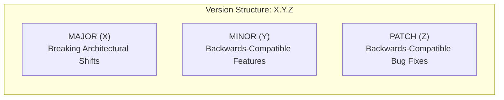
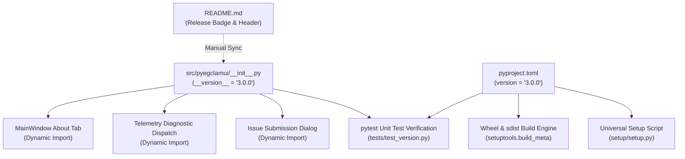
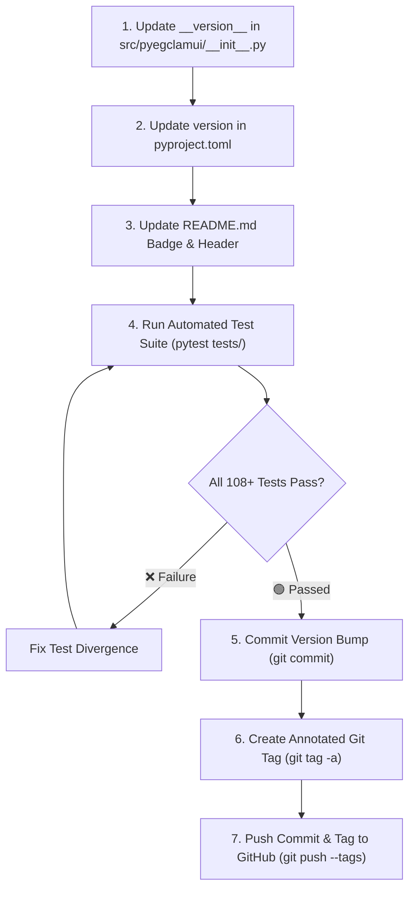

# Application Versioning & Release Management Guide

This document establishes the official versioning standards, Single Source of Truth (SSOT) architecture, release tagging conventions, and cross-file synchronization procedures for **pyEGClamUI**.

---

## 1. Semantic Versioning Specification (SemVer 2.0.0)

pyEGClamUI strictly adheres to the [Semantic Versioning 2.0.0](https://semver.org/) specification:

$$\text{Version Format: } \mathbf{MAJOR}.\mathbf{MINOR}.\mathbf{PATCH}$$



### Version Bump Criteria

| Increment Type | Version Component | Example Trigger Event | Backward Compatible? | Release Tag Example |
| :--- | :--- | :--- | :--- | :--- |
| 🔴 **Major** | `MAJOR` ($X.0.0$) | Rewriting GUI framework, breaking config schema changes, dropping core Python runtime | ❌ No | `v4.0.0` |
| 🟡 **Minor** | `MINOR` ($3.Y.0$) | Adding new scan profiles, resident daemon acceleration cards, installer CLI commands | 🟢 Yes | `v3.1.0` |
| 🟢 **Patch** | `PATCH` ($3.0.Z$) | Resolving race conditions, regex parsing bug fixes, socket timeout adjustments | 🟢 Yes | `v3.0.1` |
| ⚪ **Pre-Release** | `SUFFIX` ($-beta.1$) | Internal test builds, release candidates (`-rc.1`) before formal public tag | 🟡 Experimental | `v3.1.0-rc.1` |

---

## 2. Single Source of Truth (SSOT) Architecture

To eliminate version divergence and build drift, pyEGClamUI maintains a strict two-file statutory declaration:

1. **Python Runtime SSOT**: [`src/pyegclamui/__init__.py`](../src/pyegclamui/__init__.py)  
   Exposes the immutable `__version__` module attribute evaluated dynamically at runtime by the GUI, CLI, and telemetry engine.
2. **Packaging Build SSOT**: [`pyproject.toml`](../pyproject.toml)  
   Specifies the static package distribution version evaluated by `pip`, `wheel`, and `setuptools`.



> [!IMPORTANT]
> **Zero Hardcoded Version Duplication**: Source code components (`main_window.py`, `telemetry.py`, `issue_dialog.py`) must **never** hardcode version strings. They must import `__version__` directly:
> ```python
> from pyegclamui import __version__
> ```

---

## 3. File Synchronization Matrix

Whenever a new version is released, the following files must be reviewed and synchronized:

| File Path | Role | Synchronization Rule | Verification Method |
| :--- | :--- | :--- | :--- |
| [`src/pyegclamui/__init__.py`](../src/pyegclamui/__init__.py) | Runtime package attribute | 🟢 **Primary SSOT** — update `__version__ = "X.Y.Z"` | Automated pytest |
| [`pyproject.toml`](../pyproject.toml) | Packaging & distribution spec | 🟢 **Package SSOT** — update `version = "X.Y.Z"` | Automated pytest |
| [`README.md`](../README.md) | Public landing & badge | Update version badge & current release text | Visual check |
| [`TODO.md`](../TODO.md) | Release & packaging checklist | Update packaging commands with target version | Visual check |
| [`docs/VERSIONING.md`](VERSIONING.md) | Versioning documentation | Update version table if major schema changes | Document review |

---

## 4. Step-by-Step Release Bumping Workflow

Follow this procedure sequentially to increment the application version and produce a release tag:



### Procedure Details

1. **Step 1 — Update Runtime SSOT**:
   Open [`src/pyegclamui/__init__.py`](../src/pyegclamui/__init__.py) and set the target version:
   ```python
   __version__ = "3.1.0"
   ```

2. **Step 2 — Update Packaging Specification**:
   Open [`pyproject.toml`](../pyproject.toml) and update the project table:
   ```toml
   [project]
   name = "pyegclamui"
   version = "3.1.0"
   ```

3. **Step 3 — Update Public Badges & Docs**:
   Update [`README.md`](../README.md) header badge:
   ```markdown
   [](docs/VERSIONING.md)
   ```

4. **Step 4 — Execute Automated Test Suite**:
   Run the test suite inside `.venv` to verify syntax and ensure `__version__` synchronizes with `pyproject.toml`:
   ```bash
   python -m pytest tests/test_version.py -v
   python -m pytest tests/ -v
   ```

5. **Step 5 — Commit the Version Bump**:
   Commit the synchronized version files:
   ```bash
   git add src/pyegclamui/__init__.py pyproject.toml README.md
   git commit -m "chore(release): bump version to 3.1.0"
   ```

6. **Step 6 — Tag the Release**:
   Create a cryptographically signed or annotated git tag:
   ```bash
   git tag -a v3.1.0 -m "Release v3.1.0: Real-Time Guard and Resident Daemon Enhancements"
   ```

7. **Step 7 — Publish to Remote Repository**:
   Push the commit and its associated tag to GitHub:
   ```bash
   git push origin main
   git push origin v3.1.0
   ```

---

## 5. Automated Unit Test Verification

To prevent accidental release drift, pyEGClamUI enforces automated verification inside [`tests/test_version.py`](../tests/test_version.py). The test suite asserts that:
1. `__version__` follows valid Semantic Versioning syntax (`X.Y.Z`).
2. `src/pyegclamui/__init__.py` and `pyproject.toml` have identical version strings.
3. The version string is non-empty and accessible to external callers.

> [!TIP]
> Run `pytest tests/test_version.py` at any point during development to instantly confirm that all version declarations across the project are valid and aligned.

---

## 6. Version History & Changelog Standards

Version releases document notable changes grouped under standardized subheadings:

* **Added**: New features, widgets, or CLI flags.
* **Changed**: Changes in existing functionality or UI improvements.
* **Deprecated**: Features scheduled for removal in future releases.
* **Removed**: Deprecated features removed in this version.
* **Fixed**: Bug fixes and error-handling improvements.
* **Security**: Vulnerability resolutions, socket safety, and permission lockdown updates.
