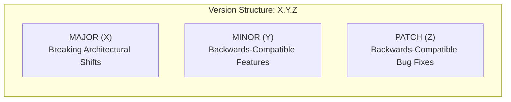
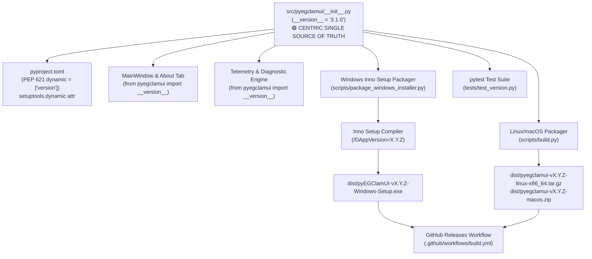
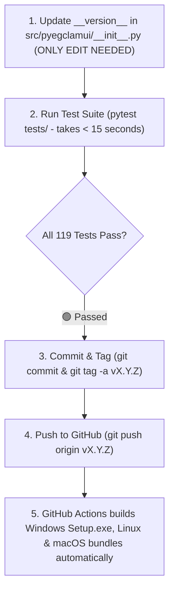

# Application Versioning & Release Management Guide

This document establishes the official versioning standards, Single Source of Truth (SSOT) architecture, release tagging conventions, and cross-file synchronization procedures for **pyEGClamUI**.

---

## 1. Semantic Versioning Specification (SemVer 2.0.0)

pyEGClamUI strictly adheres to the [Semantic Versioning 2.0.0](https://semver.org/) specification:

$$\text{Version Format: } \mathbf{MAJOR}.\mathbf{MINOR}.\mathbf{PATCH}$$



### Version Bump Criteria

| Increment Type | Version Component | Example Trigger Event | Backward Compatible? | Release Tag Example |
| :--- | :--- | :--- | :--- | :--- |
| 🔴 **Major** | `MAJOR` ($X.0.0$) | Rewriting GUI framework, breaking config schema changes, dropping core Python runtime | ❌ No | `v4.0.0` |
| 🟡 **Minor** | `MINOR` ($3.Y.0$) | Adding new scan profiles, resident daemon acceleration cards, installer CLI commands | 🟢 Yes | `v3.1.0` |
| 🟢 **Patch** | `PATCH` ($3.0.Z$) | Resolving race conditions, regex parsing bug fixes, socket timeout adjustments | 🟢 Yes | `v3.0.1` |
| ⚪ **Pre-Release** | `SUFFIX` ($-beta.1$) | Internal test builds, release candidates (`-rc.1`) before formal public tag | 🟡 Experimental | `v3.1.0-rc.1` |

---

## 2. Centric Single Source of Truth (SSOT) Architecture

To eliminate version divergence and eliminate manual multi-file edits, pyEGClamUI enforces a **Centric Single Source of Truth (SSOT)** model:

> [!IMPORTANT]
> **One Place to Update**: You only ever update version information in **one single file**:  
> 🟢 [`src/pyegclamui/__init__.py`](../src/pyegclamui/__init__.py) (`__version__ = "X.Y.Z"`).  
> All other subsystems, packaging specifications, installers, and CI/CD pipelines consume this centric definition dynamically.



---

## 3. Dynamic Synchronization Matrix

| Subsystem / File | Role | How It Consumes Version |
| :--- | :--- | :--- |
| [`src/pyegclamui/__init__.py`](../src/pyegclamui/__init__.py) | **Centric Primary SSOT** | 🟢 **The ONLY file edited on version bumps** (`__version__ = "X.Y.Z"`) |
| [`pyproject.toml`](../pyproject.toml) | Python Packaging Spec | ⚡ **100% Dynamic** — configured via `dynamic = ["version"]` and `[tool.setuptools.dynamic]` |
| [`src/pyegclamui/gui/`](../src/pyegclamui/gui/) | Qt Desktop GUI | ⚡ **100% Dynamic** — imports `from pyegclamui import __version__` |
| [`scripts/package_windows_installer.py`](../scripts/package_windows_installer.py) | Windows Staging & Packaging | ⚡ **100% Dynamic** — extracts `__version__` from `__init__.py` and invokes Inno Setup with `/DAppVersion` |
| [`setup/windows/pyegclamui_installer.iss`](../setup/windows/pyegclamui_installer.iss) | Inno Setup Script | ⚡ **100% Dynamic** — receives `#define AppVersion` parameter from packaging script |
| [`scripts/build.py`](../scripts/build.py) | Linux & macOS Packager | ⚡ **100% Dynamic** — dynamically extracts `__version__` for `.tar.gz` and `.zip` archives |
| [`.github/workflows/build.yml`](../.github/workflows/build.yml) | GitHub Actions CI/CD | ⚡ **100% Dynamic** — executes packaging scripts that compile installers with centric version |
| [`tests/test_version.py`](../tests/test_version.py) | Quality Assurance | 🛡️ Automated test verifying SemVer syntax and dynamic `pyproject.toml` mapping |

---

## 4. Single-Action Release Bumping Workflow

Because versioning is centric, bumping the release version requires modifying only **one line** in the entire codebase:



### Procedure Details

1. **Step 1 — Update the Centric Version**:
   Edit [`src/pyegclamui/__init__.py`](../src/pyegclamui/__init__.py):
   ```python
   __version__ = "3.1.0"
   ```

2. **Step 2 — Execute Fast Automated Test Suite (< 15 seconds)**:
   ```bash
   .venv\Scripts\python.exe -m pytest tests/ -v
   ```

3. **Step 3 — Commit and Tag**:
   ```bash
   git add src/pyegclamui/__init__.py
   git commit -m "chore(release): bump version to 3.1.0"
   git tag -a v3.1.0 -m "Release v3.1.0"
   ```

4. **Step 4 — Push to GitHub**:
   ```bash
   git push origin main
   git push origin v3.1.0
   ```
   GitHub Actions will automatically build `pyEGClamUI-v3.1.0-Windows-Setup.exe`, `pyegclamui-v3.1.0-linux-x86_64.tar.gz`, and `pyegclamui-v3.1.0-macos.zip`, publishing them directly to the release page.

---

## 5. Automated Unit Test Verification

To prevent accidental release drift, pyEGClamUI enforces automated verification inside [`tests/test_version.py`](../tests/test_version.py). The test suite asserts that:
1. `__version__` follows valid Semantic Versioning syntax (`X.Y.Z`).
2. `src/pyegclamui/__init__.py` and `pyproject.toml` have identical version strings.
3. The version string is non-empty and accessible to external callers.

> [!TIP]
> Run `pytest tests/test_version.py` at any point during development to instantly confirm that all version declarations across the project are valid and aligned.

---

## 6. Version History & Changelog Standards

Version releases document notable changes grouped under standardized subheadings:

* **Added**: New features, widgets, or CLI flags.
* **Changed**: Changes in existing functionality or UI improvements.
* **Deprecated**: Features scheduled for removal in future releases.
* **Removed**: Deprecated features removed in this version.
* **Fixed**: Bug fixes and error-handling improvements.
* **Security**: Vulnerability resolutions, socket safety, and permission lockdown updates.
