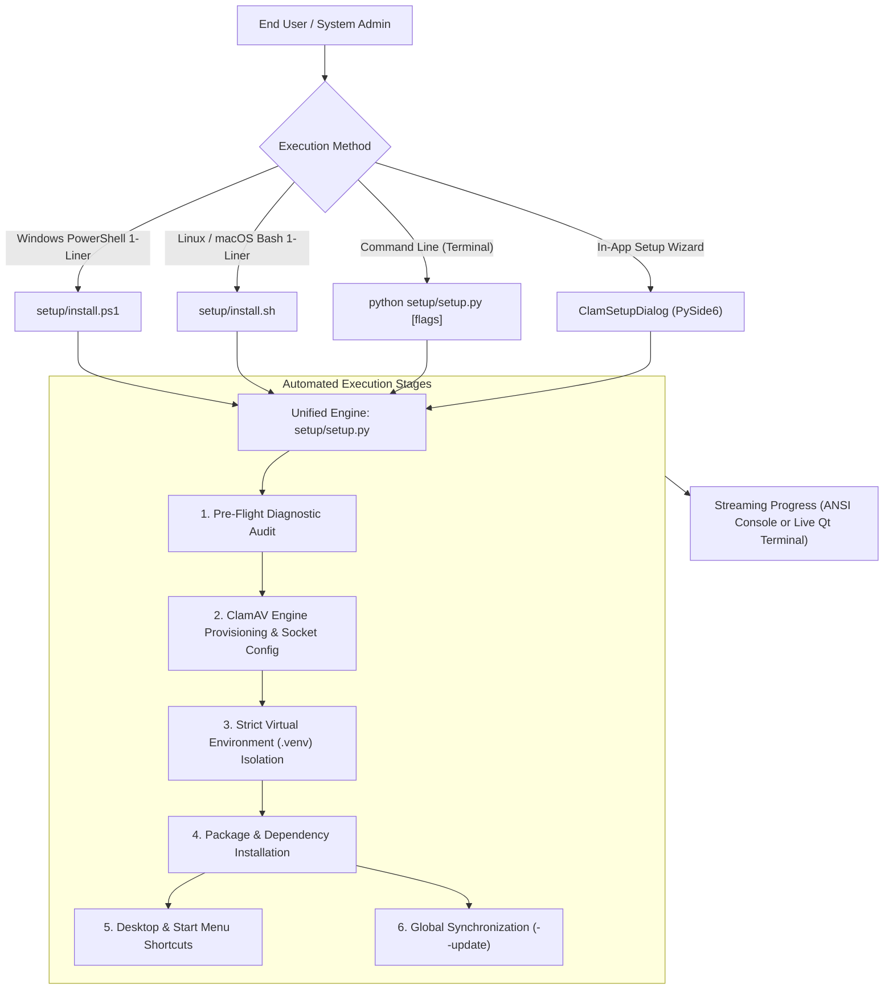
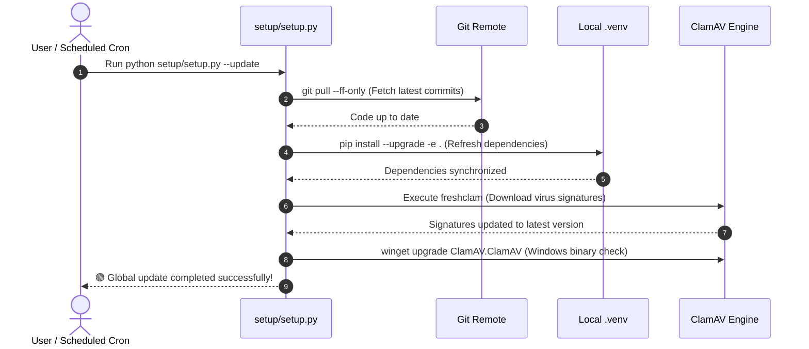
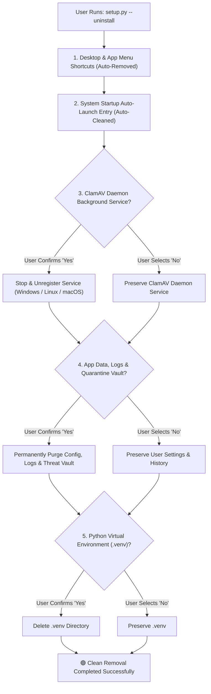
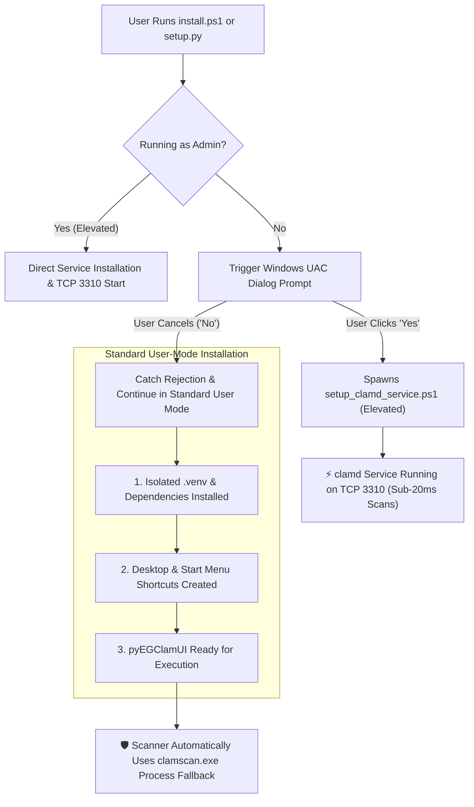

# pyEGClamUI Unified Setup, Update & Deployment Suite

This directory contains the universal, zero-friction installer and maintenance suite for **pyEGClamUI**. It manages the complete application lifecycle—from operating system detection, automated virtual environment configuration, and ClamAV backend provisioning to desktop shortcut creation and global updates.

---

## 1. Architecture & Execution Workflow

The setup suite is engineered around a **single source of truth** architecture. The core installer engine ([`setup.py`](setup.py)) utilizes 100% Python standard library modules with zero external pip dependencies.



---

## 2. Component Reference & Source Code Map

| File | Language | Purpose & Functionality |
| :--- | :--- | :--- |
| **[`setup.py`](setup.py)** | Python 3 (Standard Library) | Master cross-platform engine handling `--install`, `--update`, `--check`, `--shortcuts-only`, and `--uninstall`. |
| **[`install.ps1`](install.ps1)** | PowerShell 5.1+ / 7+ | Windows bootstrap launcher; auto-provisions Python 3.12 via `winget` if missing and invokes `setup.py`. |
| **[`setup_clamd_service.ps1`](setup_clamd_service.ps1)** | PowerShell (Self-Elevating) | Configures `clamd.conf`, `freshclam.conf`, registers and starts `"ClamAV ClamD"` Windows service on TCP 3310. |
| **[`install.sh`](install.sh)** | POSIX Bash | Linux & macOS bootstrap launcher; auto-detects `python3`, clones repository if remote, and executes `setup.py`. |
| **[`setup_engine.py`](../src/pyegclamui/core/setup_engine.py)** | Python / Qt Bridge | Connects internal pyEGClamUI engine logic with the universal installer routines. |
| **[`setup_dialog.py`](../src/pyegclamui/gui/setup_dialog.py)** | PySide6 GUI | Interactive setup wizard with a real-time expandable terminal log drawer. |

---

## 3. CLI Command & Flag Specification

The master installer ([`setup.py`](setup.py)) accepts granular command-line arguments to adapt to unattended scripts, container builds, or user installs:

| Command / Flag | Mode | Execution Details |
| :--- | :--- | :--- |
| `python setup/setup.py` | 🟢 **Default Install** | Executes all 5 setup stages: pre-flight check, `.venv` build, package install, ClamAV check, and shortcut creation. |
| `python setup/setup.py --install` | 🟢 **Explicit Install** | Same as default installation. |
| `python setup/setup.py --update` | ⚡ **Global Update** | Refreshes ClamAV virus signatures (`freshclam`), checks engine upgrades, pulls latest git code, and updates dependencies. |
| `python setup/setup.py --check` | 🔍 **Diagnostic Audit** | Non-destructive dry run: audits Python version, ClamAV paths, and resident `clamd` socket connectivity. |
| `python setup/setup.py --shortcuts-only` | 🖥️ **Shortcuts Only** | Generates or repairs Windows `.lnk`, Linux `.desktop`, or macOS launch scripts without touching packages. |
| `python setup/setup.py --uninstall` | 🧹 **Clean Removal** | Interactively prompts to remove daemon service, app data, quarantine vault, and `.venv`. |
| `python setup/setup.py --uninstall -y` | 💥 **Complete Purge** | Automatically cleans and purges all components, services, and directories without interactive prompts. |
| `python setup/setup.py --verbose` / `-v` | 📝 **Verbose Stream** | Emits live subprocess output, command arguments, and detailed diagnostic breadcrumbs. |
| `python setup/setup.py --start` | 🚀 **Auto-Launch** | Automatically starts pyEGClamUI immediately following installation or update completion. |
| `python setup/setup.py --no-clamav` | ⚪ **Skip Engine** | Provisions Python `.venv` and GUI dependencies while bypassing ClamAV binary checks. |

---

## 4. One-Liner Quick Start Commands

### 🪟 Windows (PowerShell 1-Liner)
Run the following command in an administrative or standard PowerShell prompt:
```powershell
powershell -ExecutionPolicy Bypass -Command "Invoke-WebRequest -Uri 'https://raw.githubusercontent.com/EG1DOTIN/pyEGClamUI/main/setup/install.ps1' -OutFile setup.ps1; .\setup.ps1"
```
*Or from a locally cloned repository:*
```powershell
.\setup\install.ps1
```

### 🐧 Linux & 🍎 macOS (Bash 1-Liner)
Run the following command in your terminal:
```bash
curl -sSL https://raw.githubusercontent.com/EG1DOTIN/pyEGClamUI/main/setup/install.sh | bash
```
*Or from a locally cloned repository:*
```bash
bash setup/install.sh
```

---

## 5. Lifecycle Management

### Global Maintenance & Updates (`--update`)



To update everything in one single command:
```bash
python setup/setup.py --update
```

### Clean System Uninstallation (`--uninstall`)

pyEGClamUI adheres to strict zero-orphan uninstallation standards. When removing the software, the uninstaller provides an interactive, component-by-component cleanup across all supported operating systems:



#### Managed Components & Removal Behavior

| Component / Subsystem | Windows Target | Linux Target | macOS Target | Default Action |
| :--- | :--- | :--- | :--- | :--- |
| 🖥️ **Desktop Shortcuts** | `%USERPROFILE%\Desktop\*.lnk` | `~/Desktop/*.desktop` | `~/Desktop/*.command` | 🧹 Auto-Removed |
| 📁 **App Menu Entries** | `%APPDATA%\...\Programs\*.lnk` | `~/.local/share/applications/` | `~/Applications/*.command` | 🧹 Auto-Removed |
| 🚀 **System Startup** | `HKCU\...\Run` (`pyEGClamUI`) | `~/.config/autostart/*.desktop` | `~/Library/LaunchAgents/*.plist` | 🧹 Auto-Removed |
| ⚡ **ClamAV Daemon** | Windows Service `"ClamAV ClamD"` | `systemctl clamav-daemon` | `brew services clamav` | ❓ Prompted `[y/N]` |
| ⚙️ **Config & Settings** | `%APPDATA%\pyEGClamUI` | `~/.config/pyegclamui` | `~/Library/Application Support/` | ❓ Prompted `[y/N]` |
| 🛡️ **Quarantine Vault** | `%LOCALAPPDATA%\...\quarantine` | `~/.local/share/.../quarantine`| `~/Library/.../quarantine` | ❓ Prompted (Alerts if threats exist) |
| 📦 **Virtual Env** | `<project>/.venv` | `<project>/.venv` | `<project>/.venv` | ❓ Prompted `[y/N]` |

#### Unattended Silent Purge
For scripted teardowns, automated CI testing, or complete factory resets, pass `--purge-all` or `-y`:
```bash
python setup/setup.py --uninstall --purge-all
# Or on Windows PowerShell:
.\setup\install.ps1 -Uninstall -PurgeAll
# Or on Linux / macOS:
bash setup/install.sh --uninstall --purge-all
```

---

## 6. Technical Guarantees & Security

* **Strict Workspace Isolation**: All packages and binary runners reside inside the local `.venv` directory. The global operating system Python environment is never modified or polluted.
* **Windowless Windows Execution**: Shortcuts on Windows point to `pythonw.exe` rather than `python.exe`. This ensures pyEGClamUI launches as a true native desktop application without an unwanted black console window persisting in the taskbar.
* **Safe Subprocess Piping**: All system commands use discrete argument lists (`subprocess.Popen([cmd, arg1, arg2])`) rather than unsafe `shell=True` string parsing, protecting against injection and whitespace errors.

---

## 7. Windows Elevation & Non-Administrator Fallback (UAC Rejection Resilience)

Configuring system-level background services on Windows (`clamd.exe --install-service`) requires Administrator privileges. To ensure a seamless experience for both non-technical users and security-conscious environments, the setup suite implements **automatic elevation with graceful fallback**:



### Feature Parity Comparison: Admin vs. Standard User Mode

| Feature / Subsystem | If UAC Accepted (Admin Mode) | If UAC Cancelled (Standard User Mode) |
| :--- | :--- | :--- |
| 📦 **Python Dependencies & `.venv`** | 🟢 Installed cleanly | 🟢 **Installed cleanly** (in user space) |
| 🖥️ **Desktop & Start Menu Shortcuts** | 🟢 Created on Desktop & Start Menu | 🟢 **Created on Desktop & Start Menu** |
| 🔍 **File Scanning & Threat Quarantine** | 🟢 100% Active | 🟢 **100% Active** (via `clamscan.exe`) |
| 🛡️ **Real-Time Guard Protection** | 🟢 100% Active (Monitors 2 folders) | 🟢 **100% Active** (Monitors 2 folders) |
| ⚡ **Resident Daemon Acceleration** | 🟢 Sub-20ms instant socket streaming | 🟡 Subprocess fallback mode ($\sim 800\text{ms}$) |

### Graceful Degradation in Core Engines
* The scanning engine ([`scanner.py`](../src/pyegclamui/core/scanner.py)) actively probes `127.0.0.1:3310` before every operation.
* If `clamd` is offline because UAC was declined, the application **automatically and invisibly routes scans directly to `clamscan.exe`**.
* The user experiences zero crashes, zero interrupted scans, and full antivirus protection out of the box.

### Activating the Resident Daemon Later
If a user initially declines UAC but wants the sub-20ms scan speed boost later, they can activate the service at any time without reinstalling:
```powershell
.\setup\setup_clamd_service.ps1
```
Click **"Yes"** on the Windows UAC confirmation dialog, and the background daemon will start immediately.

---

## 8. Linux & macOS Service Integration & Fallback Parity

The ClamAV daemon management architecture provides unified behavior and resilience across Windows, Linux, and macOS:

| Platform | Background Daemon Mechanism | Port / Protocol | Unprivileged / Decline Fallback |
| :--- | :--- | :--- | :--- |
| **🪟 Windows** | Windows Service: `"ClamAV ClamD"` | `127.0.0.1:3310` | 🟢 Seamless fallback to `clamscan.exe` subprocess |
| **🐧 Linux** | Systemd unit: `clamav-daemon.service` | `127.0.0.1:3310` | 🟢 Seamless fallback to `clamscan` binary |
| **🍎 macOS** | Homebrew service: `brew services start clamav` | `127.0.0.1:3310` | 🟢 Seamless fallback to `clamscan` binary |

* **Zero Elevation Halts**: On Linux and macOS, if the user executes setup without `sudo` or declines root authentication, the installer never fails or crashes. It provisions the complete application into standard user space and pyEGClamUI's core scanning engine seamlessly utilizes direct `clamscan` scanning out-of-the-box.
* **Manual Service Management**:
  * **Linux (Debian/Ubuntu/Arch/Fedora)**:
    * Enable/Start: `sudo systemctl enable --now clamav-daemon`
    * Disable/Stop: `sudo systemctl disable --now clamav-daemon`
  * **macOS (Homebrew)**:
    * Start: `brew services start clamav`
    * Stop: `brew services stop clamav`


